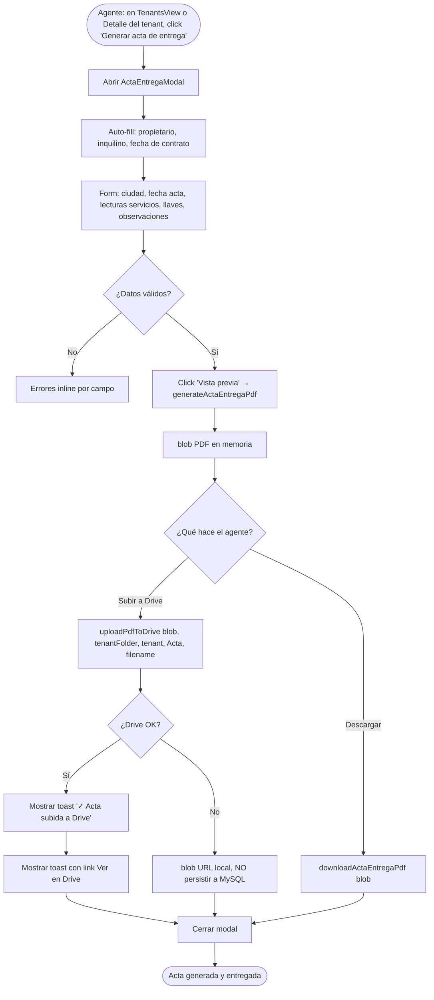
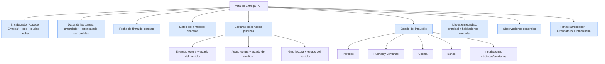
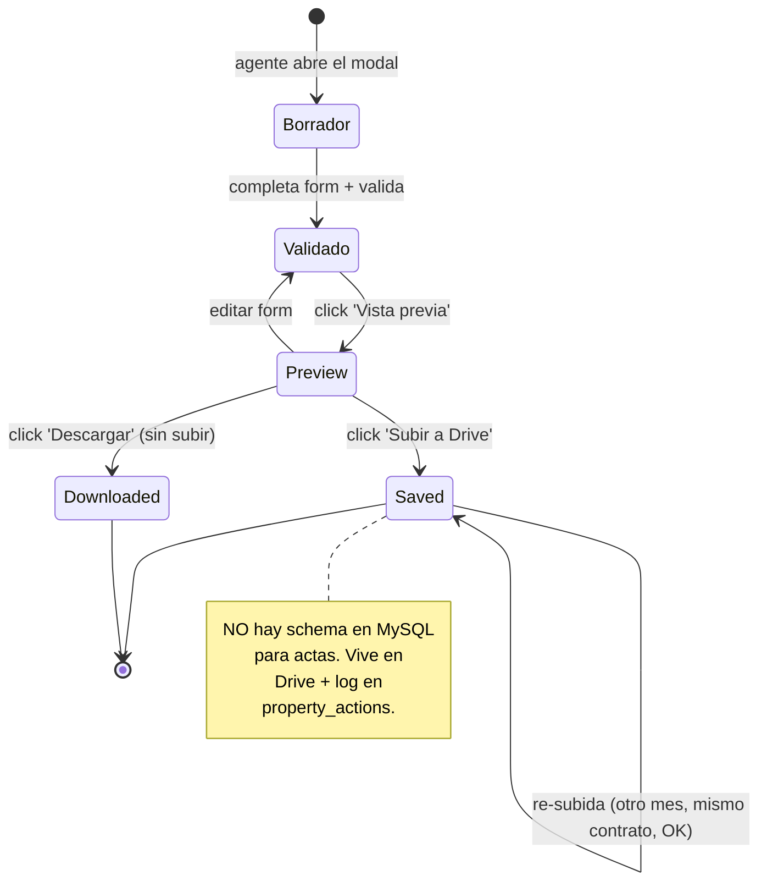
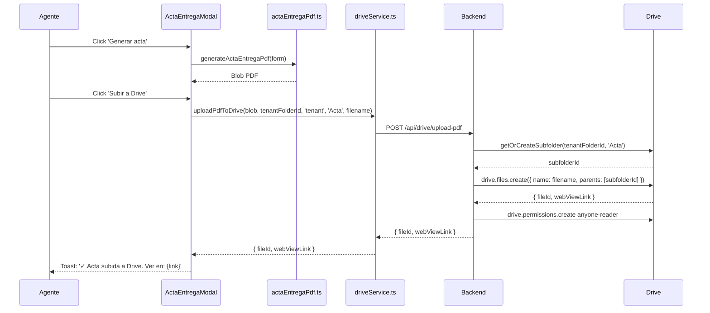
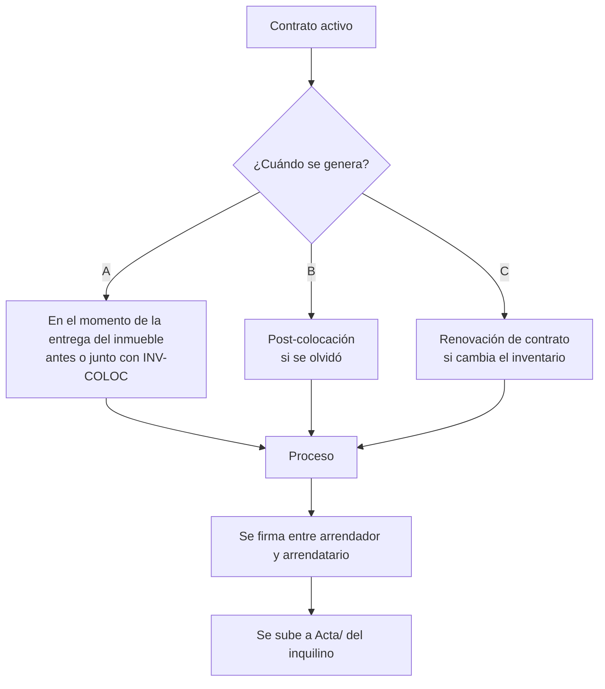

# PROCESO: ACTA-ENTREGA — Acta de Entrega del Inmueble

> Workflow agentico narrativo del proceso de generar el **Acta de Entrega**
> del inmueble al inquilino. Es un documento legal complementario al
> Contrato de Arrendamiento y al Inventario de Colocación. Captura el
> **estado físico del inmueble al momento de la entrega** (lecturas de
> servicios públicos, llaves entregadas, observaciones de paredes/puertas/
> cocina/baños/instalaciones) y se firma entre arrendador y arrendatario.
>
> El acta se sube automáticamente a la carpeta `Acta/` del inquilino en
> Google Drive (subcarpeta creada on-demand si no existe).

## 0. Metadata

| Campo | Valor |
|---|---|
| **Código** | `ACTA-ENTREGA` |
| **Nombre legible** | Acta de Entrega del Inmueble |
| **Dominio** | `tenants` (vive en `src/features/tenants/ActaEntregaModal.tsx` por legacy, no en `contracts`) |
| **Owners** | Frontend: `src/features/tenants/ActaEntregaModal.tsx` + `actaEntregaPdf.ts` · Backend: usa `server/routes/googleAuth.ts` (`POST /api/drive/upload-pdf`) + `server/routes/tenants.ts` |
| **Status** | ⏳ draft (workflow) / ✅ shipped (implementación, en prod desde jul-2026) |
| **Última revisión** | 2026-08-03 |
| **Procesos upstream** | `TENANT-ONB` (inquilino asignado), `CONTRACT-GEN` (contrato activo), `INV-COLOC` (firma del estado físico, paralelo) |
| **Procesos downstream** | — (terminal, no desbloquea nada nuevo; complementa el dossier de entrega) |

## 0.5. Diagramas

### Flujo principal (generar acta + subir a Drive)

### Estructura del PDF del Acta

### Estados del acta (ciclo de vida)

### Subida a Drive (carpeta Acta/ del inquilino)

### Cuando se genera el acta

## 1. Actores

- **Agente inmobiliario** — Completa el acta con datos del estado físico. Captura las lecturas de servicios públicos. Sube a Drive.
- **Propietario (arrendador)** — Firma el acta (físicamente o digital). NO usa InmoControl directamente.
- **Inquilino (arrendatario)** — Firma el acta. Confirma el estado físico al momento de recibir el inmueble.
- **Sistema (InmoControl frontend)** — `ActaEntregaModal.tsx` (UI), `actaEntregaPdf.ts` (generador PDF).
- **Google Drive** — Recibe el PDF en `Acta/` (subcarpeta creada on-demand) dentro de `{nombre} ({cédula})/`.

## 2. Contexto inicial

- **Cuándo se dispara**: el agente abre el Detalle del Inquilino o el Detalle de la Propiedad y hace click en "Generar acta de entrega".
- **UI entry point**:
  - `src/features/tenants/TenantsView.tsx` → tab Detalle → "Generar acta".
  - `src/features/properties/PropertiesView.tsx` → tab Inquilinos → "Acta de entrega".
- **Precondiciones**:
  - Hay un tenant activo en la propiedad.
  - Hay un contrato activo (recomendado, no bloqueante).
  - Drive puede estar conectado o no (fallback silencioso).

## 3. Flujo principal (happy path)

### Paso 1 — Abrir modal

`ActaEntregaModal` se abre con auto-fill:

- **Arrendador**: nombre + cédula del primer owner de la propiedad.
- **Arrendatario**: nombre + cédula del tenant activo.
- **Fecha de firma del contrato**: `tenant.leaseStartDate` o `today`.
- **Inmueble**: dirección de la propiedad.

El agente debe completar manualmente:

- **Ciudad** (donde se firma el acta).
- **Fecha del acta** (default = hoy).
- **Lecturas de servicios**: energía, agua, gas (lectura del medidor + estado).
- **Estado del inmueble**: paredes, puertas/ventanas, cocina, baños, instalaciones.
- **Llaves entregadas**: principal, habitaciones, controles (contador).
- **Observaciones generales** (opcional).

### Paso 2 — Validar form

Click "Generar acta" valida:

- Campos requeridos: ciudad, fecha acta, fecha contrato, nombres y cédulas de ambas partes, dirección del inmueble, lecturas de servicios.
- Estado y observaciones pueden quedar vacíos.

### Paso 3 — Generar PDF (preview)

`generateActaEntregaPdf(form)` produce el PDF. La UI lo muestra en preview.

### Paso 4 — Subir a Drive (acción principal)

Click "Subir a Drive":

1. `uploadPdfToDrive(blob, tenantDriveFolderId, 'tenant', 'Acta', 'ActaEntrega_<inquilino>_<YYYY-MM-DD>.pdf')`.
3. Server crea subcarpeta `Acta/` on-demand bajo `{nombre} ({cédula})/`.
4. Sube el PDF con `permissions.create anyone-reader`.
5. Toast: "✓ Acta subida a Drive" con link "Ver en Drive".

### Paso 5 — Log en audit (futuro)

Pendiente: loggear en `property_actions` con `action_type='acta_uploaded'`. Hoy no se loggea (TODO).

## 4. Edge cases

### EC-1 — Tenant drive folder no existe

- **Trigger**: la propiedad se creó sin Drive, o el tenant no tiene
  `drive_folder_path` set.
- **Comportamiento**: `uploadPdfToDrive` devuelve `{ skipped: true,
  reason: 'No hay carpeta padre en Drive' }`. Toast: "Drive no tiene
  carpeta para este inquilino. El acta se descargó localmente."

### EC-2 — Drive no conectado

- **Trigger**: agente no configuró Drive (ver `DRIVE-OPS`).
- **Comportamiento**: `uploadPdfToDrive` devuelve `{ skipped: true,
  reason: 'Drive no conectado' }`. Toast: "Acta descargada localmente.
  Se subirá a Drive cuando conectes tu Drive."

### EC-3 — Subir acta 2 veces (mismo contrato, mismo día)

- **Trigger**: el agente sube, edita algo, sube de nuevo.
- **Comportamiento**: la nueva acta se sube con el mismo nombre
  (`ActaEntrega_<inquilino>_<YYYY-MM-DD>.pdf`). Drive detecta el duplicado
  y crea el archivo con sufijo `(1)`, `(2)`, etc.
- **Mitigación**: en Drive, se ven N archivos con el mismo nombre
  base. El agente debe trashed manualmente los viejos.

### EC-4 — Acta generada pero no firmada

- **Trigger**: el agente sube el PDF sin firmar.
- **Comportamiento**: el PDF NO tiene firmas digitales — solo se sube el
  contenido. El acta se firma en físico o vía firma digital externa.

### EC-5 — Acta generada con datos del tenant equivocado

- **Trigger**: error — el agente abrió el acta para el tenant equivocado.
- **Comportamiento**: el modal tiene auto-fill, pero el agente puede
  editar manualmente. Si pasa, hay que descartar y rehacer.
- **Mitigación**: el modal muestra prominentemente el nombre del tenant
  activo en el título.

### EC-6 — Lectura de servicio con valor inválido

- **Trigger**: el agente pone "abc" en lugar de "12345".
- **Comportamiento**: el form NO valida el formato (puede ser numérico
  o alfanumérico según el medidor). El PDF refleja lo que escribió el
  agente.

### EC-7 — Acta con 0 llaves entregadas

- **Trigger**: el agente pone 0 en todos los contadores de llaves.
- **Comportamiento**: el PDF dice "0 llaves". Puede ser válido (ej: el
  propietario retiene las llaves hasta el primer pago).

### EC-8 — Discardo del acta generada

- **Trigger**: el agente quiere cancelar después de generar el PDF.
- **Comportamiento**: el PDF en memoria se descarta. NO se sube a Drive.
  NO se persiste en MySQL (no hay schema para actas).

### EC-9 — Error generando PDF (jsPDF falla)

- **Trigger**: datos mal formateados o bug en `actaEntregaPdf.ts`.
- **Comportamiento**: toast: "Error generando acta: {error}". El modal
  sigue abierto con los datos para corrección.

### EC-10 — Subcarpeta Acta/ ya existe (idempotencia)

- **Trigger**: ya hay actas previas, la subcarpeta ya está creada.
- **Comportamiento**: `getOrCreateSubfolder` la busca primero y la
  reusa. NO se duplica. Ver `DRIVE-OPS §3 paso 4`.

### EC-11 — Sin permisos para subir

- **Trigger**: el agente no está autenticado.
- **Comportamiento**: server devuelve `401 { error: 'Not authenticated' }`.
  Toast: "Sesión expirada. Volvé a iniciar sesión."

### EC-12 — Multi-acta (renovación de contrato)

- **Trigger**: el inquilino renueva el contrato (mismo tenant, mismo
  propiedad, nuevo contrato). Se genera un acta nueva.
- **Comportamiento**: cada acta tiene su fecha. Se suben N archivos a
  `Acta/` con diferentes fechas.

### EC-13 — PDF muy pesado (>5MB)

- **Trigger**: si las observaciones tienen miles de caracteres.
- **Comportamiento**: jsPDF maneja PDFs grandes sin problema. Drive
  acepta hasta 5TB por archivo.

### EC-14 — Cambio de ciudad en el acta

- **Trigger**: el agente pone "Bogotá" pero la propiedad está en "Medellín".
- **Comportamiento**: el form NO valida contra la dirección. El agente
  es responsable.

### EC-15 — Sin `tenant.leaseStartDate`

- **Trigger**: el tenant se creó sin fecha de inicio.
- **Comportamiento**: el modal usa `today` como default. El agente puede
  editar.

## 5. Estado que muta

### Tablas MySQL afectadas

| Tabla | Operación | | |
|---|---|---|---|
| — | — | **No hay schema en MySQL para actas hoy**. |

> Esto es intencional por ahora. El acta es un documento complementario
> que vive en Drive + log en `property_actions` (futuro).

### Archivos en Drive creados

| Carpeta destino | Trigger | Convención de nombre |
|---|---|---|
| `Mi unidad / InmoControl/{dirección}/{inquilino} ({cédula})/Acta/ActaEntrega_<inquilino>_<YYYY-MM-DD>.pdf` | generar + subir | Fija |

### Stores Zustand actualizados

| Store | Acción | Selectores afectados |
|---|---|---|
| `appStore` | (lectura, no mutación) | `selectTenantById` |

## 6. Contratos cross-cutting

- **Tostadas**: ver `TOAST-001` + tabla §7 abajo.
- **JSON errors**: ver `JSON-001`. Especialmente `401` (sin auth) y errores de Drive.
- **Timeouts**: ver `TIMEOUT-001`. Aplican: server 8s por llamada a Drive; cliente 30s para uploads.
- **Drive fallback**: ver `DRIVE-FALLBACK-001`. Acta queda local (descargable).
- **Idempotencia**: ver `IDEMPOTENT-001`. Subcarpeta `Acta/` se crea on-demand si no existe.
- **Auth**: ver `SECURITY-001`. `requireAuth` en `/api/drive/upload-pdf`.

## 7. Tostadas exactas (copy approved)

| Trigger | Tipo | Copy exacto |
|---|---|---|
| Subir acta a Drive OK | success | "✓ Acta subida a Drive" |
| Subir acta sin Drive conectado | warning | "Acta descargada localmente. Se subirá a Drive cuando conectes tu Drive." |
| Subir acta sin carpeta de tenant | warning | "Drive no tiene carpeta para este inquilino. El acta se descargó localmente." |
| Validación falla | error | "Revisa los campos obligatorios antes de generar" |
| Error generando PDF | error | "Error generando acta: {error}" |
| Cancelar después de generar | (silencioso, modal cierra) | n/a |

## 8. Anti-patrones explícitos

- ❌ **Persistir el acta en MySQL con un nuevo schema propio** → NO hay
  schema dedicado. El acta vive en Drive + log futuro en `property_actions`.
  Si se requiere búsqueda por fecha/tenant, usar Drive search.
- ❌ **Asumir que las firmas digitales están embebidas en el PDF** → NO.
  El PDF se sube con placeholders. La firma es externa.
- ❌ **Cerrar el modal antes de la subida** → Karpathy. Modal abierto
  con spinner durante el upload.
- ❌ **Persistir blob URL del PDF a MySQL** → defensa contra zombie (no
  aplica acá porque NO hay schema, pero la convención se mantiene).
- ❌ **Sobrescribir el acta anterior sin avisar** → Drive crea archivo
  nuevo con sufijo `(1)`, no sobrescribe. Ver EC-3.

## 9. Especificaciones técnicas relacionadas

- `docs/specs/wizard_tenant.md` — Spec del tenant (incluye el acta como
  parte del flujo).
- `docs/specs/fix-issue-21-consolidate-ui-primitives.md` — `Button`,
  `Card`, `Input` que usa el modal.
- ⏳ TBD — Spec de "Acta persisted en MySQL con búsqueda".

## 10. Endpoints backend utilizados

| Método | Path | Archivo | Notas |
|---|---|---|---|
| `POST` | `/api/drive/upload-pdf` | `server/routes/googleAuth.ts` | Upload genérico (subcarpeta `Acta/` se crea on-demand). |
| `GET` | `/api/tenants/:id` | `server/routes/tenants.ts` | (parent) Detalle del tenant para auto-fill. |

## 11. Riesgos identificados

| Riesgo | Probabilidad | Impacto | Mitigación |
|---|---|---|---|
| Multi-acta con mismo nombre | Alta | Baja | Sufijo `(N)` automático de Drive |
| Sin schema en MySQL → no se puede buscar | Media | Media | Buscar en Drive con `name contains 'ActaEntrega'` |
| Sin log en `property_actions` | Alta | Baja | TODO: agregar log post-upload |
| Cambio de ciudad/fechas no validado | Baja | Baja | (No es crítico, el agente revisa) |
| Acta sin firma digital embebida | Alta | Media | Firma externa (físico o DocuSign) — TODO |

## 12. Out of scope explícito

- ❌ **Schema MySQL dedicado para actas** — vive en Drive. Si se requiere
  búsqueda por tenant/fecha, usar Drive search.
- ❌ **Firma digital integrada en el PDF** — el PDF se genera sin firmas.
- ❌ **OCR de las lecturas de medidores** — el agente las tipea.
- ❌ **Multi-acta con versionado** — cada subida crea archivo nuevo en Drive.
- ❌ **Validación contra la dirección de la propiedad** — el agente es
  responsable de la coherencia.

## 13. Approval

**Status:** ⏳ Pending Review
**Aprobado por:** —
**Fecha de aprobación:** —

> Spec base: ninguno específico para acta. Vive como sub-flujo de
> `TENANT-ONB` + `CONTRACT-GEN`. Este workflow documenta el proceso
> dedicado, con énfasis en: NO hay schema MySQL (decisión consciente),
> la subcarpeta `Acta/` se crea on-demand, y la firma es externa.

---

> **Recordatorio Karpathy**: una vez aprobado, las features nuevas dentro
> de este proceso (ej: "schema MySQL para actas", "firma digital
> embebida") siguen el flujo spec → verifier → implementación. Este
> workflow NO se modifica para hacer pasar checks.