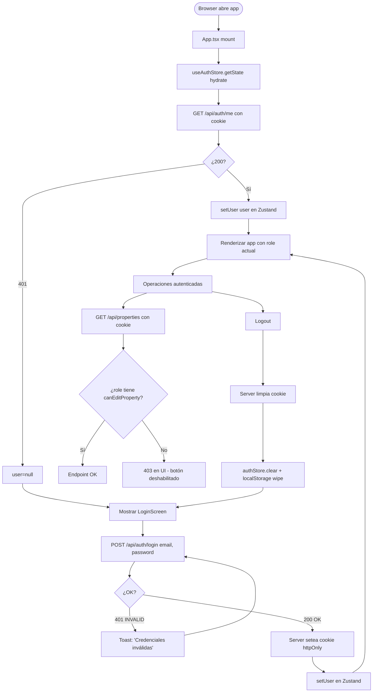
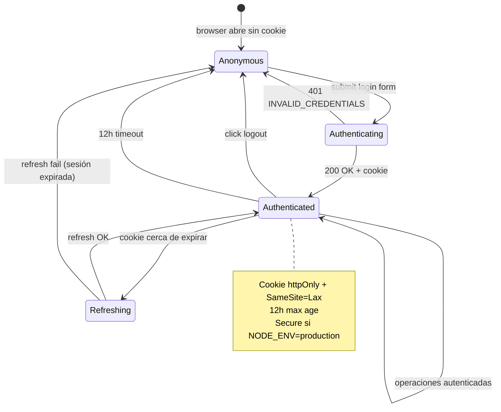
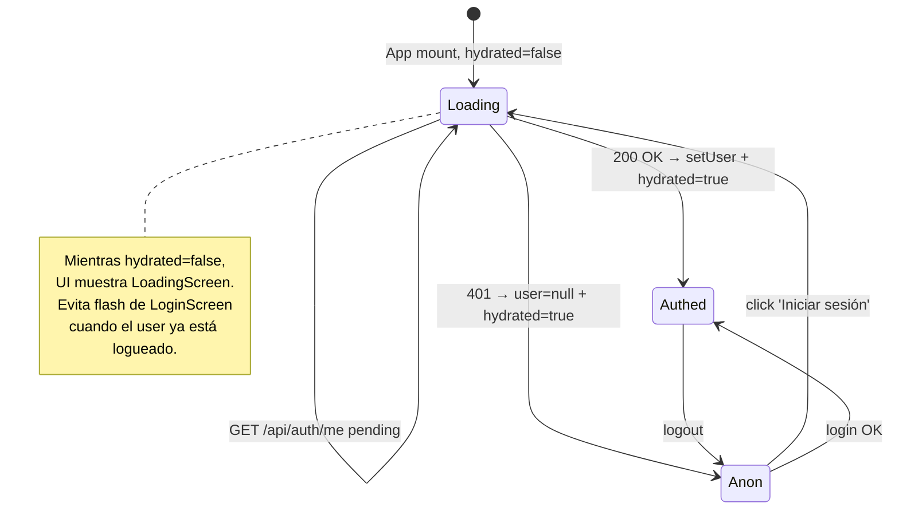
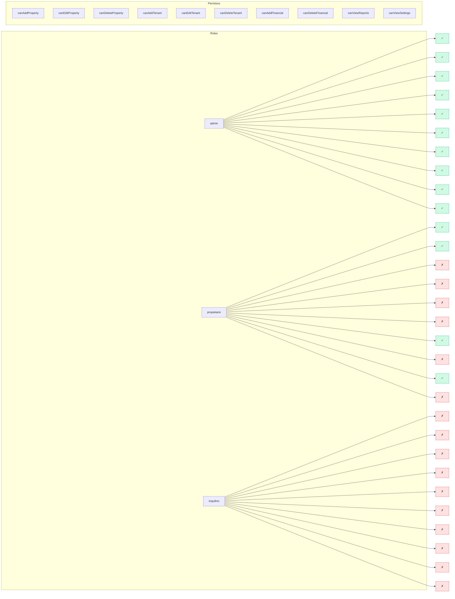
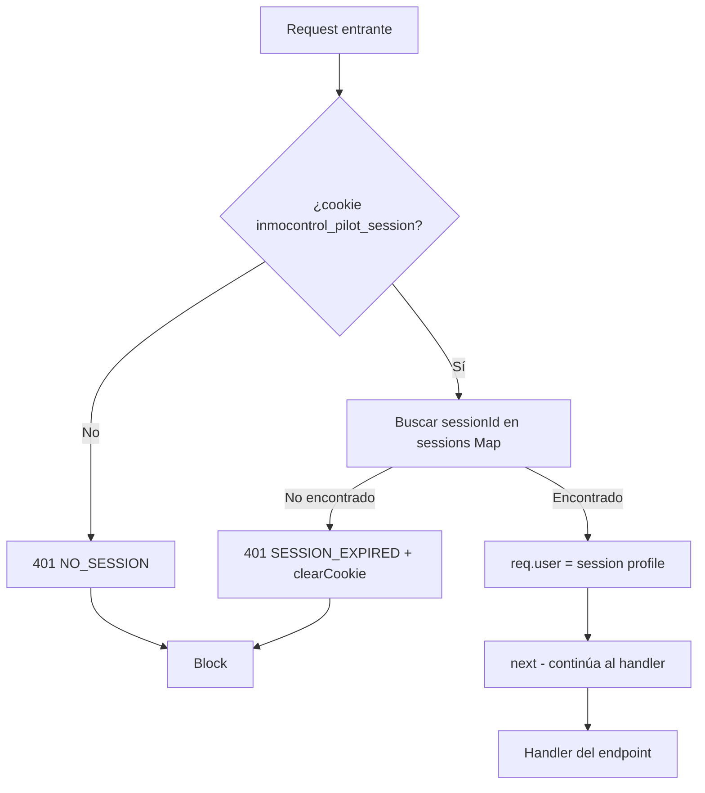

# PROCESO: AUTH — Autenticación y Autorización (Roles + Permisos)

> Workflow agentico narrativo del proceso de **autenticación y autorización**
> de InmoControl. Cubre el login (sesión httpOnly con cookie), el logout,
> la hidratación de la sesión al mount, los 3 roles (admin, propietario,
> inquilino) y la matriz de permisos por rol.
>
> **Diferido por decisión del usuario** (Fase 3 del proyecto). La
> implementación actual es un piloto single-tenant con 1 usuario hardcoded
> + bcrypt + sesión en memoria del server. Cuando se migre a SaaS
> multi-tenant, este workflow define QUÉ debe poder hacer el sistema,
> aunque el código NO esté completo.

## 0. Metadata

| Campo | Valor |
|---|---|
| **Código** | `AUTH` |
| **Nombre legible** | Autenticación y Autorización |
| **Dominio** | `auth` |
| **Owners** | Backend: `server/routes/auth.ts` (login + logout + me + `requireAuth` middleware) · Frontend: `src/features/auth/LoginScreen.tsx` + `permissions.ts` + `src/shared/store/authStore.ts` |
| **Status** | ⏳ draft (workflow) / 🚧 in-progress (piloto single-tenant; SaaS multi-tenant diferido Fase 3) |
| **Última revisión** | 2026-08-03 |
| **Procesos upstream** | — (foundational, todos los demás dependen de tener sesión válida) |
| **Procesos downstream** | TODOS los demás procesos (cada endpoint privado usa `requireAuth`; cada vista filtra por `role`) |

## 0.5. Diagramas

### Flujo principal (login → mount → operaciones autenticadas)



### Estados de autenticación



### Máquina de estados del `hydrated` flag



### Matriz de roles × permisos



### Secuencia de login

```mermaid
sequenceDiagram
    participant U as User
    participant FE as LoginScreen
    participant AuthS as authStore.ts
    participant BE as Backend
    participant DB as MySQL
    U->>FE: Submit email + password
    FE->>BE: POST /api/auth/login { email, password }
    BE->>DB: SELECT profiles WHERE email = ?
    DB-->>BE: user row with password_hash
    BE->>BE: bcrypt.compare(password, hash)
    alt OK
        BE->>BE: crypto.randomUUID → sessionId
        BE->>BE: sessions.set(sessionId, ...)
        BE->>FE: Set-Cookie: inmocontrol_pilot_session=...; HttpOnly; SameSite=Lax
        BE-->>FE: 200 { user: {id, email, displayName, role} }
        FE->>AuthS: setUser(user)
        AuthS->>AuthS: persist en localStorage 'inmocontrol:auth:v1'
        FE-->>U: Redirect a Dashboard
    else INVALID
        BE-->>FE: 401 { error: 'INVALID_CREDENTIALS' }
        FE-->>U: Toast: 'Credenciales inválidas'
    end
```

### Middleware `requireAuth` (server)



## 1. Actores

- **Usuario (admin / propietario / inquilino)** — Inicia sesión con email + password.
- **Sistema (InmoControl backend)** — `server/routes/auth.ts` valida credenciales + crea sesión en memoria.
- **Sistema (InmoControl frontend)** — `LoginScreen` (UI), `authStore` (Zustand), `permissions.ts` (matriz de roles).
- **MySQL** — Tabla `profiles` con `id`, `organization_id`, `display_name`, `email`, `role`, `password_hash` (migración 006_password_hash.sql).

## 2. Contexto inicial

- **Cuándo se dispara**:
  - **Login**: usuario abre la app sin sesión → ve `LoginScreen` → submit form.
  - **Logout**: usuario autenticado clickea "Cerrar sesión".
  - **Hydrate**: app mount → revalida sesión con `GET /api/auth/me`.
- **UI entry points**:
  - `src/features/auth/LoginScreen.tsx` → única entry de auth.
  - `src/features/shell/AppShell.tsx` → menú con "Cerrar sesión".
- **Precondiciones**:
  - El usuario tiene una fila en `profiles` con `password_hash` set (migración 006).
  - El backend está corriendo y puede leer la DB.

## 3. Flujo principal (happy path)

### Paso 1 — App mount + hydrate

`App.tsx` se monta. `useAuthStore.getState().hydrate()` se dispara:

1. `GET /api/auth/me` con la cookie (si existe).
2. Si 200: `setUser(user)` + `setHydrated(true)`.
3. Si 401: `user=null` + `setHydrated(true)`.
4. Mientras `hydrated=false`, UI muestra `LoadingScreen` (evita flash de LoginScreen).

### Paso 2 — Login (si no hay sesión)

`LoginScreen` se muestra. Usuario completa email + password + click "Iniciar sesión".

`POST /api/auth/login`:

1. Validación: `email && password` no vacíos.
2. `ensureDefaultOrg()`.
3. `SELECT * FROM profiles WHERE email = ? AND organization_id = ?`.
4. `bcrypt.compare(password, password_hash)`.
5. Si OK:
   - `crypto.randomUUID()` → sessionId.
   - `sessions.set(sessionId, {...})` en memoria.
   - `setSessionCookie(res, sessionId)` con `httpOnly`, `sameSite=Lax`, `secure=production`, `maxAge=12h`.
   - Response 200 con `{ user }`.
6. Si falla: 401 con `INVALID_CREDENTIALS` (mismo mensaje para email-no-existe y password-incorrecto, mitiga enumeración).

### Paso 3 — Operaciones autenticadas

Cualquier endpoint privado (`/api/properties`, `/api/tenants`, etc.) usa el middleware `requireAuth`:

1. Lee cookie `inmocontrol_pilot_session`.
2. Lookup en `sessions` Map.
3. Si existe: adjunta `req.user = { id, email, displayName, role, organizationId }`.
4. Si no: 401 JSON.

### Paso 4 — Permisos en UI (frontend)

El frontend usa `can(role, 'canX')` para mostrar/ocultar botones:

```typescript
{can(role, 'canAddProperty') && (
  <Button onClick={openWizard}>+ Nueva propiedad</Button>
)}
```

La matriz vive en `src/features/auth/permissions.ts` (hardcoded hoy; **debería venir del backend** cuando se implemente Fase 3 real).

### Paso 5 — Logout

Click "Cerrar sesión":

1. `POST /api/auth/logout`.
2. Server: `sessions.delete(sessionId)` + `clearSessionCookie(res)`.
3. Frontend: `authStore.clear()` + wipe localStorage del wizard draft.
4. Redirect a `LoginScreen`.

## 4. Edge cases

### EC-1 — Credenciales inválidas

- **Trigger**: email no existe O password no coincide.
- **Comportamiento**: 401 con `INVALID_CREDENTIALS`. **Mismo mensaje** para
  ambos casos (mitiga enumeración de emails).
- **Toast**: "Credenciales inválidas".

### EC-2 — Usuario sin password_hash

- **Trigger**: usuario creado antes de migración 006 (o vía OAuth).
- **Comportamiento**: 401 con `NO_PASSWORD_SET`. El piloto no acepta
  login sin password.

### EC-3 — Sesión expirada (12h)

- **Trigger**: pasaron 12 horas desde el login.
- **Comportamiento**: cookie expira. `GET /api/auth/me` → 401.
  `hydrate()` setea `user=null`. UI muestra LoginScreen.

### EC-4 — Cookie presente pero sessionId no existe en Map

- **Trigger**: server se reinició (las sesiones en memoria se pierden).
- **Comportamiento**: 401 + `clearCookie`. UI muestra LoginScreen.
- **Mitigación**: pasar a Redis o JWT firmado cuando se implemente SaaS.

### EC-5 — Login desde 2 browsers distintos

- **Trigger**: usuario logueado en Chrome, abre Firefox con la misma cookie... no, las cookies no se comparten entre browsers.
- **Comportamiento**: 2 sesiones independientes en `sessions` Map. Ambas válidas hasta que cada una expire o se haga logout.

### EC-6 — Múltiples tabs del mismo browser

- **Trigger**: usuario abre la app en 3 tabs.
- **Comportamiento**: misma cookie compartida. Las 3 tabs ven la misma sesión.
  Logout en una tab → las otras siguen logueadas (cookie no se propaga entre tabs).

### EC-7 — `role` desconocido

- **Trigger**: el server devuelve un `role` que el frontend no conoce (ej: 'gerente' futuro).
- **Comportamiento**: `can(role, 'canX')` devuelve `false` para todos los permisos (default deny). UI no muestra botones. Trazabilidad: el server tiene el role real, el backend filtra por el role real también.

### EC-8 — Ataque de fuerza bruta

- **Trigger**: atacante prueba 1000 passwords en 1 segundo.
- **Comportamiento**: hoy NO hay rate limit. bcrypt tiene costo (~100ms por compare), pero no es suficiente.
- **Mitigación**: TODO rate limit por IP en `/api/auth/login`. Out of scope del piloto.

### EC-9 — Email con mayúsculas

- **Trigger**: el usuario escribe "Admin@InmoControl.co" en vez de "admin@inmocontrol.co".
- **Comportamiento**: server hace `email.toLowerCase().trim()` antes del SELECT. Match OK.

### EC-10 — Password en blanco

- **Trigger**: el usuario envía `password=""`.
- **Comportamiento**: server valida `if (!password)` → 400 `MISSING_FIELDS`.

### EC-11 — Sesión con `Secure` cookie pero HTTP local (dev)

- **Trigger**: en dev (NODE_ENV=development), la cookie NO es Secure, así que viaja por HTTP.
- **Comportamiento**: funciona en localhost. En prod (NODE_ENV=production) es Secure y requiere HTTPS.

### EC-12 — CSRF (Cross-Site Request Forgery)

- **Trigger**: un sitio malicioso hace fetch a `/api/auth/me` con la cookie del usuario.
- **Comportamiento actual**: la cookie tiene `SameSite=Lax` que mitiga CSRF en forms GET. POSTs cross-site están bloqueados.
- **Mitigación adicional**: CSRF token para mutaciones (TODO Fase 3).

### EC-13 — Permisos del frontend vs backend

- **Trigger**: usuario con `role=inquilino` manipula el JS para enviar `POST /api/properties` sin pasar por la UI.
- **Comportamiento**: la UI muestra 403 (botón deshabilitado), pero el endpoint backend tiene su propia validación (hoy: `requireAuth` solo, no chequea role específico por endpoint).
- **Riesgo**: un inquilino podría crear una propiedad si bypasea la UI.
- **Mitigación Fase 3**: el backend debe validar `can(role, 'canX')` por endpoint, no solo sesión.

### EC-14 — Logout con sesión inválida (cookie expirada)

- **Trigger**: cookie expirada, usuario clickea logout.
- **Comportamiento**: server limpia cookie igual. Frontend limpia localStorage. OK.

### EC-15 — Sesión compartida (mismo browser, múltiples usuarios)

- **Trigger**: usuario A se loguea, luego usuario B en el mismo browser.
- **Comportamiento**: B hace login → nueva cookie reemplaza la anterior. La sesión de A queda huérfana en el server (hasta que expire).

### EC-16 — Login con credenciales válidas pero email de otro tenant

- **Trigger**: hoy NO es posible porque solo hay 1 org (`ensureDefaultOrg`). En SaaS multi-tenant, un usuario puede tener acceso a N orgs.
- **Comportamiento SaaS**: el SELECT debe traer TODAS las orgs del usuario + selector de org en la UI. Ver `SAAS-BILL §12`.

### EC-17 — remember me (sesión más larga)

- **Trigger**: usuario quiere no loguearse cada 12h.
- **Comportamiento actual**: NO soportado. TODO.

### EC-18 — Cambio de password

- **Trigger**: usuario quiere cambiar su password.
- **Comportamiento actual**: NO hay UI. TODO.

### EC-19 — Recuperación de password

- **Trigger**: usuario olvidó su password.
- **Comportamiento actual**: NO hay flujo. TODO.

### EC-20 — Logout en todos los devices

- **Trigger**: usuario perdió un device.
- **Comportamiento actual**: NO hay UI. Cada sesión es independiente.

## 5. Estado que muta

### Tablas MySQL afectadas

| Tabla | Operación | Columnas tocadas |
|---|---|---|
| `profiles` | SELECT (login + me) | `id`, `organization_id`, `display_name`, `email`, `role`, `password_hash` |
| `profiles` | INSERT (admin crea usuario, futuro) | (mismas columnas) |
| `profiles` | UPDATE (cambio de password, futuro) | `password_hash`, `updated_at` |

### Stores Zustand actualizados

| Store | Acción | Selectores afectados |
|---|---|---|
| `useAuthStore` | `setUser(user)`, `clear()`, `setHydrated(true)` | `selectUser`, `selectRole` |

### Archivos en Drive creados

| — | — | — |
|---|---|---|
| (ninguno, AUTH no genera PDFs ni uploads) | — | — |

## 6. Contratos cross-cutting

- **Tostadas**: ver `TOAST-001` + tabla §7 abajo.
- **JSON errors**: ver `JSON-001`. Especialmente 401 con códigos específicos (`NO_SESSION`, `SESSION_EXPIRED`, `INVALID_CREDENTIALS`).
- **Timeouts**: ver `TIMEOUT-001`. Cliente 15s para login.
- **Idempotencia**: ver `IDEMPOTENT-001`. Login NO es idempotente (cada POST crea sesión nueva).
- **Auth**: ver `SECURITY-001`. `requireAuth` en TODOS los endpoints privados. OAuth callback NO requiere auth.
- **Audit log**: ver `AUDIT-001`. Login OK y Login FAIL deberían loggear (TODO).

## 7. Tostadas exactas (copy approved)

| Trigger | Tipo | Copy exacto |
|---|---|---|
| Login OK | success | (redirect a Dashboard, no toast) |
| Credenciales inválidas | error | "Credenciales inválidas" |
| Sesión expirada | warning | "Tu sesión expiró. Volvé a iniciar sesión." |
| Logout OK | success | (redirect a Login, no toast) |
| Error de red en login | error | "No se pudo conectar al servidor. Reintentá." |
| Permiso denegado (UI) | warning | "No tenés permiso para hacer esto." |

## 8. Anti-patrones explícitos

- ❌ **Hardcodear credenciales en el cliente** → la sesión es httpOnly
  cookie + el server valida todo.
- ❌ **Confiar en la UI para validar permisos** → el backend DEBE validar
  también. Hoy NO lo hace completamente (riesgo `EC-13`).
- ❌ **Almacenar passwords en plaintext** → bcrypt con cost.
- ❌ **Sesiones persistentes en memoria del server** → se pierden al reiniciar.
  Migrar a Redis o JWT.
- ❌ **No rate limit en login** → fuerza bruta. TODO.
- ❌ **CSRF sin token** → SameSite=Lax mitiga parcialmente. CSRF token
  para mutaciones (TODO Fase 3).
- ❌ **Mensaje de error que revela si el email existe** → mismo mensaje
  para email-no-existe y password-incorrecto (mitiga enumeración).
- ❌ **Confundir AUTH con auth de Google OAuth (DRIVE-OPS)** → son 2 cosas
  distintas. DRIVE-OPS usa OAuth scope `drive.file`. AUTH usa email+password.

## 9. Especificaciones técnicas relacionadas

- `db/mysql/migrations/006_password_hash.sql` — Schema con `password_hash`.
- `docs/specs/fix-issue-01-require-auth-properties.md` — requireAuth en properties.
- `docs/specs/fix-issue-02-require-auth-others.md` — requireAuth en el resto.
- `docs/specs/fix-issue-04-user-zustand-store.md` — Migración de localStorage a Zustand.
- `docs/specs/fix-bug-029-central-error-wrapper.md` — `asyncHandler`.
- `tests/verifiers/fix-issue-01-require-auth-properties.md` — Verifier.
- `tests/verifiers/fix-issue-04-user-zustand-store.md` — Verifier.

## 10. Endpoints backend utilizados

| Método | Path | Archivo | Notas |
|---|---|---|---|
| `POST` | `/api/auth/login` | `server/routes/auth.ts` | Login. Crea sesión + cookie. |
| `POST` | `/api/auth/logout` | idem | Logout. Limpia sesión + cookie. |
| `GET` | `/api/auth/me` | idem | Devuelve user actual o 401. |
| (middleware) | `requireAuth` | idem | Middleware usado por TODOS los endpoints privados. |

## 11. Riesgos identificados

| Riesgo | Probabilidad | Impacto | Mitigación |
|---|---|---|---|
| Permisos solo en frontend (bypasseable) | Alta (piloto) | Alta | Validación backend por role (Fase 3) |
| Fuerza bruta en login | Alta | Alta | Rate limit por IP (TODO) |
| CSRF en mutaciones | Media | Alta | CSRF token + SameSite=Strict (TODO) |
| Sesiones en memoria se pierden al reinicio | Alta | Baja | Redis o JWT (Fase 3) |
| Sin 2FA | Alta | Media | 2FA con TOTP (futuro) |
| Sin recuperación de password | Alta | Media | Email recovery flow (futuro) |
| Sin cambio de password | Alta | Baja | UI de cambio (futuro) |

## 12. Out of scope explícito

- ❌ **SaaS multi-tenant con selector de org** — sigue single-tenant.
- ❌ **Validación de permisos por endpoint en el backend** — solo
  `requireAuth` hoy. Migrar a `requireAuth + requireRole(action)`.
- ❌ **Rate limit en login** — sin protección contra fuerza bruta.
- ❌ **CSRF token** — SameSite=Lax mitiga parcialmente.
- ❌ **2FA / TOTP** — futuro.
- ❌ **Recuperación de password** — futuro.
- ❌ **Cambio de password desde UI** — futuro.
- ❌ **Sesiones en Redis** — hoy en memoria del server.
- ❌ **Logout en todos los devices** — cada sesión es independiente.
- ❌ **remember me** — siempre 12h.

## 13. Approval

**Status:** ⏳ Pending Review (workflow) / 🚧 in-progress (implementación parcial)
**Aprobado por:** —
**Fecha de aprobación:** —

> Spec base: ninguno específico para AUTH. Vive como decisión diferida
> (Fase 3 del proyecto, per AGENTS.md).
> Este workflow documenta QUÉ debe poder hacer el sistema de auth,
> aunque la implementación completa del SaaS multi-tenant esté
> pendiente. Los puntos críticos:
> - Sesión httpOnly + cookie (✅ implementado)
> - Login con bcrypt (✅ implementado)
> - Hidratación al mount (✅ implementado)
> - Matriz de roles × permisos en frontend (✅ implementado, hardcoded)
> - Validación de permisos por endpoint en backend (❌ TODO crítico)
> - SaaS multi-tenant (❌ diferido)

---

> **Recordatorio Karpathy**: una vez aprobado, las features nuevas dentro
> de este proceso (ej: "rate limit en login", "validación de permisos
> por endpoint", "SaaS multi-tenant") siguen el flujo spec → verifier →
> implementación. Este workflow NO se modifica para hacer pasar checks.