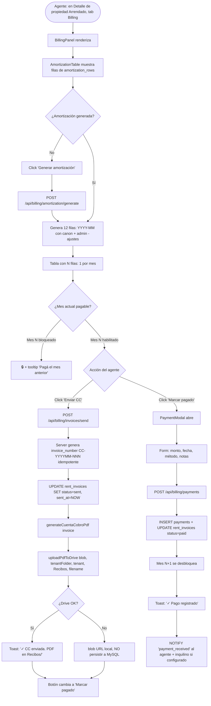
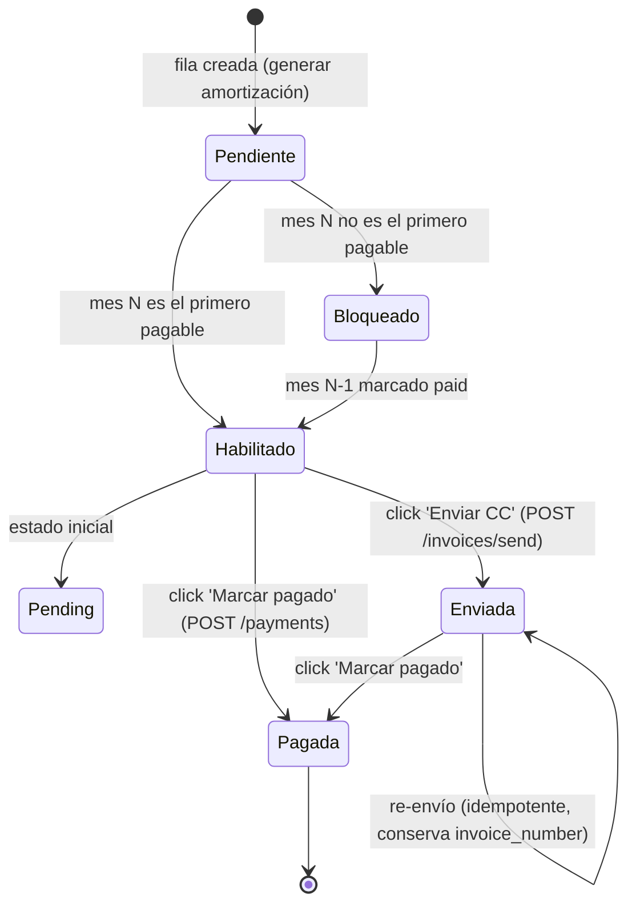
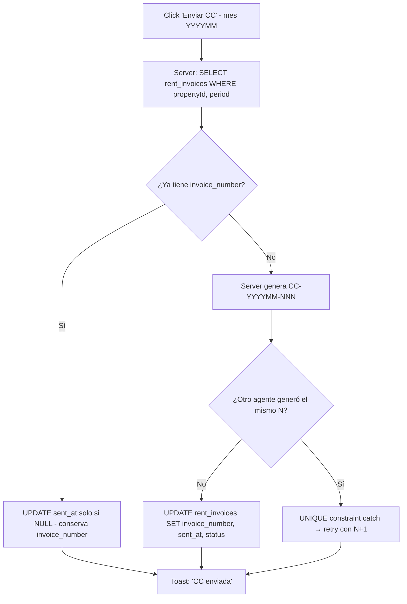
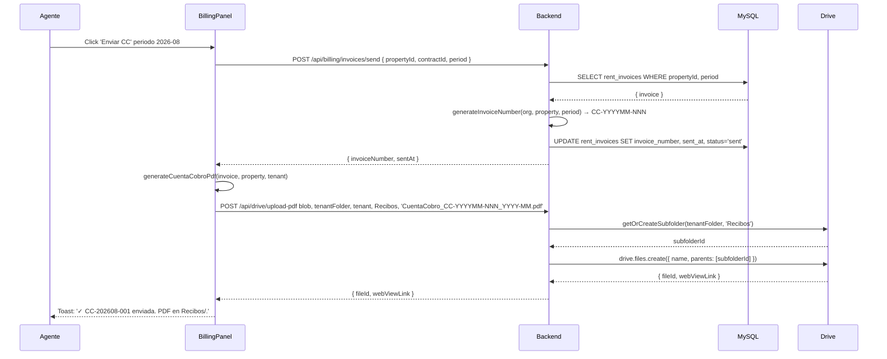
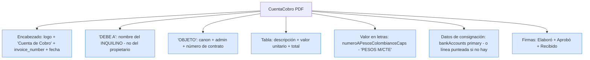

# PROCESO: BILL-INVOICE — Cuenta de Cobro Mensual al Inquilino

> Workflow agentico narrativo del proceso de **cuenta de cobro mensual**
> que InmoControl genera al inquilino. Cubre el ciclo: generar
> amortización → marcar `sent` (Enviar CC) → marcar `paid` (Marcar
> pagado) → generar PDF → subir a Drive en `Recibos/`. El consecutivo
> `invoice_number` formato `CC-YYYYMM-NNN` se genera en backend y es
> idempotente (re-envío conserva el número).
>
> Es el proceso central del ciclo de billing. Sin cuenta de cobro
> generada y enviada, no hay trazabilidad de pagos. Sin pago registrado,
> el propietario no recibe su estado de cuenta (ver `BILL-OWNER`).

## 0. Metadata

| Campo | Valor |
|---|---|
| **Código** | `BILL-INVOICE` |
| **Nombre legible** | Cuenta de Cobro Mensual al Inquilino |
| **Dominio** | `billing` |
| **Owners** | Frontend: `src/features/billing/views/BillingPanel.tsx` + `AmortizationTable.tsx` + `PaymentModal.tsx` + `cuentaCobroPdf.ts` · Backend: `server/routes/billing.ts` |
| **Status** | ⏳ draft (workflow) / ✅ shipped (implementación, Fase 9 ✅) |
| **Última revisión** | 2026-08-03 |
| **Procesos upstream** | `CONTRACT-GEN` (contrato activo), `INV-COLOC` (propiedad `Arrendado`) |
| **Procesos downstream** | `BILL-PAY` (registra pagos), `BILL-OWNER` (consolida en estado de cuenta del propietario), `NOTIFY` (notifica pago recibido / mora) |

## 0.5. Diagramas

### Flujo principal (generar amortización + Enviar CC + Marcar pagado)

### Estados de una fila de amortización (matriz UX)

### Consecutivo `invoice_number` (idempotente)

### Subida del PDF a Recibos/ del inquilino

### Formato del PDF de cuenta de cobro

## 1. Actores

- **Agente inmobiliario** — Genera la amortización (1 vez al año o al crear contrato). Click "Enviar CC" cada mes. Click "Marcar pagado" cuando el inquilino paga.
- **Inquilino** — Receptor de la cuenta de cobro. Paga según las instrucciones.
- **Propietario** — NO recibe directamente la CC (recibe el estado de cuenta mensual, ver `BILL-OWNER`).
- **Sistema (InmoControl backend)** — `POST /api/billing/amortization/generate`, `POST /api/billing/invoices/send`, `POST /api/billing/payments`. Schema `amortization_rows`, `rent_invoices`, `payments`.
- **Sistema (InmoControl frontend)** — `BillingPanel.tsx`, `AmortizationTable.tsx`, `PaymentModal.tsx`, `cuentaCobroPdf.ts` (generador PDF).
- **Google Drive** — Recibe el PDF en `Recibos/` (subcarpeta creada on-demand) del inquilino.
- **MySQL** — Tablas `amortization_rows`, `rent_invoices` (con `invoice_number`), `payments`.

## 2. Contexto inicial

- **Cuándo se dispara**: el agente abre el Detalle de una propiedad `Arrendado` y va al tab "Billing".
- **UI entry point**: `src/features/properties/PropertiesView.tsx` → tab Billing → `BillingPanel` → `AmortizationTable`.
- **Precondiciones**:
  - La propiedad está `Arrendado` (ver `INV-COLOC`).
  - Hay un contrato activo (ver `CONTRACT-GEN`).
  - NO requiere Drive para funcionar (puede generar y enviar CC sin Drive, solo no sube el PDF).

## 3. Flujo principal (happy path)

### Paso 1 — Generar amortización

`POST /api/billing/amortization/generate` con `{ contractId, months }`
(default 12). El server:

1. Lee el contrato activo (`contracts` con FK).
2. Para cada mes desde `startDate`, genera una fila en `amortization_rows`:
   - `period` = `YYYY-MM`
   - `amount` = canon mensual + admin
   - `status` = 'pending'
3. Si ya hay filas para esos meses, NO las duplica. UPSERT.

### Paso 2 — Renderizar tabla

`AmortizationTable` muestra N filas (1 por mes). Cada fila tiene:

- **Periodo** (ej: "Agosto 2026").
- **Monto** (canon + admin).
- **Estado** (pending / sent / paid).
- **Botones contextuales** según estado del mes:
  - 🔒 **Bloqueado** (mes N, donde N-1 NO está paid) → tooltip
    "Pagá el mes anterior para habilitar".
  - **Enviar CC** (mes N habilitado, no enviado) → habilita el botón.
  - **Marcar pagado** (mes N enviado, NO pagado) → habilita el botón.
  - ✓ **Pagado** (mes N pagado) → label verde, sin botones.

### Paso 3 — Enviar CC (POST /api/billing/invoices/send)

Click "Enviar CC" en el mes N habilitado:

1. `POST /api/billing/invoices/send { propertyId, contractId, period }`.
2. Server busca `rent_invoices WHERE propertyId, period`.
3. Si la fila ya tiene `invoice_number`:
   - Conserva el número (idempotente).
   - UPDATE solo `sent_at` si era NULL.
4. Si NO tiene `invoice_number`:
   - Genera `CC-YYYYMM-NNN`:
     - `YYYYMM` = periodo.
     - `NNN` = siguiente consecutivo para esa propiedad.
   - Si hay race condition (UNIQUE constraint catch), retry con N+1.
5. UPDATE `rent_invoices` con `invoice_number`, `sent_at=NOW`, `status='sent'`.

### Paso 4 — Generar PDF + subir a Drive

`generateCuentaCobroPdf(invoice, property, tenant)` produce el PDF
(ver §3 Diagrama "Formato del PDF"). UI muestra preview.

Si Drive está conectado, sube automáticamente:

- `uploadPdfToDrive(blob, tenantDriveFolderId, 'tenant', 'Recibos', 'CuentaCobro_CC-YYYYMM-NNN_YYYY-MM.pdf')`.
- Toast: "✓ CC-202608-001 enviada. PDF en Recibos/."

### Paso 5 — Marcar pagado (POST /api/billing/payments)

Click "Marcar pagado":

1. `PaymentModal` abre con form: monto (pre-poblado), fecha (default hoy), método (transferencia, efectivo, etc.), notas.
2. `POST /api/billing/payments`.
3. Server `markInvoicePaid`:
   - Si NO hay `rent_invoices` previo (caso edge): crea uno con `status='paid'`, `sent_at=NULL` (no perder trazabilidad).
   - Si ya existe: UPDATE `status='paid'`, `paid_at=NOW`.
4. INSERT en `payments`.
5. Mes N+1 se desbloquea automáticamente.

### Paso 6 — Notificación (opcional)

Si está configurado en `notificationConfigStore`, dispara `payment_received` al agente (in-app) y al inquilino (email).

## 4. Edge cases

### EC-1 — Regenerar amortización revierte `paid` → `pending`

- **Trigger**: bug histórico (BUG-004). El agente regenera la amortización
  y los meses pagados vuelven a `pending`.
- **Comportamiento actual**: el server preserva `status` si la fila ya existe.
  Solo UPSERT los campos estructurales (`amount`). El `status` y `paid_at`
  no se tocan.
- **Ver**: `fix-bug-004-regenerate-amortization.md`.

### EC-2 — Race condition en `invoice_number`

- **Trigger**: 2 agentes generan CC del mismo mes simultáneamente.
- **Comportamiento**: UNIQUE constraint en `(organization_id, property_id, period, invoice_number)`
  previene el duplicado. Server hace retry transparente con N+1.

### EC-3 — Enviar CC sin drive

- **Trigger**: Drive no conectado.
- **Comportamiento**: la CC se marca como `sent` en MySQL. El PDF no
  se sube. Toast: "CC enviada. PDF no se pudo subir a Drive (no
  disponible). Se subirá cuando Drive responda."

### EC-4 — Marcar pagado sin haber enviado CC

- **Trigger**: caso edge. El inquilino paga pero el agente no envió la CC antes.
- **Comportamiento actual**: server crea el `rent_invoices` con
  `status='paid'`, `sent_at=NULL` (no perder trazabilidad).
- **Ver**: AGENTS.md "Renombrado a markInvoicePaid".

### EC-5 — PaymentModal se cierra aunque el pago falle

- **Trigger**: bug histórico (BUG-003).
- **Comportamiento actual**: `handlePay` devuelve `boolean`. Modal cierra
  solo si `true`.
- **Ver**: `fix-bug-003-payment-modal.md`.

### EC-6 — Amortización sin PH (administración)

- **Trigger**: contrato sin admin (adminFee=0).
- **Comportamiento**: el monto es solo canon. PDF muestra solo esa línea.

### EC-7 — Amortización con descuentos (ej: primer mes 50%)

- **Trigger**: el contrato tiene `notes` con descuento o el agente edita
  manualmente.
- **Comportamiento actual**: NO soportado. El monto es fijo.
- **Pendiente**: campo `adjustments` en `amortization_rows`. Ver §12.

### EC-8 — Valor en letras mal formateado

- **Trigger**: el monto es 1234567.50 (con decimales).
- **Comportamiento actual**: COP sin decimales. `numeroAPesosColombianosCaps`
  formatea a "PESOS M/CTE" colombiano.

### EC-9 — Bank accounts no configuradas

- **Trigger**: la agencia no configuró `BillingPolicy.bankAccounts`.
- **Comportamiento**: el PDF muestra línea punteada en la sección de
  consignación. El inquilino debe contactarse para recibir datos.

### EC-10 — Pago parcial

- **Trigger**: el inquilino paga menos del monto total.
- **Comportamiento**: `payment.amount` puede ser < `invoice.amount`. El
  status queda en `pending` (no `paid`). El saldo se arrastra.
- **Ver**: `fix-issue-36-amortization-contract-fk-validation.md` (cubre
  pagos parciales).

### EC-11 — Multi-propiedad del mismo inquilino

- **Trigger**: el inquilino tiene 2 contratos activos.
- **Comportamiento**: cada propiedad tiene su propio set de `amortization_rows`,
  `rent_invoices`, `payments`. NO se mezclan.

### EC-12 — Mora (mes N no pagado a tiempo)

- **Trigger**: hoy > `period.end_date` y `status='sent'` o `'pending'`.
- **Comportamiento**: el sistema genera alerta de mora (ver `NOTIFY regla mora`).
  No bloquea otras acciones.

### EC-13 — Re-envío de CC (ya enviada)

- **Trigger**: el agente re-envía la misma CC.
- **Comportamiento**: server conserva `invoice_number`. UPDATE solo `sent_at`
  si era NULL. Idempotente.

### EC-14 — Eliminar invoice con payment asociado

- **Trigger**: el agente quiere eliminar una CC ya pagada.
- **Comportamiento actual**: NO permitido. La CC es trazabilidad legal.
  Se puede marcar como `cancelled` (futuro, ver §12).

### EC-15 — Mora acumulativa entre meses

- **Trigger**: el inquilino no paga 3 meses.
- **Comportamiento**: 3 filas en `amortization_rows` con `status='sent'`.
  NOTIFY regla mora dispara por cada una (offset 1d después del
  vencimiento). Total adeudado = suma de las 3.

## 5. Estado que muta

### Tablas MySQL afectadas

| Tabla | Operación | Columnas tocadas |
|---|---|---|
| `amortization_rows` | INSERT (generar) / UPDATE (status) | `contract_id`, `period`, `amount`, `status`, `paid_at`, `created_at` |
| `rent_invoices` | INSERT / UPDATE | `property_id`, `contract_id`, `period`, `invoice_number` (CC-YYYYMM-NNN), `sent_at`, `paid_at`, `status` |
| `payments` | INSERT | `id`, `invoice_id`, `contract_id`, `amount`, `date`, `method`, `notes`, `created_at` |
| `property_actions` | INSERT | `property_id`, `action_type='invoice_sent'\|'payment_received'`, `details` |

### Archivos en Drive creados

| Carpeta destino | Trigger | Convención de nombre |
|---|---|---|
| `Mi unidad / InmoControl/{dirección}/{inquilino} ({cédula})/Recibos/CuentaCobro_CC-YYYYMM-NNN_YYYY-MM.pdf` | "Enviar CC" | Fija |

### Stores Zustand actualizados

| Store | Acción | Selectores afectados |
|---|---|---|
| `appStore` | `updateAmortizationRow(...)`, `updateInvoice(...)` | `selectAmortizationByContract`, `selectInvoiceByPeriod` |

## 6. Contratos cross-cutting

- **Tostadas**: ver `TOAST-001` + tabla §7 abajo. Reutiliza las de billing.
- **JSON errors**: ver `JSON-001`. Especialmente errores de UNIQUE constraint en invoice_number.
- **Timeouts**: ver `TIMEOUT-001`. Aplican: server 8s por llamada a Drive; cliente 15s para queries, 30s para uploads.
- **Drive fallback**: ver `DRIVE-FALLBACK-001`. CC se marca sent igual sin PDF en Drive.
- **Idempotencia**: ver `IDEMPOTENT-001`. `invoice_number` idempotente. `amortization_rows` UPSERT.
- **Race**: ver `RACE-001`. UNIQUE constraint + retry transparente en `invoice_number`.

## 7. Tostadas exactas (copy approved)

| Trigger | Tipo | Copy exacto |
|---|---|---|
| Generar amortización OK | success | "✓ Amortización generada: {N} meses" |
| Enviar CC OK (Drive OK) | success | "✓ CC-{invoiceNumber} enviada. PDF en Recibos/." |
| Enviar CC OK (Drive fail) | warning | "CC-{invoiceNumber} enviada. PDF no se pudo subir a Drive (no disponible). Se subirá cuando Drive responda." |
| Re-envío CC (idempotente) | success | "CC-{invoiceNumber} re-enviada." |
| Marcar pagado OK | success | "✓ Pago registrado. Mes siguiente desbloqueado." |
| Marcar pagado error | error | "Error registrando pago: {error}" |
| Pago parcial | warning | "Pago parcial registrado. Saldo: {saldo}." |
| Mes anterior impago | warning | "Pagá el mes anterior para habilitar este mes." |
| Mora detectada | (NOTIFY) | WhatsApp al inquilino según configuración |

## 8. Anti-patrones explícitos

- ❌ **Cerrar el PaymentModal antes del POST** → BUG-003. Karpathy.
  Modal abierto con spinner hasta response.
- ❌ **Regenerar amortización revirtiendo status** → BUG-004. Preservar
  `status` y `paid_at`.
- ❌ **Generar `invoice_number` en el cliente** → server es la fuente.
  Cliente solo dispara.
- ❌ **Permitir 2 CC con mismo `invoice_number`** → UNIQUE constraint.
- ❌ **Borrar físicamente una CC pagada** → trazabilidad legal.
- ❌ **Marcar como `sent` sin subir PDF** → OK si Drive fail, pero el
  badge debe ser honesto (ver EC-3).
- ❌ **Asumir que el PDF se subió a Drive** → verificar respuesta del
  server antes del toast.
- ❌ **Permitir pagos sin monto > 0** → validación cliente + server.

## 9. Especificaciones técnicas relacionadas

- `docs/specs/wizard_billing.md` — Spec del billing (aprobado).
- `docs/specs/fix-bug-003-payment-modal.md` — PaymentModal no se cierra si falla.
- `docs/specs/fix-bug-004-regenerate-amortization.md` — Preservar status en regenerate.
- `docs/specs/fix-bug-007-invoice-number-race.md` — UNIQUE constraint + retry.
- `docs/specs/fix-bug-008-mark-invoice-paid-transaction.md` — markInvoicePaid.
- `docs/specs/fix-issue-36-amortization-contract-fk-validation.md` — FK validation.
- `tests/verifiers/wizard_billing.md` — Verifier E2E.
- `tests/verifiers/fix-bug-003-payment-modal.md` — Verifier del BUG-003.

## 10. Endpoints backend utilizados

| Método | Path | Archivo | Notas |
|---|---|---|---|
| `POST` | `/api/billing/amortization/generate` | `server/routes/billing.ts` | Genera N filas (UPSERT). |
| `POST` | `/api/billing/invoices/send` | idem | Genera `invoice_number` idempotente + status='sent'. |
| `POST` | `/api/billing/payments` | idem | Marca paid + INSERT payment. |
| `GET` | `/api/billing/amortization` | idem | Lista amortización por contrato. |
| `GET` | `/api/billing/invoices` | idem | Lista invoices. |
| `GET` | `/api/billing/payments` | idem | Lista pagos. |
| `POST` | `/api/drive/upload-pdf` | `server/routes/googleAuth.ts` | Sube PDF a `Recibos/`. |

## 11. Riesgos identificados

| Riesgo | Probabilidad | Impacto | Mitigación |
|---|---|---|---|
| Race condition en `invoice_number` | Baja (post-fix) | Alta | UNIQUE + retry transparente |
| Mora silenciosa | Media | Alta | NOTIFY regla mora (configurable) |
| Pago parcial no detectado | Media | Media | UI muestra saldo pendiente |
| Drive cuota excedida | Baja | Media | Throttle + retry |
| Regenerar amortización revierte status | Baja (post-fix) | Alta | UPSERT preserva status |
| PDF no subido a Drive | Media | Media | Re-subir desde BillingPanel |

## 12. Out of scope explícito

- ❌ **Ajustes manuales en amortización** (descuentos, intereses) — el
  monto es fijo. Pendiente `adjustments` column.
- ❌ **Renovación automática de amortización** al pasar el año.
- ❌ **Multi-moneda** — solo COP.
- ❌ **Notificación proactiva al inquilino** de "venció el pago" — solo
  mora después del offset.
- ❌ **Cierre de invoice cancelada** — hoy solo `sent` o `paid`.

## 13. Approval

**Status:** ⏳ Pending Review
**Aprobado por:** —
**Fecha de aprobación:** —

> Spec base: `docs/specs/wizard_billing.md` (aprobado).
> Este workflow es la versión "proceso dedicado" del billing mensual,
> con énfasis en: la matriz UX (mes bloqueado/habilitado/enviado/pagado),
> el `invoice_number` idempotente, la transición a `paid` que desbloquea
> el mes siguiente, y el upload automático a `Recibos/` del inquilino.

---

> **Recordatorio Karpathy**: una vez aprobado, las features nuevas dentro
> de este proceso (ej: "ajustes manuales", "renovación automática de
> amortización") siguen el flujo spec → verifier → implementación. Este
> workflow NO se modifica para hacer pasar checks.