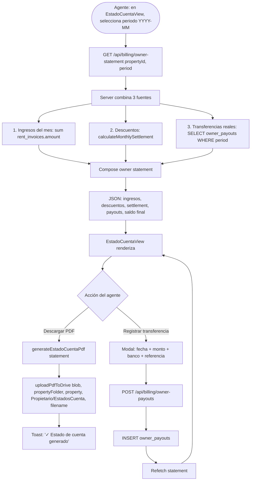
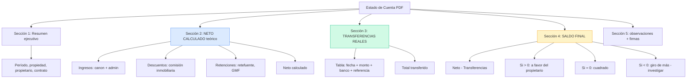
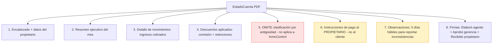
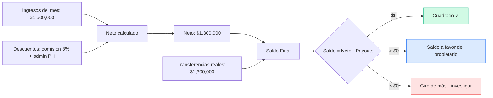
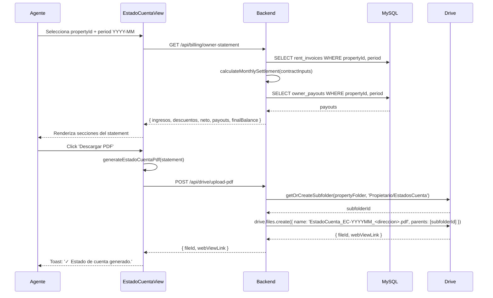
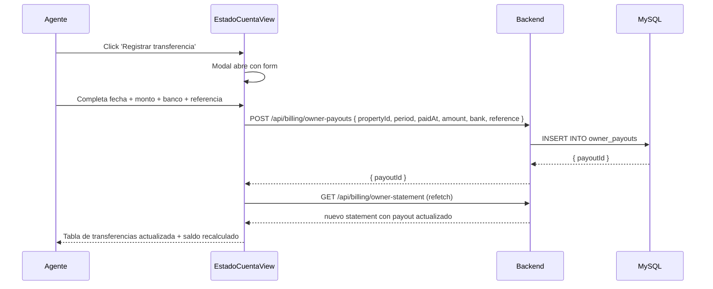

# PROCESO: BILL-OWNER — Estado de Cuenta Mensual al Propietario

> Workflow agentico narrativo del proceso de **estado de cuenta mensual**
> que InmoControl genera al propietario. Cubre el cálculo del **neto
> calculado** (canon - comisión - admin - retenciones) + **transferencias
> reales** registradas por el agente + **saldo final** (a favor del
> propietario, cuadrado, o giro de más). El PDF replica el formato
> `modelo-estado-de-cuenta.pdf` adaptado a InmoControl.
>
> Es el **espejo** del `BILL-INVOICE` desde la perspectiva del
> propietario. Lo desbloquea la trazabilidad del flujo de caja.

## 0. Metadata

| Campo | Valor |
|---|---|
| **Código** | `BILL-OWNER` |
| **Nombre legible** | Estado de Cuenta Mensual al Propietario |
| **Dominio** | `billing` |
| **Owners** | Frontend: `src/features/billing/views/EstadoCuentaView.tsx` (reemplaza `AccountStatementView`) + `estadoCuentaPdf.ts` · Backend: `server/routes/billing.ts` (endpoint `/api/billing/owner-statement`) |
| **Status** | ⏳ draft (workflow) / ✅ shipped (Fase 10 ✅) |
| **Última revisión** | 2026-08-03 |
| **Procesos upstream** | `BILL-INVOICE` (CC generadas y enviadas), `BILL-PAY` (pagos registrados) |
| **Procesos downstream** | — (terminal, no desbloquea nada nuevo; reporte para el propietario) |

## 0.5. Diagramas

### Flujo principal (generar estado de cuenta)



### Doble componente del documento



### Estructura del PDF (8 secciones adaptadas)



### Cálculo del saldo final



### Secuencia de generación + subida



### Registro de transferencia real



## 1. Actores

- **Agente inmobiliario** — Genera el estado de cuenta. Registra las transferencias reales al propietario.
- **Propietario** — Receptor del estado de cuenta. Tiene 5 días hábiles para reportar inconsistencias.
- **Gerencia** — Aprueba el estado de cuenta (firma "Aprobó").
- **Sistema (InmoControl backend)** — `GET /api/billing/owner-statement`, `POST /api/billing/owner-payouts`. Schema `owner_payouts` (migración 005).
- **Sistema (InmoControl frontend)** — `EstadoCuentaView.tsx` (reemplaza `AccountStatementView`), `estadoCuentaPdf.ts`.
- **Google Drive** — Recibe el PDF en `Propietario/EstadosCuenta/` (subcarpeta creada on-demand) de la propiedad.
- **MySQL** — Tablas `rent_invoices`, `owner_payouts`, `payments`, `contracts`.

## 2. Contexto inicial

- **Cuándo se dispara**: el agente abre el Detalle de una propiedad `Arrendado` y va al tab "Estado de cuenta".
- **UI entry point**: `src/features/properties/PropertiesView.tsx` → tab Estado de Cuenta → `EstadoCuentaView`.
- **Precondiciones**:
  - La propiedad está `Arrendado` con contrato activo.
  - Hay al menos 1 mes con `rent_invoices` para mostrar.

## 3. Flujo principal (happy path)

### Paso 1 — Cargar el statement

`GET /api/billing/owner-statement?propertyId=...&period=YYYY-MM`. El
server combina 3 fuentes:

1. **Ingresos del mes** = `SUM(rent_invoices.amount) WHERE propertyId, period`.
2. **Descuentos** = `calculateMonthlySettlement(contractInputs)` con canon, admin, comisión%.
3. **Transferencias reales** = `SELECT * FROM owner_payouts WHERE propertyId, period`.

Devuelve:
```typescript
interface OwnerStatement {
  period: string;             // 'YYYY-MM'
  propertyId: string;
  propertyAddress: string;
  ownerName: string;
  ownerIdNumber: string;
  contract: { rentAmount, adminFee, commissionPct };
  ingresos: number;
  descuentos: {
    comision: number;
    retefuente: number;       // pendiente Fase 4
    gmf: number;              // ✅ implementado
    admin: number;
  };
  netoCalculado: number;
  transferencias: Array<{
    id: string;
    paidAt: string;
    amount: number;
    bank: string;
    reference: string;
    notes?: string;
  }>;
  totalTransferido: number;
  saldoFinal: number;         // netoCalculado - totalTransferido
  observaciones?: string;
}
```

### Paso 2 — Renderizar UI

`EstadoCuentaView` muestra las 4 secciones:

1. **Resumen ejecutivo** (período + propiedad + propietario + neto + saldo).
2. **Neto calculado** (teórico): tabla con ingresos, descuentos, neto.
4. **Transferencias reales**: tabla con cada payout.
5. **Saldo final**: neto - transferencias, con interpretación.

### Paso 3 — Generar PDF + subir a Drive

Click "Descargar PDF":

1. `generateEstadoCuentaPdf(statement)` produce el PDF (8 secciones adaptadas).
2. `uploadPdfToDrive(blob, propertyFolderId, 'property', 'Propietario/EstadosCuenta', 'EstadoCuenta_EC-YYYYMM_<direccion>.pdf')`.
3. Toast: "✓ Estado de cuenta generado. PDF en Drive."

### Paso 4 — Registrar transferencia (CRUD de payouts)

Click "Registrar transferencia":

1. Modal abre con form: fecha, monto, banco, referencia.
3. `POST /api/billing/owner-payouts`.
4. Server `INSERT INTO owner_payouts`.
5. Refetch del statement → tabla + saldo recalculados.

### Paso 5 — Verificación del propietario

El propietario revisa el estado de cuenta y tiene 5 días hábiles
para reportar inconsistencias (es la nota del PDF, sección 7).

## 4. Edge cases

### EC-1 — Sin ingresos en el mes (period sin CC)

- **Trigger**: el periodo no tiene CC generada (ej: primer mes del contrato, sin facturar).
- **Comportamiento**: el statement muestra ingresos=$0, neto=$0 (o negativo si hay admin), saldo=0 (o a favor del propietario).
- **UI**: el statement se puede generar igual. El agente decide si enviar o no.

### EC-2 — Sin transferencias registradas

- **Trigger**: el agente aún no giró al propietario.
- **Comportamiento**: el statement muestra transferencias=[], totalTransferido=0.
  Saldo = neto (todo a favor del propietario).

### EC-3 — Saldo negativo (giro de más)

- **Trigger**: el agente giró más de lo que el neto indicaba.
- **Comportamiento**: el PDF marca el saldo en rojo con nota "⚠ Giro de más - investigar".
- **Mitigación**: el agente debe registrar un pago de devolución del propietario (futuro, ver §12).

### EC-4 — Comisión % cambiada mid-contract

- **Trigger**: el agente modificó `contract.commissionPct` después de generar algunos pagos.
- **Comportamiento actual**: el statement usa el valor actual del contrato.
  Los meses anteriores mantienen el histórico (si se cambió el contrato).
- **Mejora futura**: snapshot del `commissionPct` en cada `payments` (TODO).

### EC-5 — Sin propietario cargado

- **Trigger**: la propiedad no tiene `owner_name`.
- **Comportamiento**: server devuelve `400 { error: 'Propiedad sin propietario cargado' }`.

### EC-6 — Período fuera del rango del contrato

- **Trigger**: el agente pide un statement de un periodo anterior al `startDate` del contrato o posterior al `endDate`.
- **Comportamiento**: el statement muestra $0 (sin ingresos). NO es error.

### EC-7 — Sin `commissionPct` en el contrato

- **Trigger**: contrato legacy sin comisión (default 8%).
- **Comportamiento**: server usa `?? 8` como fallback. Ver `fix-bug-002-commission-percentage.md`.

### EC-8 — Múltiples transferencias el mismo día

- **Trigger**: el agente hace 2 pagos parciales al propietario el mismo día.
- **Comportamiento**: 2 filas en `owner_payouts`. Suma correcta.

### EC-9 — Transferencia con monto 0 o negativo

- **Trigger**: error humano.
- **Comportamiento**: validación cliente + server. Toast: "El monto debe ser mayor a 0."

### EC-10 — Banco no seleccionado

- **Trigger**: el agente no llena el campo bank.
- **Comportamiento**: el form requiere banco. Si no hay, default 'Bancolombia' (TODO).

### EC-11 — Statement de periodo futuro

- **Trigger**: el agente pide statement de un mes que aún no llega.
- **Comportamiento**: el statement muestra $0 (sin ingresos aún).

### EC-12 — Drive caído al subir PDF

- **Trigger**: `DRIVE-FALLBACK-001`.
- **Comportamiento**: el statement se genera igual. El PDF queda local.
  Toast: "Estado de cuenta generado. PDF no se pudo subir a Drive."

### EC-13 — Sin pagos registrados (BILL-PAY no se ejecutó)

- **Trigger**: el inquilino no paga, el agente tampoco genera el statement.
- **Comportamiento**: el statement muestra ingresos=$0, neto=$0, transferencias=$0.

### EC-14 — Multi-propiedad del mismo propietario

- **Trigger**: el propietario tiene 5 propiedades en InmoControl.
- **Comportamiento**: cada statement es per-property. NO se consolidan
  en un solo PDF multi-propiedad (futuro, ver §12).

### EC-15 — Período inválido (formato)

- **Trigger**: el agente pone "2026-13" o "agosto".
- **Comportamiento**: validación cliente (formato YYYY-MM). Server también
  valida. Toast: "Formato debe ser YYYY-MM."

## 5. Estado que muta

### Tablas MySQL afectadas

| Tabla | Operación | Columnas tocadas |
|---|---|---|
| `owner_payouts` | INSERT / DELETE | `id`, `property_id`, `period`, `paid_at`, `amount`, `bank`, `reference`, `notes`, `created_at` |
| `property_actions` | INSERT | `property_id`, `action_type='owner_statement_generated'\|'owner_payout_registered'` |

### Archivos en Drive creados

| Carpeta destino | Trigger | Convención de nombre |
|---|---|---|
| `Mi unidad / InmoControl/{dirección}/Propietario/EstadosCuenta/EstadoCuenta_EC-YYYYMM_<direccion>.pdf` | generar PDF + subir | Fija |

### Stores Zustand actualizados

| Store | Acción | Selectores afectados |
|---|---|---|
| `appStore` | `addOwnerPayout(...)` | `selectOwnerPayoutsByProperty` |

## 6. Contratos cross-cutting

- **Tostadas**: ver `TOAST-001` + tabla §7 abajo.
- **JSON errors**: ver `JSON-001`. Especialmente errores de cálculo.
- **Timeouts**: ver `TIMEOUT-001`. Cliente 15s para queries.
- **Drive fallback**: ver `DRIVE-FALLBACK-001`. PDF queda local.
- **Idempotencia**: ver `IDEMPOTENT-001`. Statement es read-only (GET). Solo `owner_payouts` INSERT.
- **Auth**: ver `SECURITY-001`. `requireAuth` en endpoints.

## 7. Tostadas exactas (copy approved)

| Trigger | Tipo | Copy exacto |
|---|---|---|
| Generar PDF OK (Drive OK) | success | "✓ Estado de cuenta generado. PDF en Drive." |
| Generar PDF OK (Drive fail) | warning | "Estado de cuenta generado. PDF no se pudo subir a Drive (no disponible)." |
| Registrar transferencia OK | success | "✓ Transferencia registrada" |
| Saldo negativo (giro de más) | warning | "⚠ Saldo negativo. El giro fue mayor al neto. Investigá." |
| Sin propietario cargado | error | "La propiedad no tiene propietario cargado." |
| Período inválido | error | "Formato debe ser YYYY-MM." |

## 8. Anti-patrones explícitos

- ❌ **Asumir que el neto calculado es lo que se transfirió** → son 2
  cosas distintas. El PDF muestra ambos lados.
- ❌ **Modificar el contrato retroactivamente** → no se regeneran los
  statements. Cada estado es histórico.
- ❌ **Permitir transferencias sin monto > 0** → validación cliente + server.
- ❌ **Cerrar el modal antes del POST** → Karpathy.
- ❌ **Persistir blob URL a MySQL** → defensa contra zombie.
- ❌ **Generar statement sin contrato activo** → caso edge, no error.
- ❌ **Asumir que el propietario recibirá el PDF automáticamente** →
  el agente debe enviarlo (futuro: integración con email).

## 9. Especificaciones técnicas relacionadas

- `docs/specs/wizard_billing.md` — Spec del billing.
- `docs/specs/fix-bug-002-commission-percentage.md` — `commission_pct` (NO `commission_percentage`).
- `docs/specs/fix-bug-024-drive-service-timeouts.md` — Timeouts.
- `docs/specs/fix-issue-36-amortization-contract-fk-validation.md` — FK validation.
- `db/mysql/migrations/005_owner_payouts.sql` — Schema de payouts.
- `tests/verifiers/wizard_billing.md` — Verifier E2E.

## 10. Endpoints backend utilizados

| Método | Path | Archivo | Notas |
|---|---|---|---|
| `GET` | `/api/billing/owner-statement` | `server/routes/billing.ts` | Devuelve el statement consolidado. |
| `POST` | `/api/billing/owner-payouts` | idem | Registra transferencia real. |
| `GET` | `/api/billing/owner-payouts` | idem | Lista payouts por property/period. |
| `DELETE` | `/api/billing/owner-payouts/:id` | idem | Elimina payout (trazabilidad: NO recomendado). |
| `POST` | `/api/drive/upload-pdf` | `server/routes/googleAuth.ts` | Sube PDF a `Propietario/EstadosCuenta/`. |

## 11. Riesgos identificados

| Riesgo | Probabilidad | Impacto | Mitigación |
|---|---|---|---|
| Comisión % cambiada retroactivamente | Media | Media | Snapshot por pago (TODO) |
| Saldo negativo silencioso | Media | Alta | Toast warning + nota en PDF |
| Sin auditoría de payouts eliminados | Alta | Alta | Soft delete en `owner_payouts` (TODO) |
| PDF no enviado al propietario | Alta | Media | Integración con `NOTIFY` email al propietario (TODO) |
| Multi-propiedad no consolidada | Alta | Baja | Statement multi-propiedad (futuro) |
| Retefuente no implementada | Alta | Alta | Fase 4 (TODO prioritario) |

## 12. Out of scope explícito

- ❌ **Retefuente** — pendiente Fase 4 del proyecto (cálculo de
  retenciones colombianas).
- ❌ **Snapshot de `commissionPct` por pago** — hoy usa valor actual.
- ❌ **Statement multi-propiedad** — solo per-property.
- ❌ **Envío automático al propietario** — el agente debe descargar y enviar.
- ❌ **Reversión de giro de más** — sin flujo de devolución.
- ❌ **Soft delete en `owner_payouts`** — hoy DELETE físico (no recomendado).

## 13. Approval

**Status:** ⏳ Pending Review
**Aprobado por:** —
**Fecha de aprobación:** —

> Spec base: `docs/specs/wizard_billing.md` + AGENTS.md sección
> "Estado de cuenta del propietario (BillingPanel → EstadoCuentaView)".
> Este workflow es la versión "proceso dedicado" del estado de cuenta,
> con énfasis en: el **doble componente** (neto calculado vs transferencias
> reales), las **8 secciones del PDF** (omitiendo la #5 de antigüedad y
> adaptando la #6 al propietario), la integración con `calculateMonthlySettlement`
> + `owner_payouts`, y el **saldo final** con sus 3 interpretaciones.

---

> **Recordatorio Karpathy**: una vez aprobado, las features nuevas dentro
> de este proceso (ej: "retefuente", "statement multi-propiedad")
> siguen el flujo spec → verifier → implementación. Este workflow NO se
> modifica para hacer pasar checks.