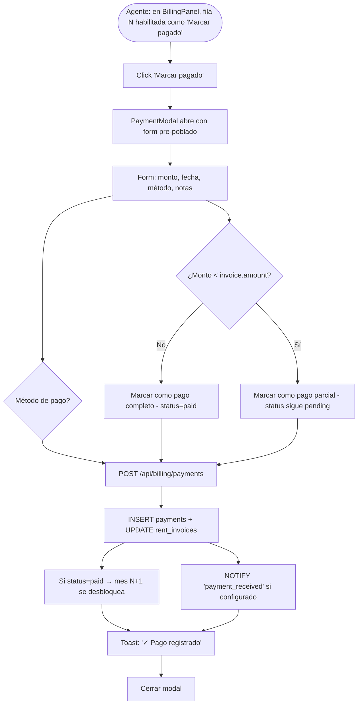
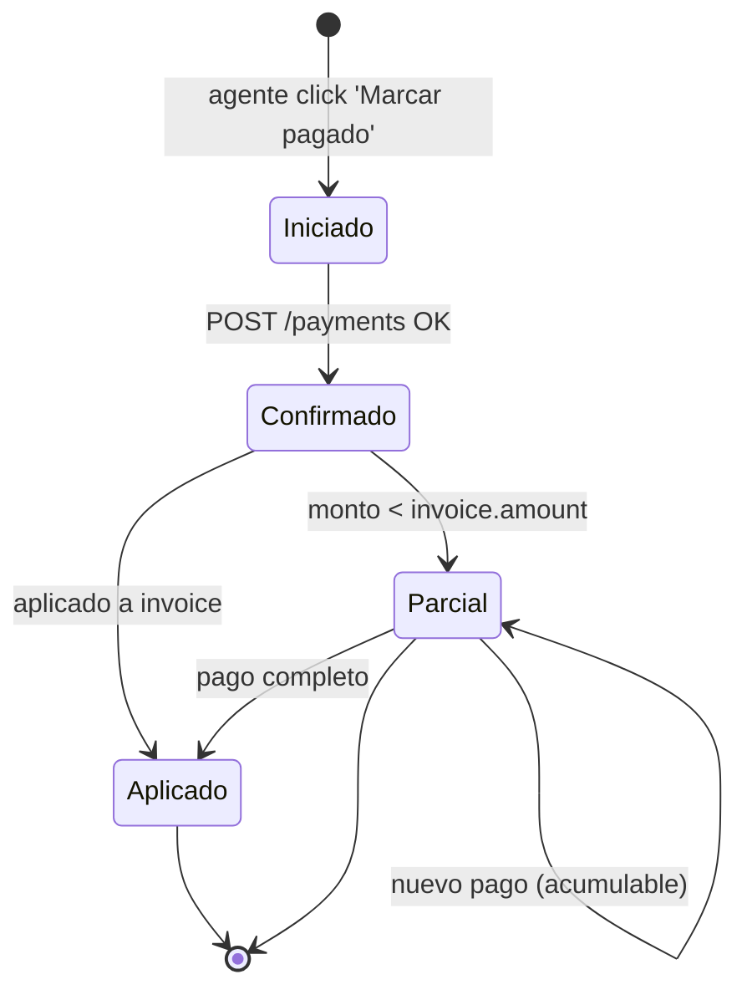
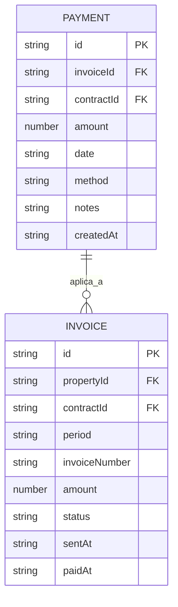
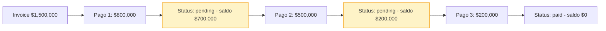

# PROCESO: BILL-PAY — Cobranza y Registro de Pagos

> Workflow agentico narrativo del sub-proceso de **cobranza y registro
> de pagos** del inquilino en InmoControl. Cubre la acción de "Marcar
> pagado" desde `BILL-INVOICE`, el registro de pagos parciales, los
> ajustes manuales (descuentos, intereses, notas), y la consulta de
> balance por contrato.
>
> Es el **cierre del ciclo mensual** de una cuenta de cobro. Sin pago
> registrado, no hay flujo de caja y el propietario no recibe el
> estado de cuenta correcto (ver `BILL-OWNER`).

## 0. Metadata

| Campo | Valor |
|---|---|
| **Código** | `BILL-PAY` |
| **Nombre legible** | Cobranza y Registro de Pagos |
| **Dominio** | `billing` |
| **Owners** | Frontend: `src/features/billing/views/BillingPanel.tsx` + `components/PaymentModal.tsx` · Backend: `server/routes/billing.ts` (endpoint `/api/billing/payments`) |
| **Status** | ⏳ draft (workflow) / ✅ shipped (implementación, Fase 9 ✅) |
| **Última revisión** | 2026-08-03 |
| **Procesos upstream** | `BILL-INVOICE` (CC generada y enviada, requiere pago) |
| **Procesos downstream** | `BILL-OWNER` (consolida pagos en estado de cuenta del propietario), `NOTIFY` (`payment_received` configurable) |

## 0.5. Diagramas

### Flujo principal (Marcar pagado + registrar pagos parciales)

### Estados de un pago (ciclo de vida)

### Estructura del pago

### Pago parcial (acumulación)

## 1. Actores

- **Agente inmobiliario** — Marca los pagos desde `BillingPanel`. Puede hacer pagos parciales.
- **Inquilino** — Paga al agente (transferencia, efectivo) o directamente al banco del propietario.
- **Propietario** — Receptor indirecto (recibe el neto después de comisión, ver `BILL-OWNER`).
- **Sistema (InmoControl backend)** — `POST /api/billing/payments`. Schema `payments`, updates `rent_invoices.status` y `amortization_rows.status`.
- **Sistema (InmoControl frontend)** — `PaymentModal.tsx`.

## 2. Contexto inicial

- **Cuándo se dispara**: el agente abre el BillingPanel de una propiedad `Arrendado` y la fila de un mes está habilitada como "Marcar pagado" (ya sea `sent` o `pending`).
- **UI entry point**: `BillingPanel.tsx` → `AmortizationTable.tsx` → botón "Marcar pagado" → `PaymentModal`.
- **Precondiciones**:
  - La fila de amortización existe (`amortization_rows`).
  - Hay un invoice asociado (`rent_invoices`).

## 3. Flujo principal (happy path)

### Paso 1 — Abrir PaymentModal

El modal abre con auto-fill:
- **Monto** (default = invoice.amount).
- **Fecha** (default = hoy).
- **Método** (default = 'transferencia').
- **Notas** (vacío).

### Paso 2 — Validar form

Click "Registrar pago" valida:
- `amount > 0`.
- `date <= hoy` (no se permiten pagos futuros).
- `method` no vacío.

### Paso 3 — POST /api/billing/payments

`{ invoiceId, amount, date, method, notes }`.

Server:
1. `markInvoicePaid(invoiceId, payment)`:
   - Si NO existe `rent_invoices` (caso edge): crea con `status='paid'`, `sent_at=NULL`.
   - Si existe: UPDATE `status='paid'` si `amount >= invoice.amount`. Si parcial: UPDATE `status='pending'`, `paid_at=NULL`.
2. INSERT en `payments`.

### Paso 4 — Desbloquear mes siguiente

Si el pago es completo, el mes N+1 se desbloquea automáticamente. La UI
re-renderiza la tabla con el nuevo estado.

### Paso 5 — Toast + cerrar modal

Toast: "✓ Pago registrado. Mes siguiente desbloqueado." (o "Pago
parcial registrado. Saldo: $X" si parcial).

## 4. Edge cases

### EC-1 — Pago parcial

- **Trigger**: el inquilino paga menos del total.
- **Comportamiento**: status queda en `pending`. Saldo = `invoice.amount - sum(payments)`.
- **Mitigación**: la UI muestra saldo pendiente.

### EC-2 — Pago con monto > invoice.amount

- **Trigger**: error humano.
- **Comportamiento**: el server acepta el pago y registra el excedente como
  saldo a favor del inquilino (o ignora el excedente según decisión de
  negocio, ver §12).

### EC-3 — Pago sin invoice previo

- **Trigger**: caso edge — el agente marca como pagado sin haber enviado CC antes.
- **Comportamiento**: server crea `rent_invoices` con `status='paid'`, `sent_at=NULL`.
- **Ver**: AGENTS.md "Renombrado a markInvoicePaid".

### EC-4 — Pago duplicado

- **Trigger**: doble click en "Registrar pago".
- **Comportamiento**: el botón se deshabilita durante el POST. Si por algún
  motivo se dispara 2 veces, server acepta ambos (2 filas en `payments`).

### EC-5 — Editar un pago ya registrado

- **Trigger**: el agente quiere corregir el monto o método.
- **Comportamiento actual**: NO permitido por la UI. El pago es
  inmutable (trazabilidad). Para corregir, hay que "anular" y registrar
  uno nuevo (TODO).

### EC-6 — Eliminar un pago

- **Trigger**: el agente borra un pago por error.
- **Comportamiento actual**: NO permitido. Soft delete futuro (TODO).

### EC-7 — Mora + pago parcial

- **Trigger**: el inquilino debe 3 meses, paga 1 mes parcial.
- **Comportamiento**: la mora sigue activa para los 2 meses impagos.
  El pago parcial se aplica al mes más antiguo (FIFO).

### EC-8 — Mora + pago completo

- **Trigger**: el inquilino paga los 3 meses de una.
- **Comportamiento**: 3 filas en `payments`. Las 3 filas de `amortization_rows`
  pasan a `paid`.

### EC-9 — Pago en moneda extranjera

- **Trigger**: error.
- **Comportamiento**: solo COP. Validación cliente.

### EC-10 — Fecha de pago futura

- **Trigger**: error.
- **Comportamiento**: validación cliente. Toast: "La fecha no puede ser futura."

### EC-11 — Pago sin método

- **Trigger**: error.
- **Comportamiento**: validación cliente. Default 'transferencia'.

### EC-12 — Mora sigue aunque se pague

- **Trigger**: el inquilino paga tarde pero paga.
- **Comportamiento**: el pago se registra normalmente. La "mora" como
  flag desaparece (status='paid'). Pero los días de mora quedan en
  `payments.notes` o como log.

### EC-13 — Pago en USD convertido

- **Trigger**: el inquilino paga en USD (raro en Colombia).
- **Comportamiento**: NO soportado.

### EC-14 — Cash vs transferencia

- **Trigger**: el método es 'efectivo'.
- **Comportamiento**: el server acepta. El log de `payment` indica 'efectivo'.

### EC-15 — Multi-propiedad del mismo inquilino

- **Trigger**: el inquilino tiene 2 contratos activos.
- **Comportamiento**: cada propiedad tiene su propio set de `payments`. No se mezclan.

## 5. Estado que muta

### Tablas MySQL afectadas

| Tabla | Operación | Columnas tocadas |
|---|---|---|
| `payments` | INSERT | `id`, `invoice_id`, `contract_id`, `amount`, `date`, `method`, `notes`, `created_at` |
| `rent_invoices` | UPDATE | `status`, `paid_at` |
| `amortization_rows` | UPDATE (cuando status='paid' del invoice) | `status`, `paid_at` |
| `property_actions` | INSERT | `property_id`, `action_type='payment_received'`, `details` |

### Archivos en Drive creados

| — | — | — |
|---|---|---|
| (ninguno) | (ninguno) | (ninguno, los pagos no generan PDF) |

### Stores Zustand actualizados

| Store | Acción | Selectores afectados |
|---|---|---|
| `appStore` | `addPayment(...)`, `updateInvoice(...)`, `updateAmortizationRow(...)` | `selectPaymentsByContract`, `selectInvoiceByPeriod` |

## 6. Contratos cross-cutting

- **Tostadas**: ver `TOAST-001` + tabla §7 abajo. Reutiliza las de billing.
- **JSON errors**: ver `JSON-001`. Especialmente `400` si monto ≤ 0.
- **Timeouts**: ver `TIMEOUT-001`. Cliente 15s para queries.
- **Idempotencia**: ver `IDEMPOTENT-001`. Pago NO es idempotente (cada POST registra un pago distinto).
- **Auth**: ver `SECURITY-001`. `requireAuth` en `/api/billing/payments`.

## 7. Tostadas exactas (copy approved)

| Trigger | Tipo | Copy exacto |
|---|---|---|
| Pago completo OK | success | "✓ Pago registrado. Mes siguiente desbloqueado." |
| Pago parcial OK | warning | "Pago parcial registrado. Saldo: ${saldo}." |
| Pago error | error | "Error registrando pago: {error}" |
| PaymentModal cierra sin éxito | (modal abierto, no toast) | n/a |
| Pago duplicado (doble click) | (segundo click no hace nada) | n/a |

## 8. Anti-patrones explícitos

- ❌ **Cerrar el PaymentModal antes del POST** → BUG-003. Karpathy.
- ❌ **Permitir pagos con monto ≤ 0** → validación cliente + server.
- ❌ **Borrar físicamente un pago** → trazabilidad legal.
- ❌ **Permitir pagos sin método** → validación cliente.
- ❌ **Asumir que el pago se aplicó al invoice correcto** → FK validation.

## 9. Especificaciones técnicas relacionadas

- `docs/specs/wizard_billing.md` — Spec del billing.
- `docs/specs/fix-bug-003-payment-modal.md` — PaymentModal no se cierra si falla.
- `docs/specs/fix-bug-008-mark-invoice-paid-transaction.md` — markInvoicePaid.

## 10. Endpoints backend utilizados

| Método | Path | Archivo | Notas |
|---|---|---|---|
| `POST` | `/api/billing/payments` | `server/routes/billing.ts` | Registra pago + actualiza invoice. |
| `GET` | `/api/billing/payments?contractId=...` | idem | Lista pagos. |

## 11. Riesgos identificados

| Riesgo | Probabilidad | Impacto | Mitigación |
|---|---|---|---|
| Pago duplicado | Media | Baja | Doble POST prevention (idempotencia parcial) |
| Editar/borrar pago | Alta | Media | Soft delete futuro (TODO) |
| Mora silenciosa post-pago | Baja | Baja | Log de días de mora |

## 12. Out of scope explícito

- ❌ **Editar/borrar pagos** — son inmutables.
- ❌ **Multi-moneda** — solo COP.
- ❌ **Pagos parciales con saldo a favor** — el excedente se ignora.
- ❌ **Pagos programados** (Nequi, PSE) — manual.
- ❌ **Cash management** — no se trackea caja chica.

## 13. Approval

<Status> ⏳ Pending Review </Status>

> Spec base: `docs/specs/wizard_billing.md` (aprobado).
> Este workflow es la versión "proceso dedicado" del sub-flujo de
> cobranza, con énfasis en: la inmutabilidad de los pagos (trazabilidad
> legal), el manejo de pagos parciales con saldo, y la integración con
> `BILL-OWNER` para consolidar en el estado de cuenta del propietario.

---

> **Recordatorio Karpathy**: una vez aprobado, las features nuevas dentro
> de este proceso (ej: "editar pagos", "soft delete") siguen el flujo
> spec → verifier → implementación. Este workflow NO se modifica para
> hacer pasar checks.