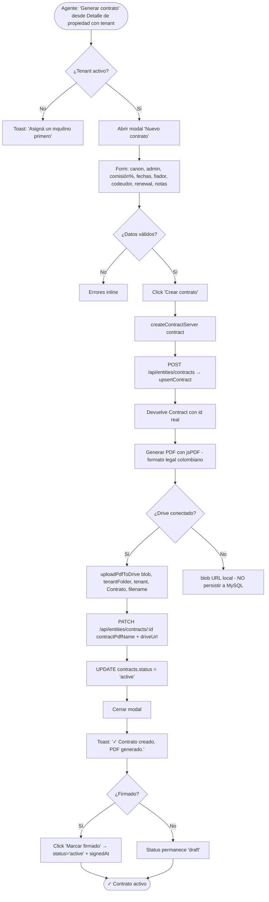
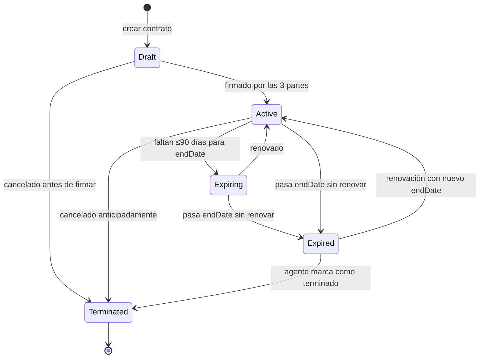
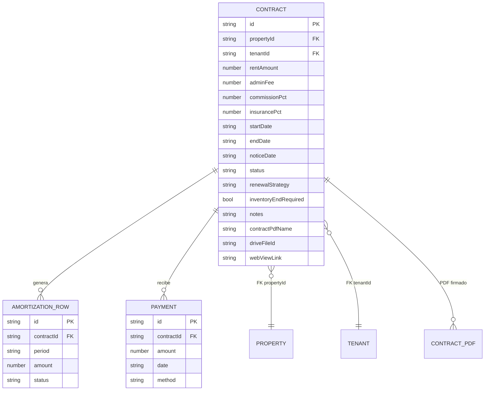
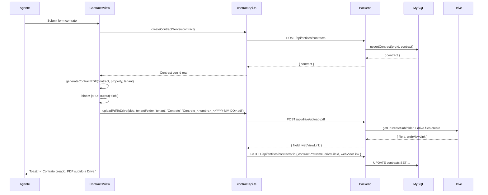
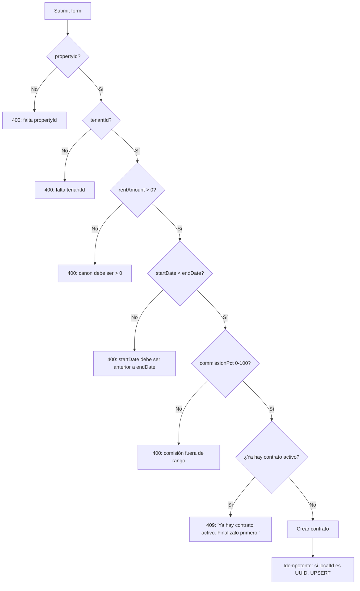

# PROCESO: CONTRACT-GEN — Generación de Contrato de Arrendamiento

> Workflow agentico narrativo del proceso de **generar el Contrato de
> Arrendamiento** entre propietario, inquilino e inmobiliaria en
> InmoControl. Crea el registro del contrato en MySQL (con FK a
> `properties` y `tenants`), permite definir cláusulas (canon, admin,
> comisión, fechas, fiador, codeudor, renewal), genera el PDF con
> formato legal colombiano, y lo sube a la carpeta `Contrato/` del
> inquilino en Drive.
>
> Es el **vínculo legal** que materializa la relación comercial. Sin
> contrato activo, no hay cuenta de cobro mensual. Sin contrato firmado,
> no se puede hacer Acta de Entrega ni Inventario de Colocación.

## 0. Metadata

| Campo | Valor |
|---|---|
| **Código** | `CONTRACT-GEN` |
| **Nombre legible** | Generación de Contrato de Arrendamiento |
| **Dominio** | `contracts` |
| **Owners** | Frontend: `src/features/contracts/ContractsView.tsx` + `contractApi.ts` + `contractTypes.ts` · Backend: `server/routes/entities.ts` (rutas `/contracts` + helper `upsertContract`) |
| **Status** | ⏳ draft (workflow) / ✅ shipped (implementación, en prod desde jul-2026) |
| **Última revisión** | 2026-08-03 |
| **Procesos upstream** | `PROP-CAPT` (propiedad `Activo`), `TENANT-ONB` (inquilino asignado, propiedad `En Colocación`) |
| **Procesos downstream** | `INV-COLOC` (requiere contrato activo), `ACTA-ENTREGA` (al iniciar contrato), `BILL-INVOICE` (mensual, requiere contrato activo), `BILL-PAY` (registra pagos contra el contrato) |

## 0.5. Diagramas

### Flujo principal (crear contrato + generar PDF + subir a Drive)

### Estados del contrato (ciclo de vida)

### Estructura de la fila del contrato

### Subida del PDF a Drive (Contrato/)

### Validaciones del form

## 1. Actores

- **Agente inmobiliario** — Crea el contrato desde el Detalle del Inmueble (cuando hay tenant) o desde `ContractsView`. Define cláusulas, fechas, fiador.
- **Propietario** — Firma el contrato (firma física, digital o DocuSign — fuera de scope de InmoControl). Su firma queda registrada como `signedAt` en el contrato.
- **Inquilino** — Firma el contrato. Su firma queda registrada.
- **Inmobiliaria** — Firmante como intermediaria (el agente en representación).
- **Sistema (InmoControl backend)** — `POST /api/entities/contracts`, `PATCH /api/entities/contracts/:id`, `GET /api/entities/contracts`. Schema `contracts` (snake_case en DB).
- **Sistema (InmoControl frontend)** — `ContractsView.tsx`, `contractApi.ts` (con mapper snake ↔ camel), `contractTypes.ts`.
- **Google Drive** — Recibe el PDF firmado en `{nombre} ({cédula})/Contrato/`.
- **MySQL** — Tabla `contracts` con FK a `properties` y `tenants`.

## 2. Contexto inicial

- **Cuándo se dispara**: el agente abre el Detalle de una propiedad `En Colocación` (con tenant activo) y hace click en "Generar contrato".
- **UI entry points**:
  - `src/features/properties/PropertiesView.tsx` → tab Contratos → botón "Nuevo contrato".
  - `src/features/contracts/ContractsView.tsx` → listado de contratos → "Nuevo".
- **Precondiciones**:
  - La propiedad existe en MySQL con `status` ∈ {`En Colocación`, `Arrendado`}.
  - Hay un tenant activo en esa propiedad.
  - NO hay otro contrato activo en esa propiedad.

## 3. Flujo principal (happy path)

### Paso 1 — Abrir modal "Nuevo contrato"

El agente abre el modal. Ve el form con campos:

- **Propiedad** (auto-poblada, no editable)
- **Inquilino** (auto-poblado del tenant activo, no editable)
- **Canon mensual (COP)** (requerido, > 0)
- **Administración PH mensual (COP)** (opcional, default 0)
- **Comisión %** (default 8%, editable)
- **Seguro %** (default 0.5%, editable)
- **Fecha de inicio** (default = hoy, editable)
- **Fecha de fin** (default = hoy + 12 meses, editable)
- **Preaviso (días antes del fin)** (default 90)
- **Renovación** (auto / manual / none, default manual)
- **Inventario final requerido al terminar** (checkbox, default true)
- **Fiador** (opcional: nombre, cédula, contacto)
- **Codeudor** (opcional: nombre, cédula, contacto)
- **Notas / cláusulas especiales** (texto libre)

### Paso 2 — Validar form

Click "Crear contrato":

1. `propertyId`, `tenantId`, `rentAmount`, `startDate`, `endDate` requeridos.
2. `startDate < endDate` (validación server).
3. `commissionPct` entre 0 y 100.
4. NO hay otro contrato activo en la misma propiedad (constraint 1:1).
5. `rentAmount > 0`.

### Paso 3 — Crear fila en MySQL

`POST /api/entities/contracts` con el body. El server:

1. `ensureDefaultOrg(orgId)` (helper).
2. `upsertContract(orgId, c)`:
   - Si `c.id` viene (cliente lo generó con `crypto.randomUUID()`): INSERT con ON DUPLICATE KEY UPDATE (idempotente).
   - Si no: INSERT con id nuevo generado por server.
3. SELECT el contrato y devolverlo.

### Paso 4 — Generar PDF

`generateContractPDF(contract, property, tenant)` produce un PDF con:

- Encabezado: "Contrato de Arrendamiento de Vivienda Urbana" + logo InmoControl.
- Datos de las partes: propietario (de `property.owners`), inquilino (de `tenant`), inmobiliaria (InmoControl).
- Cláusulas estándar colombianas (12 cláusulas base):
  1. Objeto del contrato.
  2. Canon mensual + administración.
  3. Fecha de pago (5 primeros días del mes).
  4. Duración (start → end).
  5. Renovación.
  6. Preaviso (90 días).
  7. Inventario (al inicio y al final).
  8. Servicios públicos (responsabilidad del inquilino).
  9. Mantenimiento.
  10. Restricciones (no comercial, no mascotas sin acuerdo, etc.).
  11. Terminación anticipada (cláusula penal).
  12. Jurisdicción (tribunales de {ciudad}).
- Datos del fiador / codeudor (si hay).
- Sección de firmas (3 espacios: propietario, inquilino, inmobiliaria).
- Notas / cláusulas especiales (si hay).

### Paso 5 — Subir PDF a Drive

Si Drive está conectado:

1. `uploadPdfToDrive(blob, tenantDriveFolderId, 'tenant', 'Contrato', 'Contrato_<inquilino>_<YYYY-MM-DD>.pdf')`.
2. Si OK: `PATCH /api/entities/contracts/:id` con `{ contractPdfName, driveFileId, webViewLink }`.
3. Si fail: blob URL local (NO persistir a MySQL).

### Paso 6 — Marcar como activo (cuando se firma)

El agente (o el sistema cuando recibe la firma) hace:

`PATCH /api/entities/contracts/:id` con `{ status: 'active', signedAt: 'YYYY-MM-DD' }`.

Esto desbloquea `BILL-INVOICE` (la primera cuenta de cobro se genera
cuando el contrato está activo).

## 4. Edge cases

### EC-1 — Ya hay contrato activo en la misma propiedad

- **Trigger**: el agente intenta crear otro contrato sin finalizar el
  anterior.
- **Comportamiento**: server devuelve `409 { error: 'Ya hay contrato
  activo en esta propiedad. Finalizalo primero.' }`.
- **Constraint**: hard en DB (UNIQUE en `(property_id, status='active')`).

### EC-2 — Canon = 0 o negativo

- **Trigger**: error humano.
- **Comportamiento**: validación cliente + server. 400 con mensaje claro.

### EC-3 — startDate > endDate

- **Trigger**: error humano o confusión con la UI.
- **Comportamiento**: 400 con mensaje claro. UI muestra hint "La fecha
  de fin debe ser posterior a la fecha de inicio".

### EC-4 — Comisión fuera de rango

- **Trigger**: el agente pone 150% o -5%.
- **Comportamiento**: 400 con mensaje. UI clampea a [0, 100].

### EC-5 — Drive caído al subir PDF

- **Trigger**: `DRIVE-FALLBACK-001`. Timeout 8s server / 30s cliente.
- **Comportamiento**: el contrato se crea en MySQL igual. El PDF queda
  como blob URL local. NO se persiste a MySQL (defensa contra zombie).
- **Toast**: "Contrato creado. PDF no se pudo subir a Drive (no
  disponible). Se subirá cuando Drive responda."
- **Mitigación**: el agente puede re-subir desde el Detalle del Contrato.

### EC-6 — Contrato creado pero PDF no generado

- **Trigger**: bug — la generación de PDF falla por datos faltantes.
- **Comportamiento**: el contrato queda en MySQL con `contractPdfName=null`.
  Toast: "Contrato creado. Error generando PDF. Reintentá."
- **Mitigación**: el agente puede regenerar el PDF desde el Detalle.

### EC-7 — Modificar un contrato activo (PATCH)

- **Trigger**: el agente quiere cambiar el canon a mitad del contrato.
- **Comportamiento actual**: se permite PATCH pero se loggea en
  `property_actions` con `action_type='contract_modified'`. **No se
  regenera el PDF automáticamente** (el contrato legal original sigue
  vigente; el cambio es administrativo).
- **Pendiente**: regenerar PDF + notificar al inquilino/propietario del
  cambio. Ver §12.

### EC-8 — Eliminar contrato con pagos/amortización

- **Trigger**: el agente clickea "Eliminar contrato".
- **Comportamiento**: server devuelve `409 { error: 'No se puede
  eliminar contrato con pagos o amortización generada. Marcalo como
  terminado en su lugar.' }`.
- **UI**: el botón "Eliminar" se reemplaza por "Terminar contrato" cuando
  hay dependencias FK. Ver `fix-bug-012-delete-contract-fk-409.md`.

### EC-9 — Terminación anticipada (cláusula penal)

- **Trigger**: el agente marca el contrato como `terminated` antes de
  `endDate`.
- **Comportamiento**: server acepta. El status pasa a `terminated`.
  Las futuras cuentas de cobro se cancelan. Los pagos ya realizados se
  mantienen (trazabilidad legal).
- **UI**: pide confirmar con texto "Confirmar terminación anticipada —
  esta acción no se puede deshacer".

### EC-10 — Renovación automática vs manual

- **Trigger**: el contrato llega a `endDate` con `renewalStrategy='auto'`.
- **Comportamiento actual**: NO se renueva automáticamente. El sistema
  genera alerta (ver `NOTIFY regla vencimiento`) y el agente renueva
  manualmente con `PATCH /contracts/:id { startDate, endDate }`.
- **Pendiente**: job automático que crea nuevo contrato basado en el
  anterior con fechas renovadas. Ver §12.

### EC-11 — Contrato sin fiador/codeudor

- **Trigger**: el agente deja fiador y codeudor vacíos.
- **Comportamiento**: server acepta. El PDF se genera sin esas secciones.

### EC-12 — Multi-tenant SaaS sin cifrado de PII

- **Trigger**: en piloto OK (single tenant). En SaaS multi-tenant,
  los datos del fiador/codeudor deberían estar cifrados.
- **Comportamiento actual**: datos en plaintext en MySQL.
- **Pendiente**: cifrado en columna. Ver §12.

### EC-13 — Propiedad cambia de tenant (rotación)

- **Trigger**: el inquilino se va. El agente asigna uno nuevo (ver
  `TENANT-ONB`).
- **Comportamiento**: el contrato del tenant anterior se marca como
  `terminated` o `expired`. El nuevo tenant requiere un nuevo contrato.
  La propiedad pasa por `Inactivo` brevemente y vuelve a `En Colocación`
  con el nuevo tenant.

### EC-14 — Currency en COP sin decimales

- **Trigger**: el canon es 1500000.5 (con decimales).
- **Comportamiento**: el form redondea a COP sin decimales (regla del
  proyecto, ver AGENTS.md). UI muestra "1.500.000".

### EC-15 — FK al regenerar amortización

- **Trigger**: el agente edita el contrato. Se regenera la amortización
  (`POST /api/billing/amortization/generate`).
- **Comportamiento**: server valida que `contractId` exista (FK check).
  Si el contrato fue eliminado, devuelve 400 con mensaje claro.
- **Ver**: `fix-bug-036-amortization-contract-fk-validation.md`.

## 5. Estado que muta

### Tablas MySQL afectadas

| Tabla | Operación | Columnas tocadas |
|---|---|---|
| `contracts` | INSERT / UPDATE | `id`, `property_id`, `tenant_id`, `rent_amount`, `admin_fee`, `commission_pct`, `insurance_pct`, `start_date`, `end_date`, `notice_date`, `status`, `renewal_strategy`, `inventory_end_required`, `notes`, `contract_pdf_name`, `drive_file_id`, `web_view_link`, `signed_at`, `created_at`, `updated_at` |
| `amortization_rows` | (read-only) FK a `contracts.id` | — |
| `payments` | (read-only) FK a `contracts.id` | — |
| `property_actions` | INSERT | `property_id`, `action_type='contract_created'\|'contract_modified'\|'contract_terminated'` |

### Archivos en Drive creados

| Carpeta destino | Trigger | Convención de nombre |
|---|---|---|
| `Mi unidad / InmoControl/{dirección}/{inquilino} ({cédula})/Contrato/Contrato_<nombre>_<YYYY-MM-DD>.pdf` | finalizar creación | Fija |

### Stores Zustand actualizados

| Store | Acción | Selectores afectados |
|---|---|---|
| `appStore` | `addContract(...)`, `updateContract(...)` | `selectContracts`, `selectContractById`, `selectContractByTenant` |

## 6. Contratos cross-cutting

- **Tostadas**: ver `TOAST-001` + tabla §7 abajo.
- **JSON errors**: ver `JSON-001`. Especialmente el `409` de "ya hay contrato activo" y "FK violation" en DELETE.
- **Timeouts**: ver `TIMEOUT-001`. Aplican: server 8s por llamada a Drive; cliente 15s para queries, 30s para uploads.
- **Drive fallback**: ver `DRIVE-FALLBACK-001`. Contrato se crea igual sin PDF en Drive.
- **Idempotencia**: ver `IDEMPOTENT-001`. `id` del cliente se respeta (UPSERT si ya existe).
- **Auth**: ver `SECURITY-001`. `requireAuth` en `/api/entities/contracts*`.

## 7. Tostadas exactas (copy approved)

| Trigger | Tipo | Copy exacto |
|---|---|---|
| Crear contrato OK (Drive OK) | success | "✓ Contrato creado. PDF subido a Drive." |
| Crear contrato OK (Drive fail) | warning | "Contrato creado. PDF no se pudo subir a Drive (no disponible). Se subirá cuando Drive responda." |
| Contrato activo duplicado | error | "Ya hay contrato activo en esta propiedad. Finalizalo primero." |
| Canon ≤ 0 | error | "El canon debe ser mayor a 0." |
| Fechas inválidas | error | "La fecha de inicio debe ser anterior a la fecha de fin." |
| Comisión fuera de rango | error | "La comisión debe estar entre 0 y 100%." |
| Marcar como firmado OK | success | "✓ Contrato marcado como firmado. Activo." |
| Terminar contrato OK | success | "Contrato terminado. No se generarán más cuentas de cobro." |
| Eliminar contrato con dependencias | error | "No se puede eliminar contrato con pagos o amortización. Marcalo como terminado." |
| Error generando PDF | error | "Contrato creado. Error generando PDF: {error}" |

## 8. Anti-patrones explícitos

- ❌ **Tener 2 contratos activos en la misma propiedad** → constraint
  duro en DB. Ver EC-1.
- ❌ **Borrar físicamente un contrato** → usar `terminated`. Borrado
  físico solo si NO tiene pagos/amortización (caso edge, ver
  `fix-bug-012-delete-contract-fk-409.md`).
- ❌ **Asumir que el contrato se renueva automáticamente** → hoy es
  manual. Job automático es TODO.
- ❌ **Persistir blob URL del PDF a MySQL** → defensa contra zombie
  (igual que en `PROP-DOCS`).
- ❌ **Modificar el contrato sin regenerar el PDF** → hoy se permite
  pero NO regenera. Riesgo legal si el contrato cambia y el PDF queda
  desactualizado.
- ❌ **Cerrar el modal antes del POST** → Karpathy. Modal abierto con
  spinner.
- ❌ **Confiar en el cliente para validar fechas** → server también
  valida (startDate < endDate, etc.).
- ❌ **Generar cuenta de cobro sin contrato activo** → `BILL-INVOICE`
  debe validar FK + status.

## 9. Especificaciones técnicas relacionadas

- `docs/specs/wizard_contract.md` — Spec del contrato (aprobado).
- `docs/specs/fix-bug-005-contracts-autofill.md` — Auto-fill de campos
  desde property/tenant.
- `docs/specs/fix-bug-011-contract-patch-validation.md` — Validación de
  PATCH (campos permitidos).
- `docs/specs/fix-bug-012-delete-contract-fk-409.md` — 409 al eliminar
  con dependencias.
- `docs/specs/fix-bug-036-amortization-contract-fk-validation.md` —
  Validación FK en regeneración de amortización.
- `tests/verifiers/wizard_contract.md` — Verifier E2E del contrato.

## 10. Endpoints backend utilizados

| Método | Path | Archivo | Notas |
|---|---|---|---|
| `POST` | `/api/entities/contracts` | `server/routes/entities.ts` | Crea/upserta contrato. UPSERT si viene id. |
| `GET` | `/api/entities/contracts` | idem | Lista contratos (con filtro `?tenantId=`). |
| `GET` | `/api/entities/contracts/:id` | idem | Detalle. |
| `PATCH` | `/api/entities/contracts/:id` | idem | Update parcial (campos validados). |
| `DELETE` | `/api/entities/contracts/:id` | idem | 409 si tiene pagos/amortización. |
| `POST` | `/api/drive/upload-pdf` | `server/routes/googleAuth.ts` | Sube PDF del contrato. |
| `GET` | `/api/tenants/:id` | `server/routes/tenants.ts` | (parent) Detalle del tenant para auto-fill. |

## 11. Riesgos identificados

| Riesgo | Probabilidad | Impacto | Mitigación |
|---|---|---|---|
| Multi-tenant SaaS sin cifrado de PII | Alta (cuando se haga) | Alta | Cifrar columnas `notes`, datos de fiador/codeudor |
| Contrato sin PDF persistido | Media | Media | Validar `contractPdfName` antes de marcar como `active` |
| Modificar contrato sin avisar | Alta | Alta (legal) | TODO: regenerar PDF + notificar al inquilino |
| FK violation en DELETE | Baja (post-fix) | Media | 409 con mensaje claro + UI reemplaza "Eliminar" por "Terminar" |
| Renovación manual olvidada | Alta | Media | Alerta de `NOTIFY regla vencimiento` 60 días antes |
| Currency con decimales | Baja | Baja | UI redondea a COP sin decimales |
| Carrera en INSERT simultáneo | Baja | Baja | UNIQUE constraint + retry transparente |

## 12. Out of scope explícito

- ❌ **Renovación automática** — hoy manual vía PATCH.
- ❌ **Regeneración automática de PDF al modificar contrato** — hoy
  manual. Riesgo legal.
- ❌ **Cifrado de PII** (fiador, codeudor, notas) — pendiente para SaaS
  multi-tenant.
- ❌ **Firma digital integrada** (DocuSign, etc.) — el PDF se genera con
  placeholders. La firma real es fuera de InmoControl.
- ❌ **Auto-generación de amortización al crear contrato** — el agente
  la genera desde `BILL-INVOICE`.
- ❌ **Multi-contrato activo por propiedad** — constraint duro hoy. No se
  permite.

## 13. Approval

**Status:** ⏳ Pending Review
**Aprobado por:** —
**Fecha de aprobación:** —

> Spec base: `docs/specs/wizard_contract.md` (aprobado).
> Este workflow es la versión "proceso dedicado" del contrato, con
> énfasis en: el ciclo de vida del status (draft → active → expiring →
> expired → terminated), las validaciones (FK, fechas, comisión), la
> integración con `BILL-INVOICE` (FK contractId), y la política de
> terminación vs eliminación.

---

> **Recordatorio Karpathy**: una vez aprobado, las features nuevas dentro
> de este proceso (ej: "renovación automática", "firma digital
> integrada") siguen el flujo spec → verifier → implementación. Este
> workflow NO se modifica para hacer pasar checks.