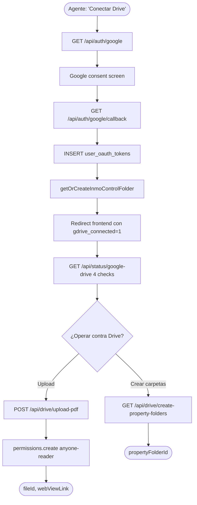
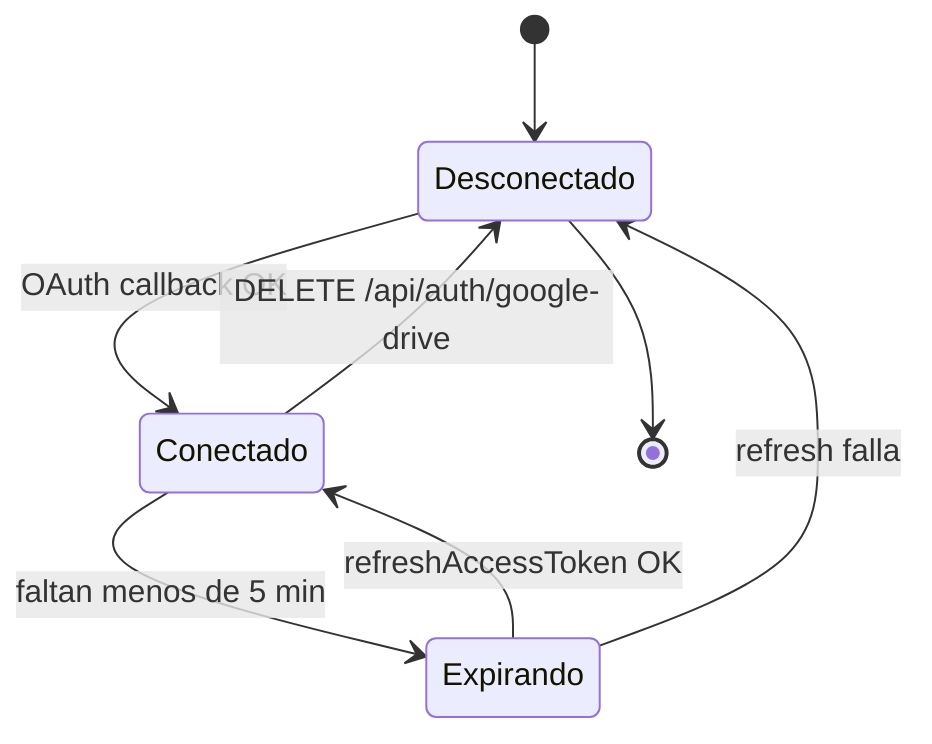
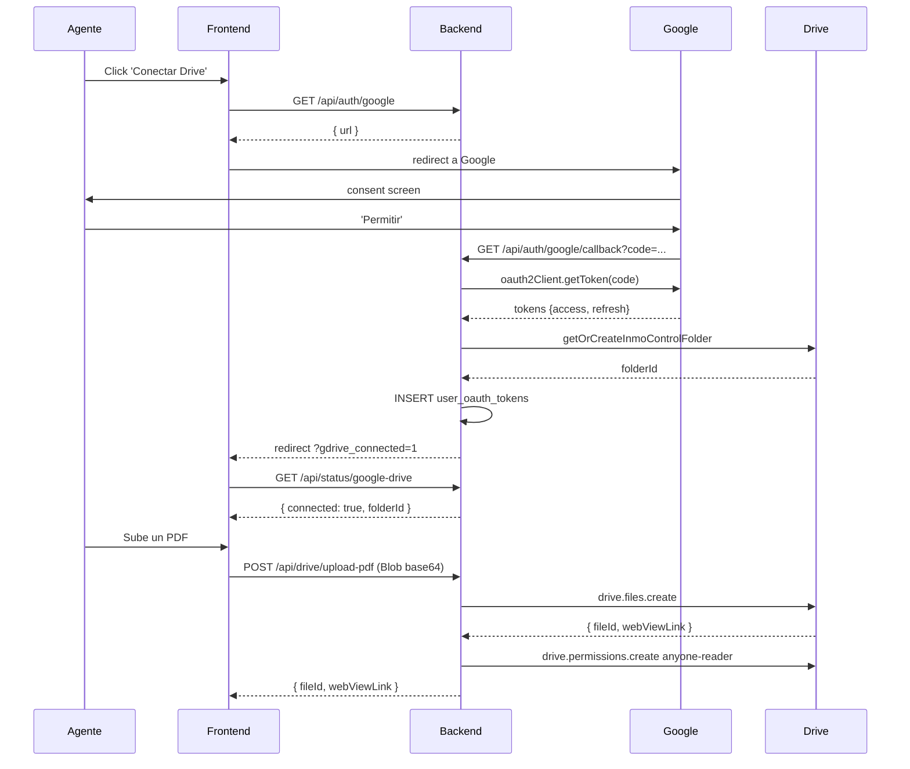
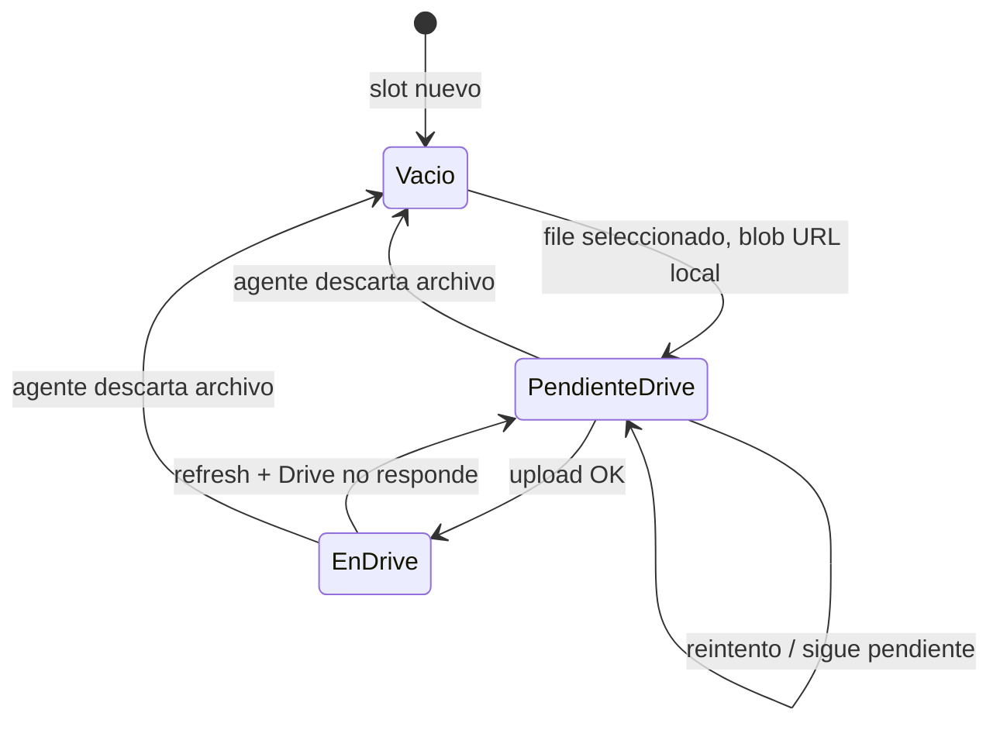

# PROCESO: DRIVE-OPS — Operaciones de Google Drive

> Workflow agentico narrativo del proceso foundational de Google Drive.
> **Este proceso lo usan los otros 12 procesos inmobiliarios** (captación,
> inquilinos, PDFs varios). Define el ciclo de vida OAuth, refresh transparente
> de tokens, uploads a subcarpetas, y la política de fallback cuando Drive
> no responde.
>
> NO incluye código de implementación. Cuando esté aprobado, los specs
> puntuales referencian este workflow por código.

## 0. Metadata

| Campo | Valor |
|---|---|
| **Código** | `DRIVE-OPS` |
| **Nombre legible** | Operaciones de Google Drive |
| **Dominio** | `drive` |
| **Owners** | Backend: `server/routes/googleAuth.ts` · Frontend: `src/lib/drive/driveService.ts` + `src/shared/store/googleDriveStore.ts` |
| **Status** | ⏳ draft (workflow) / ✅ shipped (implementación, en prod desde jul-2026) |
| **Última revisión** | 2026-08-03 |
| **Procesos upstream** | — (foundational, no depende de otros) |
| **Procesos downstream** | `PROP-CAPT`, `PROP-DOCS`, `INV-CAPT`, `INV-COLOC`, `TENANT-ONB`, `CONTRACT-GEN`, `ACTA-ENTREGA`, `BILL-INVOICE`, `BILL-OWNER`, `REPORTS` |

## 0.5. Diagramas

### Flujo principal (happy path)

### Estados de conexión (Drive)

### Secuencia OAuth + Upload

### Estados del storage (badge 🟢/🟠/⚪)

## 1. Actores

- **Agente inmobiliario** — Dispara "Conectar Drive" desde Settings. Sube documentos durante wizards y operaciones varias.
- **Sistema (InmoControl backend)** — Maneja OAuth callback, persiste tokens, sube archivos vía `googleapis`.
- **Sistema (InmoControl frontend)** — Lee el estado de conexión desde `useGoogleDriveStore`. Muestra badges 🟢/🟠/⚪ en archivos.
- **Google OAuth** — Autoriza el acceso (`drive.file` scope: solo lo que crea esta app).
- **Google Drive** — Almacena los PDFs en `Mi unidad / InmoControl/...`.
- **MySQL** — Persiste tokens en `user_oauth_tokens` y folder IDs en `properties.drive_folder_id`, `tenants.drive_folder_path`, etc.

## 2. Contexto inicial

- **Cuándo se dispara**:
  - **OAuth**: agente hace click en "Conectar Google Drive" desde `SettingsView` (o desde el banner de "Drive no conectado" en cualquier wizard).
  - **Uploads**: disparados automáticamente por otros procesos (`PROP-CAPT`, `BILL-INVOICE`, etc.) o manualmente por el agente desde modales.
- **UI entry points**:
  - `src/features/settings/SettingsView.tsx` → botón "Conectar Drive" / "Desconectar"
  - Modales de upload en cada proceso downstream (badge 🟢/🟠/⚪ del estado real)
- **Precondiciones**:
  - Agente autenticado (sesión httpOnly, ver `SECURITY-001`).
  - **OAuth** solo: usuario NO logueado en Google todavía (es el flow que inicia el OAuth).
  - **Uploads**: Drive previamente conectado (tokens en MySQL con `drive_folder_id` no NULL).

## 3. Flujo principal (happy path)

### Paso 1 — Iniciar OAuth

El agente hace click en "Conectar Google Drive". El frontend llama
`GET /api/auth/google` (NO requiere sesión, ver `SECURITY-001`). El backend
genera la URL de autorización con `access_type=offline` + `prompt=consent`
(para garantizar `refresh_token` la primera vez) y devuelve `{ url }`.

El frontend abre esa URL en un popup o redirect. Google muestra la pantalla
de consentimiento (la app está en modo **Testing**, ver `docs/TESTERS.md`
para agregar testers).

### Paso 2 — Callback OAuth

Google redirige a `GET /api/auth/google/callback?code=...&state=...`. El
backend:

1. Intercambia el `code` por tokens vía `oauth2Client.getToken(code)`.
2. Extrae el `userId` del `id_token` JWT (sin llamar a la API de profile).
3. Llama `getOrCreateInmoControlFolder(drive, userId)` para crear
   `Mi unidad / InmoControl/` si no existe.
4. Persiste en `user_oauth_tokens` con `ON DUPLICATE KEY UPDATE`
   (idempotente: re-conectar actualiza, no duplica).
5. Redirige al frontend con `?gdrive_connected=1&folder=<folderId>`.
6. Si algo falla, redirige con `?gdrive_error=<detail>` (en vez de 500 HTML,
   ver `JSON-001` + `BUG-029`).

### Paso 3 — Estado de conexión

El frontend llama `GET /api/status/google-drive` después del callback (y
periódicamente) para saber si Drive está **realmente** operativo AHORA.
El endpoint valida 4 cosas:

1. ¿Hay fila en `user_oauth_tokens`?
2. ¿Hay `access_token`?
3. ¿Hay `expiry_date`?
4. ¿Faltan más de 5 min para que expire?

Si alguna falla, devuelve `{ connected: false, reason: 'no_token' | 'no_expiry' | 'expired' }`.
Solo si pasa las 4, devuelve `{ connected: true, folderId }`.

Esto evita el bug histórico (jul-2026) donde el cliente creía estar
conectado pero el server truena al intentar operar contra Drive (toasts
mentirosos).

### Paso 4 — Subir un PDF (genérico)

El proceso downstream (ej: `BILL-INVOICE` → "Enviar CC") llama
`uploadPdfToDrive(blob, parentFolderId, parentKind, subfolder, fileName)`
desde `src/lib/drive/driveService.ts`. El helper:

1. Verifica `useGoogleDriveStore.connected` (skip si no, devuelve
   `{ skipped: true, reason: 'Drive no conectado' }`).
2. Verifica `parentFolderId` no vacío.
3. Convierte el `Blob` a base64.
4. Llama `POST /api/drive/upload-pdf` con timeout 30s (`DRIVE_UPLOAD_TIMEOUT_MS`).
5. Si OK: devuelve `{ fileId, webViewLink }`.
6. Si timeout: `{ error: 'Drive no respondió a tiempo. Reintentá.' }`.
7. Si error de server: `{ error: <message> }`.

El server (`POST /api/drive/upload-pdf`) hace:

1. `requireAuth` (ver `SECURITY-001`).
2. Lee tokens de `user_oauth_tokens` para `userId='default_user'` (TODO:
   multi-user cuando se implemente auth real).
3. `isTokenExpiringSoon(expiry_date)` → si sí, `refreshAccessToken()` + UPDATE.
4. `getOrCreateSubfolder(drive, parentFolderId, subfolder)` — crea
   on-demand si no existe.
5. `drive.files.create({ requestBody: { name, parents }, media: { mimeType, body } })`.
6. `drive.permissions.create({ fileId, requestBody: { role: 'reader', type: 'anyone' } })`
   (cualquiera con el link puede ver).
7. Devuelve `{ fileId, fileName, webViewLink }`.

### Paso 5 — Crear carpetas de propiedad (defensa)

Cuando se crea una propiedad nueva, `PropertiesView.handleFinalize` (o
`ensurePropertyPersisted` en Option B, ver `PROP-CAPT`) llama
`createPropertyFolders(propertyId, propertyName)`. Esto:

1. Verifica `useGoogleDriveStore.connected`.
2. Llama `GET /api/drive/create-property-folders?propertyId=...&propertyName=...`.
3. El server chequea **primero** si ya existe una carpeta con ese nombre
   bajo `InmoControl/` (defensa contra doble-creación si algo llama este
   endpoint 2 veces).
4. Si existe → reusa el folder ID.
5. Si no → crea `{dirección}/` + subcarpetas `Propietario/` e `Inventarios/`.

### Paso 6 — Desconectar (limpieza)

El agente hace click en "Desconectar". El frontend llama
`DELETE /api/auth/google-drive`. El server hace `DELETE FROM user_oauth_tokens`.
**NO** borra los archivos en Drive (pertenecen al Google account del usuario).

El frontend limpia `useGoogleDriveStore`. Los badges 🟢 → 🟠 en todos
los archivos que tenían URLs de Drive.

## 4. Edge cases

### EC-1 — Drive OAuth no devuelve refresh_token

- **Trigger**: el usuario ya autorizó antes y Google no re-emite el
  refresh_token en el segundo flow.
- **Comportamiento**: la fila en `user_oauth_tokens` queda con
  `refresh_token=NULL`. El primer upload funciona (access_token vigente),
  pero el segundo falla cuando el access_token expira.
- **Mitigación**: el flow siempre usa `prompt=consent` (forzado en
  `generateAuthUrl`), que sí garantiza el refresh_token. Pero si el
  usuario clickea "Permitir" rápido sin pasar por la pantalla completa,
  Google puede omitirlo.

### EC-2 — Token expirado mid-flow

- **Trigger**: el access_token vence entre dos llamadas (5 min de margen).
- **Comportamiento**: cada handler chequa `isTokenExpiringSoon()` antes
  de operar contra Drive. Si vence, hace `refreshAccessToken()` transparente
  + UPDATE a MySQL. La operación continúa sin error.

### EC-3 — Drive timeout / caído

- **Trigger**: cualquier llamada a `drive.files.*` o `drive.permissions.*`
  tarda más de 8s (server) o 15s/30s (cliente, según query vs upload).
- **Comportamiento**: el cliente recibe `{ error: 'Drive no respondió a
  tiempo. Reintentá.' }`. El archivo queda como `blob:` URL local con
  badge 🟠. El flujo downstream (ej: "Enviar CC") sigue funcionando —
  el PDF se descarga local igual (no se rompe, ver `DRIVE-FALLBACK-001`).

### EC-4 — Tester OAuth no aprobado

- **Trigger**: email del agente NO está en la lista de Test users de
  Google Cloud Console (la app está en modo **Testing**, no verificada).
- **Comportamiento**: Google devuelve `403 access_denied`. El callback
  redirige con `?gdrive_error=access_denied`.
- **Mitigación**: ver `docs/TESTERS.md` — agregar el email del tester
  en Google Cloud Console → OAuth consent screen → Test users (30 seg,
  sin redeploy).

### EC-5 — Carpeta de Drive ya existe (doble creación)

- **Trigger**: el cliente llama `createPropertyFolders` 2 veces
  (ej: doble click, retry tras error, doble `handleFinalize`).
- **Comportamiento**: el server busca primero por nombre + parent.
  Si existe → reusa. Si no → crea. **NUNCA duplica carpetas** (defensa
  explícita en `googleAuth.ts:295-305`).
- **Adicional**: `appStore.addProperty` chequea `if (p.id)` antes de
  postear (si ya viene con UUID, NO postea de nuevo, ver `IDEMPOTENT-001`).

### EC-6 — Subcarpeta no existe (genérico)

- **Trigger**: `uploadPdfToDrive` recibe una `subfolder` que no existe
  aún en Drive (ej: `EstadosCuenta/` que es nuevo).
- **Comportamiento**: el server `getOrCreateSubfolder` la crea on-demand
  bajo `parentFolderId`. Devuelve OK con el `fileId` del nuevo archivo.

### EC-7 — Frontend piensa que Drive está conectado pero server truena

- **Trigger**: el cliente lee `useGoogleDriveStore.connected=true` pero
  al hacer un POST el server responde 401 (`No connected to Google Drive`).
- **Causa raíz**: el `connected` del store se setea en el OAuth callback
  pero no se re-valida contra `GET /api/status/google-drive`. Bug
  histórico (jul-2026, ver §3 paso 3).
- **Mitigación**: el endpoint `GET /api/status/google-drive` ahora
  refleja la verdad operacional (4 checks), no solo si hay tokens.
- **Pendiente**: el frontend debería re-validar este status después de
  cada error 401 de Drive y auto-corregir el store.

### EC-8 — Permisos anyone-reader vs. privado

- **Trigger**: el usuario quiere que un PDF sea privado (solo él con
  sesión Google puede verlo).
- **Comportamiento actual**: TODOS los PDFs se suben con `permissions.create
  { role: 'reader', type: 'anyone' }`. Cualquiera con el link puede ver.
- **Pendiente**: parametrizar `visibility` por documento (no implementado
  todavía, ver §12 Out of scope).

### EC-9 — `gdrive_error` en URL pero el agente no entiende qué hacer

- **Trigger**: el callback redirige con `?gdrive_error=<detail>`. El
  frontend muestra un toast genérico.
- **Mitigación**: mapear códigos comunes (`access_denied`, `popup_closed`,
  `token_exchange_failed`) a toasts específicos (ver §7).

## 5. Estado que muta

### Tablas MySQL afectadas

| Tabla | Operación | Columnas tocadas |
|---|---|---|
| `user_oauth_tokens` | INSERT / UPDATE / DELETE | `access_token`, `refresh_token`, `expiry_date`, `drive_folder_id` |
| `properties` | UPDATE (durante `createPropertyFolders`) | `drive_folder_id` (seteado si era NULL) |
| `tenants` | UPDATE (durante `createTenantFolders`) | `drive_folder_path` |
| `property_documents` | UPDATE (durante upload de doc) | `drive_url`, `web_view_link` |
| `inventories` | UPDATE (durante upload de PDF inventario) | `drive_pdf_url` (legacy) o `inventory_captacion_pdf_url` / `inventory_colocacion_pdf_url` (DB inglés) |
| `property_actions` | INSERT (audit log) | `action_type='drive_upload'`, `details='<subfolder>/<file>· subida a Drive'` |

### Archivos en Drive creados

| Carpeta destino | Trigger | Convención de nombre |
|---|---|---|
| `Mi unidad / InmoControl/` | OAuth callback (1ra vez) | Fija |
| `Mi unidad / InmoControl/{dirección}/` | `createPropertyFolders` | `{dirección}` |
| `Mi unidad / InmoControl/{dirección}/Propietario/` | idem | Fija |
| `Mi unidad / InmoControl/{dirección}/Inventarios/` | idem | Fija |
| `Mi unidad / InmoControl/{dirección}/{inquilino} ({cédula})/` | `createTenantFolders` | Fija (ver `TENANT-ONB`) |
| `Mi unidad / InmoControl/{dirección}/{inquilino}/Cedula\|Contrato\|Recibos/` | idem | Fija |
| `Mi unidad / InmoControl/{dirección}/Propietario/EstadosCuenta/` | `uploadPdfToDrive` (BILL-OWNER) | `EstadosCuenta/` (creada on-demand) |
| `Mi unidad / InmoControl/{dirección}/{inquilino}/Acta/` | `uploadPdfToDrive` (ACTA-ENTREGA) | `Acta/` (creada on-demand) |

### Stores Zustand actualizados

| Store | Acción | Selectores afectados |
|---|---|---|
| `useGoogleDriveStore` | `setConnected(bool)`, `setFolderId(id)` | `selectIsConnected`, `selectFolderId` |

## 6. Contratos cross-cutting

Referenciar los cross-cutting invariants del README por código (no duplicar acá).

- **Tostadas**: ver `TOAST-001` + tabla §7 abajo.
- **JSON errors**: ver `JSON-001`. Especialmente el callback OAuth: redirige
  con query param, NO devuelve HTML (ver `BUG-029`).
- **Timeouts**: ver `TIMEOUT-001`. Aplican: server 8s por llamada a
  `drive.files.*` (helper `withTimeout`); cliente 15s para queries
  (`createPropertyFolders`, `status`), 30s para uploads (`uploadPdfToDrive`,
  `uploadFileToDrive`).
- **Drive fallback**: ver `DRIVE-FALLBACK-001`. Si Drive no responde,
  el archivo queda como `blob:` local con badge 🟠, el flujo downstream
  sigue (descarga local sí o sí).
- **Idempotencia**: ver `IDEMPOTENT-001`. `user_oauth_tokens` usa
  `ON DUPLICATE KEY UPDATE`. `createPropertyFolders` chequea existencia.
  `appStore.addProperty` chequea `if (p.id)`.
- **Auth**: ver `SECURITY-001`. `requireAuth` en TODOS los endpoints
  privados (`upload-pdf`, `upload-file`, `create-property-folders`,
  `status`, `delete`). El callback OAuth NO requiere auth (usuario no
  logueado todavía).
- **Audit log**: ver `AUDIT-001`. Cada upload exitoso loggea en
  `property_actions` con sufijo "· subida a Drive".

## 7. Tostadas exactas (copy approved)

| Trigger | Tipo | Copy exacto |
|---|---|---|
| OAuth callback OK | success | "✓ Google Drive conectado" |
| OAuth callback error genérico | error | "Error conectando Drive: {detail}" |
| OAuth `access_denied` | warning | "Cancelaste la autorización de Drive. Podés reintentar cuando quieras." |
| OAuth `popup_closed` | warning | "Cerraste la ventana antes de autorizar. Reintentá cuando quieras." |
| Drive query timeout (15s) | warning | "Drive no respondió a tiempo. Reintentá en unos segundos." |
| Drive upload timeout (30s) | warning | "Drive no respondió a tiempo. El PDF se descargó igual — se sube a Drive cuando vuelva la conexión." |
| Upload PDF OK | success | "✓ {filename} subido a Drive" |
| Upload PDF falla (continúa) | warning | "Drive no disponible — el archivo se guardó localmente. Se subirá cuando Drive responda." |
| Desconectar OK | success | "Drive desconectado. Los archivos ya subidos siguen en tu Google Drive." |

## 8. Anti-patrones explícitos

- ❌ **Asumir que Drive siempre responde** → Visto en BUG-014/015/016/022/024
  (timeouts faltantes en uploads a Drive). Todos los endpoints deben tener
  timeout + el cliente debe tener timeout también.
- ❌ **Decir "conectado" si hay tokens pero el token venció** → Visto en
  jul-2026 (BUG-024, status mentiroso). El endpoint `/status/google-drive`
  DEBE chequear expiry real.
- ❌ **Crear carpeta de propiedad sin chequear si ya existe** → Visto en
  bug histórico (duplicación de carpetas). El server DEBE buscar por nombre
  antes de crear.
- ❌ **Cerrar el modal de upload antes de la respuesta** → el agente piensa
  que falló. El modal debe quedar abierto con spinner hasta que el server
  responda.
- ❌ **Borrar archivos de Drive al desconectar** → los archivos son del
  usuario, no nuestros. `DELETE /api/auth/google-drive` solo borra tokens.

## 9. Especificaciones técnicas relacionadas

- `docs/specs/fix-bug-019-hydrate-timeouts.md` — Timeouts en hidratación
  de stores (afecta cómo se carga `useGoogleDriveStore`).
- `docs/specs/fix-bug-024-drive-service-timeouts.md` — Timeouts diferenciados
  query (15s) vs upload (30s).
- `docs/specs/fix-bug-029-central-error-wrapper.md` — `asyncHandler` para
  que TODOS los handlers devuelvan JSON, nunca HTML.
- ⏳ TBD — Spec del status check honesto (`/status/google-drive` con 4 checks).

## 10. Endpoints backend utilizados

| Método | Path | Archivo | Notas |
|---|---|---|---|
| `GET` | `/api/auth/google` | `server/routes/googleAuth.ts` | Genera URL OAuth (NO requiere auth). |
| `GET` | `/api/auth/google/callback` | idem | Intercambia code → tokens, persiste, redirige. |
| `GET` | `/api/status/google-drive` | idem | Status operacional (4 checks). `requireAuth`. |
| `DELETE` | `/api/auth/google-drive` | idem | Borra tokens. `requireAuth`. |
| `POST` | `/api/drive/upload-pdf` | idem | Upload genérico a subcarpeta arbitraria (crea on-demand). `requireAuth`. |
| `POST` | `/api/upload/google-drive` | idem | Upload legacy (mantenido por compat, NO usar en código nuevo). `requireAuth`. |
| `GET` | `/api/drive/create-property-folders` | idem | Crea carpetas de propiedad (defensa contra duplicación). `requireAuth`. |
| `POST` | `/api/drive/upload-file` | idem | Upload a subcarpeta fija (`Propietario` o `Inventarios`). `requireAuth`. |
| `POST` | `/api/inventories/upload-pdf` | `server/routes/inventories.ts` | Upload PDF inventario. `requireAuth`. |
| `POST` | `/api/inventories/upload-photos` | idem | Upload fotos inventario. `requireAuth`. |
| `POST` | `/api/tenants/upload-document` | `server/routes/tenants.ts` | Upload PDF inquilino. `requireAuth`. |

## 11. Riesgos identificados

| Riesgo | Probabilidad | Impacto | Mitigación |
|---|---|---|---|
| OAuth refresh_token revocado por Google | Baja | Alta | UI muestra "Reconectar Drive" si el server devuelve 401 con `invalid_grant` |
| Drive rate limiting (429) | Baja | Media | Helper `withTimeout` + retry transparente (no implementado todavía) |
| Pool MySQL agotado durante refresh token | Muy baja | Alta | `connectionLimit=10` + queue |
| `userId='default_user'` hardcoded | Alta (single-tenant piloto) | Alta cuando se implemente multi-tenant | Reemplazar por `req.session.userId` cuando se implemente auth real |
| Carpeta de Drive crece sin bound | Media | Baja | No es problema hoy (piloto single-user) |

## 12. Out of scope explícito

- ❌ Multi-tenant real (per-agency tokens). Hoy `userId='default_user'`
  hardcoded. Decisión pendiente para Fase 3 (`AUTH`).
- ❌ Visibilidad privada de PDFs (siempre `anyone-reader`). Decisión pendiente.
- ❌ Retry transparente de uploads que fallaron por timeout. Hoy el badge
  🟠 queda y el agente tiene que re-subir manualmente.
- ❌ Sincronización bidireccional (Drive → DB). Hoy solo escribimos a
  Drive, nunca leemos de Drive para sincronizar.
- ❌ Refactor del monolito `PropertiesView.tsx` (Fase 2 del proyecto).

## 13. Approval

**Status:** ⏳ Pending Review
**Aprobado por:** —
**Fecha de aprobación:** —

---

> **Recordatorio Karpathy**: una vez aprobado, las features nuevas dentro
> de este proceso (ej: parametrizar `visibility` por documento) siguen el
> flujo spec → verifier → implementación. Este workflow NO se modifica para
> hacer pasar checks.