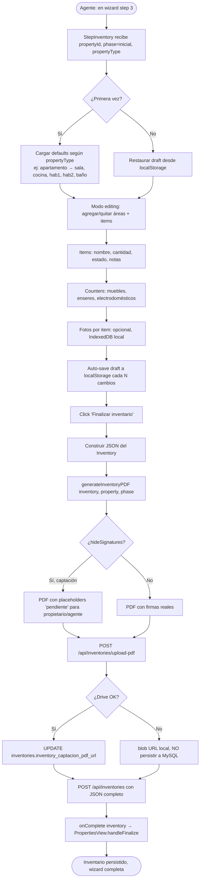
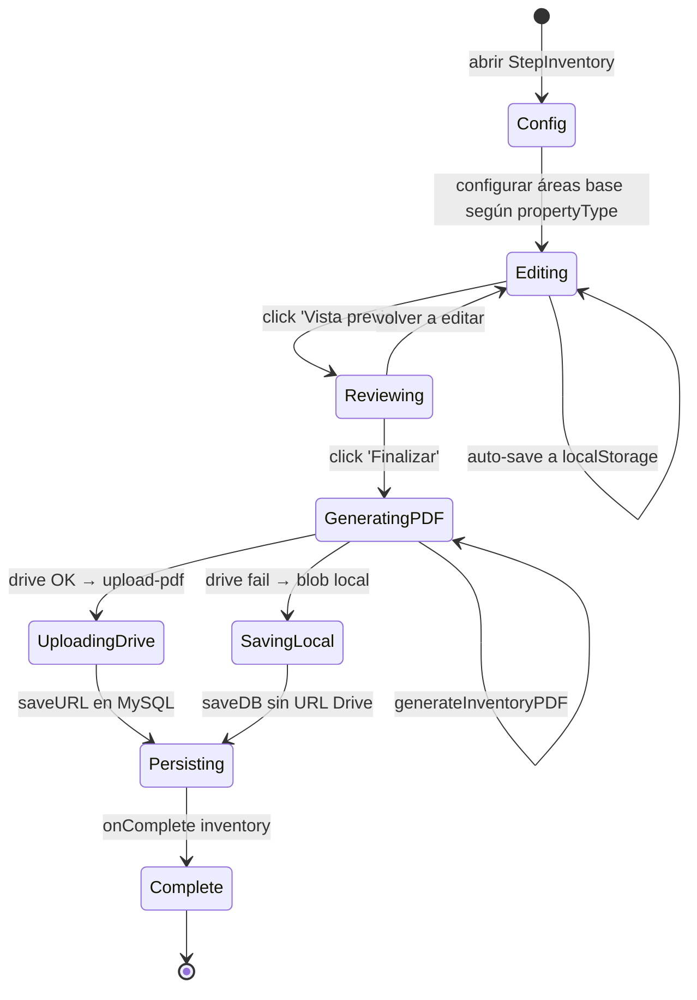
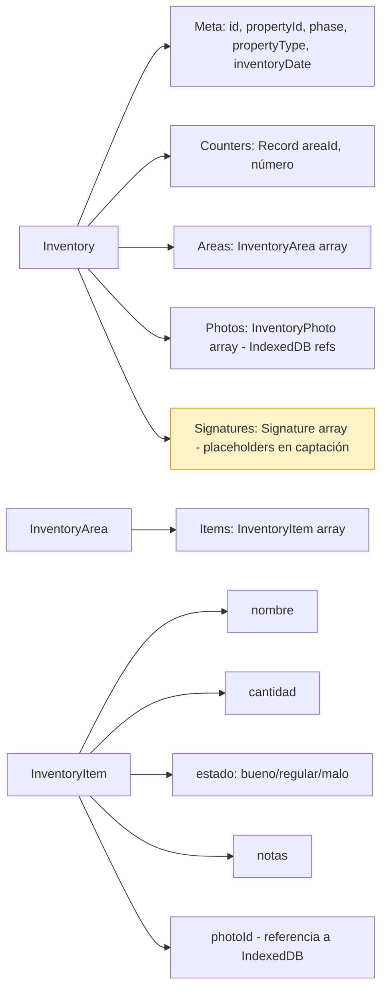
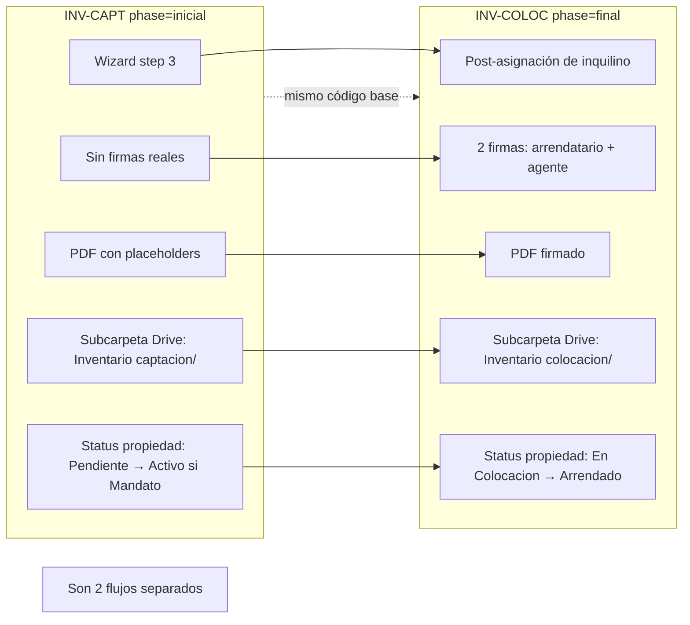

# PROCESO: INV-CAPT — Inventario de Captación

> Workflow agentico narrativo del sub-proceso de **Inventario de Captación**
> de una propiedad en InmoControl. Es el step 3 del wizard de captación
> (`PROP-CAPT`). Captura el estado del inmueble al momento de captación:
> áreas (sala, cocina, habitaciones, baños), items por área, contadores
> (muebles, enseres), y opcionalmente fotos por item.
>
> **NO lleva firmas del arrendatario** en esta fase (es inventario de
> captación — el arrendatario todavía no está asignado). Las firmas del
> propietario y agente se hacen al finalizar el wizard (en realidad,
> el PDF se genera con placeholders "pendiente" para esas firmas; la
> firma real del propietario va en el Contrato de Mandato, y la del
> agente + arrendatario va en el Inventario de Colocación).

## 0. Metadata

| Campo | Valor |
|---|---|
| **Código** | `INV-CAPT` |
| **Nombre legible** | Inventario de Captación (phase='inicial') |
| **Dominio** | `properties` |
| **Owners** | Frontend: `src/features/properties/components/StepInventory.tsx` + `AreaConfigPanel.tsx` + `AreaEditor.tsx` + `inventoryConfig.ts` + `inventoryPdf.ts` + `inventoryDB.ts` (IndexedDB local) · Backend: `server/routes/inventories.ts` |
| **Status** | ⏳ draft (workflow) / ✅ shipped (implementación, en prod desde jul-2026) |
| **Última revisión** | 2026-08-03 |
| **Procesos upstream** | `PROP-CAPT` (step 1+2 OK + propiedad persistida), `DRIVE-OPS` (upload PDF + fotos) |
| **Procesos downstream** | `PROP-CAPT` (handleFinalize recibe el inventario + UPSERT), `INV-COLOC` (el de colocación usa el inicial como `baseInventory` para copiar áreas base) |

## 0.5. Diagramas

### Flujo principal (wizard step 3 → finalize)

### Máquina de estados del inventario (en edición)

### Estructura del JSON del inventario

### Diferencia con Inventario de Colocación

## 1. Actores

- **Agente inmobiliario** — Es quien llena el inventario en el wizard step 3. Recorre cada área, agrega items, cuenta enseres, toma fotos.
- **Propietario** — Firma el Contrato de Mandato (no firma el inventario de captación — el suyo va en Mandato). Su firma aparece como "pendiente" en el PDF.
- **Sistema (InmoControl backend)** — `POST /api/inventories`, `POST /api/inventories/upload-pdf`, `POST /api/inventories/upload-photos`. Schema `inventories` con `phase='inicial'`.
- **Sistema (InmoControl frontend)** — `StepInventory.tsx` (wizard), `inventoryDB.ts` (IndexedDB para fotos), `useDraftPersistence.ts` (auto-save a localStorage).
- **IndexedDB** — Almacenamiento local de fotos por item (base64). NO se persiste a MySQL (explotaría 5MB del navegador).
- **Google Drive** — Recibe el PDF del inventario en `Inventarios/Inventario captacion/`.
- **MySQL** — Tabla `inventories` con `phase='inicial'`, columna `inventory_captacion_pdf_url` (en inglés, NO español — ver AGENTS.md "Nombres de columnas").

## 2. Contexto inicial

- **Cuándo se dispara**: el agente llega a step 3 del wizard después de completar step 1 (datos) + step 2 (5 docs legales). `ensurePropertyPersisted` ya creó la fila en MySQL con `wizardPropertyDbId`.
- **UI entry point**: `src/features/properties/PropertiesView.tsx` → cuando `step === 3`, renderiza `StepInventory` con `phase='inicial'`, `hideSignatures=true`, `onComplete={handleFinalize}`.
- **Precondiciones**:
  - `wizardPropertyDbId` está set (propiedad persistida en MySQL).
  - `propertyType` está definido (apartamento, casa, apartaestudio, etc.) — define las áreas base del inventario.

## 3. Flujo principal (happy path)

### Paso 1 — Cargar áreas base según tipo de propiedad

`getPropertyTypeConfig(propertyType)` devuelve la lista de áreas base:
- **Apartamento**: sala, cocina, comedor, habitación 1, habitación 2, baño 1, baño 2.
- **Casa**: sala, cocina, comedor, hab principal, hab 2, hab 3, baño 1, baño 2, garaje, jardín.
- **Apartaestudio**: sala/cocina integrada, baño.
- **Oficina**: recepción, sala de juntas, área de trabajo, baño.
- **Local**: área principal, depósito, baño.
- **Bodega**: área principal, oficina, baño.
- **Finca**: casa principal, áreas exteriores, establos, depósitos.
- **Otro**: vacío (el agente agrega manualmente).

`AreaConfigPanel` permite agregar/quitar áreas customizadas.

### Paso 2 — Agregar items por área

Para cada área, `AreaEditor` permite agregar items:
- Nombre (ej: "Sofá", "Mesa de comedor", "Refrigerador").
- Cantidad.
- Estado: bueno / regular / malo.
- Notas opcionales.
- Foto opcional (1 foto por item, en IndexedDB).

### Paso 3 — Configurar counters (muebles, enseres)

`Counters` son agregados globales:
- `multiCounters` según tipo de propiedad: cantidad de camas, cantidad de sillas, etc.
- `singleCounters` (TODO): aires acondicionados, ventiladores, etc.

### Paso 4 — Subir fotos por item (opcional)

Drag&drop o file picker. La foto se guarda como base64 en IndexedDB
(`inventoryDB.savePhoto(itemId, blob)`), NO en MySQL ni en localStorage
(explotaría el límite de 5MB del navegador).

Al renderizar, se recupera de IndexedDB por `photoId`.

### Paso 5 — Auto-save a localStorage

Cada cambio estructural (área agregada, item agregado, counter cambiado)
dispara auto-save a localStorage vía `useDraftPersistence`. NO incluye
fotos (en IndexedDB) ni firmas (placeholders).

Draft key: `${propertyId}:inicial`.

### Paso 6 — Vista previa

Click "Vista previa" → `generateInventoryPDF(inventory, property, phase)`:

- Renderiza cada área con sus items.
- Tabla de counters al final.
- Sección de firmas con placeholders "____________________" para:
  - Propietario (nombre + cédula)
  - Agente (nombre + cédula)
- Footer: "Este inventario se firma al finalizar el Contrato de Mandato
  y al iniciar el Inventario de Colocación."

### Paso 7 — Finalizar inventario

Click "Finalizar inventario" → handler:

1. Construir `Inventory` JSON completo.
2. `generateInventoryPDF()` → blob.
3. Si Drive conectado:
   - `POST /api/inventories/upload-pdf` con base64 del PDF.
   - Server: `drive.files.create({ name: 'Inventario_captacion_<YYYY-MM-DD>.pdf', parents: [propFolderId/Inventarios/Inventario captacion] })`.
   - Server devuelve `{ fileId, webViewLink }`.
4. Si Drive NO conectado:
   - `URL.createObjectURL(blob)` → blob URL local.
   - NO se persiste a MySQL (ver EC-1).
5. `POST /api/inventories` con el JSON completo:
   - `propertyId`, `phase='inicial'`, `propertyType`, `counters`, `areas`, `photos_meta` (referencias a IndexedDB), `signatures_meta` (placeholders).
6. `onComplete(inventory)` → `PropertiesView.handleFinalize` recibe el inventario y hace el UPSERT final de la propiedad.

### Paso 8 — handleFinalize (PropertiesView)

1. `ensurePropertyPersisted()` (idempotente).
2. UPSERT `POST /api/properties` con `localId=<UUID real>` + mandate + docs + status.
3. Si `mandatePdfUrl + mandateSignedAt` → `status='Activo'`.
4. Si no → `status='Pendiente'`.
5. Modal de resumen (ver `PROP-CAPT §3 paso 3 finalize`).

## 4. Edge cases

### EC-1 — Drive caído al subir PDF

- **Trigger**: `DRIVE-FALLBACK-001`. Timeout 8s server / 30s cliente.
- **Comportamiento**: el PDF se genera igual, queda como blob URL local.
  NO se persiste a MySQL (capa de defensa contra zombie).
  El inventario JSON sí se persiste (es metadata sin binarios).
- **Mitigación**: el agente debe re-subir el PDF desde el Detalle del
  Inmueble cuando Drive vuelva.

### EC-2 — Foto muy pesada (>5MB)

- **Trigger**: el agente sube una foto de 8MB como base64.
- **Comportamiento**: IndexedDB rechaza con error de cuota. Toast: "La
  foto es demasiado pesada (>5MB). Reducí su tamaño y reintentá."
- **Mitigación**: compresión client-side con `canvas.toBlob({ quality: 0.7 })`
  antes de guardar en IndexedDB (parcialmente implementado).

### EC-3 — Wizard cerrado a mitad del step 3

- **Trigger**: el agente cierra el browser con 8 áreas configuradas pero
  sin finalizar.
- **Comportamiento**: el draft del inventario está en localStorage (counters +
  áreas + items). Las fotos están en IndexedDB (separado). Al reabrir:
  - Si la propiedad sigue en MySQL (`wizardPropertyDbId`), el wizard se
    reconecta y el step 3 carga el draft desde localStorage.
  - Las fotos se recuperan de IndexedDB por `photoId`.

### EC-4 — IndexedDB limpia (browser data cleared)

- **Trigger**: el agente limpia "Site data" del browser.
- **Comportamiento**: las fotos se pierden. El draft del inventario
  (estructura, counters) sigue en localStorage.
- **Mitigación**: warning al agente "Tus fotos se perdieron porque
  limpiaste los datos del browser. Re-subí las que faltan."

### EC-5 — Inventario sin items (solo áreas vacías)

- **Trigger**: el agente quiere finalizar sin haber agregado ningún item.
- **Comportamiento**: el servidor acepta el inventario vacío (es válido —
  algunas propiedades se captan sin enseres). Toast: "Inventario guardado
  sin items. Podés agregar items después desde el Detalle del Inmueble."

### EC-6 — PropertyType no reconocido (legacy o custom)

- **Trigger**: la propiedad tiene `propertyType='otro'` o un valor legacy.
- **Comportamiento**: `getPropertyTypeConfig('otro')` devuelve config
  vacía. El agente debe agregar áreas manualmente en `AreaConfigPanel`.

### EC-7 — Multi-propiedad con misma dirección

- **Trigger**: error humano — el agente está llenando 2 inventarios al
  mismo tiempo y los mezcla.
- **Comportamiento**: `inventoryId = ${propertyId}:inicial` usa el
  propertyId real (UUID de MySQL) como discriminante. NO hay colisión
  porque cada propiedad tiene su UUID único.

### EC-8 — Inventario con N items por área (>100)

- **Trigger**: una bodega con 200 items.
- **Comportamiento**: el servidor acepta sin límite. El PDF generado puede
  ser pesado (varias páginas). La UI scrollea correctamente.

### EC-9 — Edición post-finalize

- **Trigger**: el agente finalizó el inventario pero quiere agregar un
  item que olvidó.
- **Comportamiento actual**: NO hay UI de edición post-finalize del
  inventario de captación. El agente tendría que descartar y rehacer.
- **Pendiente**: edición post-finalize con regenerar PDF + re-upload a
  Drive (TODO, ver §12).

### EC-10 — Inventario de captación usado como base para colocación

- **Trigger**: el agente asigna un inquilino → llega el momento del
  Inventario de Colocación (ver `INV-COLOC`).
- **Comportamiento**: `INV-COLOC` recibe `baseInventory` = el de captación.
  `StepInventory` con `phase='final'` y `baseInventory` set:
  - `initialCounters(propertyType, base)` copia los counters.
  - El agente puede editar/agregar áreas.
  - Las áreas nuevas se suman (no reemplazan).

### EC-11 — Firma del propietario en Mandato vs inventario

- **Trigger**: el propietario firma el Mandato pero no el inventario
  (que tiene placeholder).
- **Comportamiento**: **correcto por diseño**. La firma del propietario
  en el Mandato es la firma legal que acepta el estado del inmueble
  al inicio de la relación. La firma del inventario de captación es
  redundante — el inventario de captación es solo el baseline.

### EC-12 — Schema drift `inventario_*` vs `inventory_*`

- **Trigger**: bug histórico (jul-2026). El código usaba nombres en
  español (`inventario_captacion_pdf_url`).
- **Comportamiento**: server tira `500 ER_BAD_FIELD_ERROR`.
- **Mitigación**: migración 009 + replicado en schema-hostinger.sql +
  schema-completo.sql. Convención en AGENTS.md. Solo `inventory_*` (inglés)
  es válido en DB. La API puede responder con alias español si lo prefiere
  el cliente, pero la DB es inglés.

### EC-13 — Sin areas base (propertyType='otro')

- **Trigger**: el agente eligió 'otro' en step 1.
- **Comportamiento**: el step 3 arranca con 0 áreas. El agente debe
  agregar manualmente en `AreaConfigPanel`. Validación: no se puede
  finalizar sin al menos 1 área.

### EC-14 — Counter negativo

- **Trigger**: error humano — el agente pone `-2` en "cantidad de camas".
- **Comportamiento**: validación cliente en el input. Server también
  valida (>=0). Toast: "La cantidad no puede ser negativa."

### EC-15 — Re-key del wizardPropertyId → wizardPropertyDbId

- **Trigger**: el agente cierra el browser entre step 1 y step 3, vuelve.
- **Comportamiento**: `StepInventory` usa `propertyId` (que es
  `wizardPropertyDbId` una vez persistido, ver `PROP-CAPT §3 paso 1`).
  El draft key también se re-keyea. No hay bug de "wizardPropertyId stale".

## 5. Estado que muta

### Tablas MySQL afectadas

| Tabla | Operación | Columnas tocadas |
|---|---|---|
| `inventories` | INSERT | `id`, `property_id`, `phase='inicial'`, `property_type`, `counters_json`, `areas_json`, `photos_meta_json`, `signatures_meta_json`, `inventory_captacion_pdf_url`, `inventory_date`, `drive_file_id`, `created_at`, `updated_at` |

### IndexedDB afectado

| Store | Operación | Columnas tocadas |
|---|---|---|
| `photos` | INSERT / DELETE | `id`, `inventoryId`, `itemId`, `blob` (base64), `mimeType` |

### Archivos en Drive creados

| Carpeta destino | Trigger | Convención de nombre |
|---|---|---|
| `Mi unidad / InmoControl/{dirección}/Inventarios/Inventario captacion/Inventario_captacion_<YYYY-MM-DD>.pdf` | finalizar wizard step 3 | Fija |

### Stores Zustand actualizados

| Store | Acción | Selectores afectados |
|---|---|---|
| `appStore` | (lectura, no mutación directa — handleFinalize actualiza la propiedad) | `selectPropertyById` |

## 6. Contratos cross-cutting

- **Tostadas**: ver `TOAST-001` + tabla §7 abajo. Reutiliza las de `PROP-CAPT` + agrega las de inventario.
- **JSON errors**: ver `JSON-001`. Especialmente `POST /api/inventories` y `/api/inventories/upload-pdf`.
- **Timeouts**: ver `TIMEOUT-001`. Aplican: server 8s por llamada a Drive; cliente 30s para uploads.
- **Drive fallback**: ver `DRIVE-FALLBACK-001`. PDF queda local, NO se persiste a MySQL.
- **Persistencia temprana**: ver `PERSIST-001`. El step 3 arranca con la propiedad YA persistida.
- **Idempotencia**: ver `IDEMPOTENT-001`. `inventoryId = ${propertyId}:inicial` es estable.
- **Auth**: ver `SECURITY-001`. `requireAuth` en todos los endpoints de inventories.

## 7. Tostadas exactas (copy approved)

| Trigger | Tipo | Copy exacto |
|---|---|---|
| Auto-save OK | (silencioso, console) | "[draft] Inventario guardado en localStorage" |
| Vista previa generada | (silencioso, modal abre) | n/a |
| Finalizar inventario Drive OK | success | "✓ Inventario de captación subido a Drive" |
| Finalizar inventario Drive fail (sigue) | warning | "Drive no disponible — el inventario se guardó localmente. Se subirá a Drive cuando vuelva." |
| Finalizar inventario Drive fail (data) | error | "Error subiendo inventario: {error}" |
| Foto muy pesada | error | "La foto es demasiado pesada (>5MB). Reducí su tamaño y reintentá." |
| IndexedDB llena | error | "No hay espacio para más fotos. Limpiá las fotos antiguas o usá menos fotos." |
| Área sin items | warning | "El área '{areaName}' no tiene items. ¿Seguro querés finalizar?" |
| Finalizar sin áreas | error | "Agregá al menos un área antes de finalizar." |
| Counter negativo | error | "La cantidad no puede ser negativa." |
| Inventario persistido | success | "Inventario de captación guardado" |

## 8. Anti-patrones explícitos

- ❌ **Persistir fotos como base64 a MySQL** → explotaría 5MB del navegador.
  IndexedDB es el storage correcto para binarios locales.
- ❌ **Persistir blob URL del PDF a MySQL** → defensa contra zombie (igual
  que en `PROP-DOCS EC-2`).
- ❌ **Asumir que el inventario de captación tiene firma del arrendatario**
  → NO. La firma del arrendatario va en el Inventario de Colocación.
  Las firmas del propietario y agente son placeholders "pendiente" en el PDF.
- ❌ **Usar nombres en español para columnas de PDF** → bug del jul-2026.
  Solo `inventory_captacion_pdf_url` (inglés) en DB.
- ❌ **Cerrar el modal de finalizar antes del POST** → mismo patrón
  Karpathy. Modal abierto con spinner.
- ❌ **Asumir que Drive siempre responde** → defensa 8s server + 30s cliente.
- ❌ **Generar el PDF sin `hideSignatures=true`** en el modo captación →
  le mostraría campos de firma vacíos al agente, confunde.

## 9. Especificaciones técnicas relacionadas

- `docs/specs/wizard_property.md` AC-3, AC-11, AC-12 — Spec del wizard
  step 3.
- `docs/specs/fix_wizard_docs_persistence.md` — Persistencia temprana.
- `docs/specs/fix-bug-026-stepinventory-base-inventory-memo.md` — Memo del
  baseInventory entre step 3 y finalize.
- `docs/specs/fix-bug-014-inventories-upload-pdf-timeout.md` — Timeout 8s
  en upload PDF.
- `docs/specs/fix-bug-015-inventories-upload-photos-timeout.md` — Timeout 8s
  en upload fotos.
- `docs/specs/fix-bug-009-audit-migration-009.md` — Reconciliación de schema
  (`inventory_*` vs `inventario_*`).
- `tests/verifiers/wizard_inventory.md` — Verifier E2E del inventario.

## 10. Endpoints backend utilizados

| Método | Path | Archivo | Notas |
|---|---|---|---|
| `GET` | `/api/inventories?propertyId=...` | `server/routes/inventories.ts` | Lista inventarios de una propiedad. |
| `POST` | `/api/inventories` | idem | Crea/upserta inventario (phase='inicial'). Acepta id local. |
| `POST` | `/api/inventories/upload-pdf` | idem | Sube PDF del inventario a `Inventarios/Inventario captacion/`. |
| `POST` | `/api/inventories/upload-photos` | idem | Sube fotos a subcarpeta. |
| `POST` | `/api/properties` | `server/routes/properties.ts` | (parent) UPSERT al finalizar wizard. |

## 11. Riesgos identificados

| Riesgo | Probabilidad | Impacto | Mitigación |
|---|---|---|---|
| Fotos pesadas saturan IndexedDB | Media | Media | Compresión client-side + límite de N fotos por item |
| Inventario no finalizable por bug | Baja | Alta | Tests E2E del wizard (wizard_property verifier) |
| Schema drift nombres español | Baja (post-009) | Alta | Convención en AGENTS.md + replicado en schema |
| PDF muy pesado (>5MB) | Baja | Baja | jsPDF puede manejar varios MB sin problema |
| IndexedDB limpia | Media | Media | Draft en localStorage preserva estructura (sin fotos) |
| Draft pierde counters | Baja | Baja | Auto-save incremental a localStorage |

## 12. Out of scope explícito

- ❌ **Edición post-finalize del inventario de captación** — el agente
  tiene que rehacer si quiere cambiar. TODO.
- ❌ **Comparación automática con `INV-COLOC`** (diff de items) —
  interesante para detectar daños, pero fuera de scope.
- ❌ **OCR de las fotos** — el agente llena manualmente.
- ❌ **Multi-firma digital** (DocuSign, etc.) — el PDF se genera con
  placeholders "pendiente".
- ❌ **Refactor del monolito `StepInventory.tsx` (1081 líneas)** — Fase 2.
- ❌ **Sincronización de fotos a la nube** — solo IndexedDB local.
  Si el agente cambia de device, las fotos no están.

## 13. Approval

**Status:** ⏳ Pending Review
**Aprobado por:** —
**Fecha de aprobación:** —

> Spec base: `docs/specs/wizard_property.md` AC-3/11/12 +
> `docs/specs/wizard_inventory.md` (pendiente de escribir).
> Este workflow es la versión "proceso dedicado" del inventario de
> captación, con énfasis en: la diferencia con INV-COLOC, el storage
> de fotos en IndexedDB (NO MySQL), el placeholder de firmas, y el
> uso del inventario como base para INV-COLOC.

---

> **Recordatorio Karpathy**: una vez aprobado, las features nuevas dentro
> de este proceso (ej: "edición post-finalize", "diff con INV-COLOC")
> siguen el flujo spec → verifier → implementación. Este workflow NO se
> modifica para hacer pasar checks.