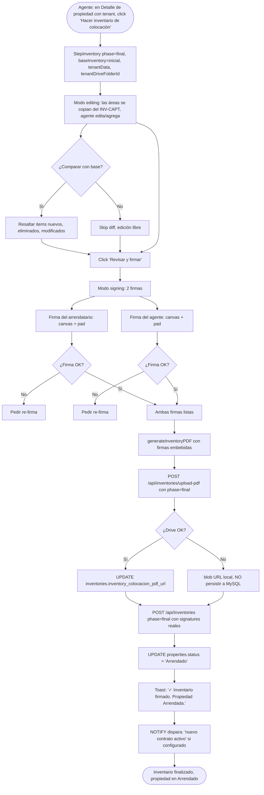
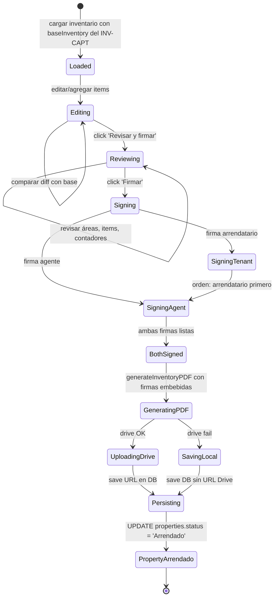
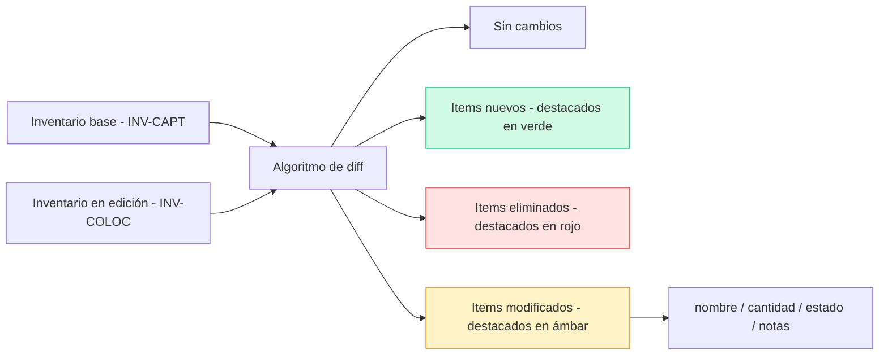
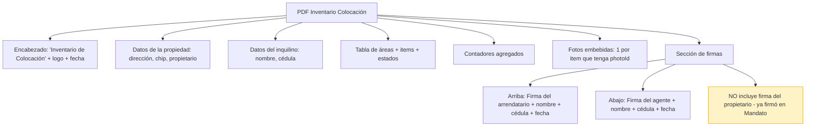
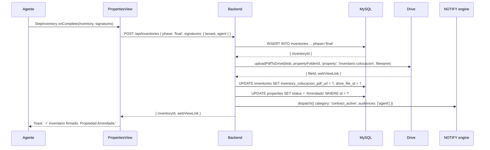

# PROCESO: INV-COLOC — Inventario de Colocación

> Workflow agentico narrativo del proceso de **Inventario de Colocación**
> de una propiedad en InmoControl. Es el inventario firmado al momento
> de **entregar físicamente** el inmueble al inquilino. Usa el Inventario
> de Captación como base (las áreas se copian), permite comparar/editar
> items, y se firma con **2 firmas**: arrendatario + agente (el propietario
> ya firmó en el Contrato de Mandato).
>
> **Este es el momento que marca la propiedad como `Arrendado`**.
> Sin este inventario firmado, la propiedad sigue en `En Colocación` aunque
> tenga contrato activo y tenant asignado.

## 0. Metadata

| Campo | Valor |
|---|---|
| **Código** | `INV-COLOC` |
| **Nombre legible** | Inventario de Colocación (phase='final') |
| **Dominio** | `properties` |
| **Owners** | Frontend: `src/features/properties/components/StepInventory.tsx` (mismo componente, phase='final', `hideSignatures=false`) + `SignatureStep.tsx` · Backend: `server/routes/inventories.ts` |
| **Status** | ⏳ draft (workflow) / ✅ shipped (implementación, en prod desde jul-2026) |
| **Última revisión** | 2026-08-03 |
| **Procesos upstream** | `INV-CAPT` (inventario inicial como `baseInventory`), `CONTRACT-GEN` (contrato activo), `TENANT-ONB` (inquilino asignado, propiedad `En Colocación`) |
| **Procesos downstream** | `BILL-INVOICE` (mensual, requiere propiedad `Arrendado`), `BILL-PAY` (pagos), `BILL-OWNER` (estado de cuenta), `REPORTS` (consolidado anual) |

## 0.5. Diagramas

### Flujo principal (firmar inventario + transición a Arrendado)

### Estados del inventario (fase de firma)

### Comparación con INV-CAPT (diff visual)

### Estructura del PDF firmado

### Secuencia de transición a Arrendado

## 1. Actores

- **Agente inmobiliario** — Lleva a cabo el inventario junto con el inquilino. Edita/agrega items, firma como INMOVIRTUAL.
- **Inquilino** — Recorre el inmueble con el agente. Confirma el estado del inventario. Firma como receptor.
- **Propietario** — NO firma este inventario (ya firmó en el Mandato). Su firma está en el Mandato + Contrato de Arrendamiento.
- **Sistema (InmoControl backend)** — `POST /api/inventories` (phase='final'), `POST /api/inventories/upload-pdf`, transición `properties.status` → `Arrendado`.
- **Sistema (InmoControl frontend)** — `StepInventory.tsx` (mismo componente, phase='final', `hideSignatures=false`), `SignatureStep.tsx` (canvas de firma).
- **Google Drive** — Recibe el PDF firmado en `Inventarios/Inventario colocacion/`.
- **MySQL** — Tabla `inventories` con `phase='final'`, columna `inventory_colocacion_pdf_url` (inglés, NO español).
- **NOTIFY engine** — Dispara notificación opcional `contract_active` cuando se marca Arrendado.

## 2. Contexto inicial

- **Cuándo se dispara**: el agente abre el Detalle de una propiedad `En Colocación` (con tenant activo + contrato activo) y hace click en "Hacer inventario de colocación".
- **UI entry point**: `src/features/properties/PropertiesView.tsx` → tab Inventarios → botón "Hacer inventario de colocación" → modal `StepInventory`.
- **Precondiciones**:
  - La propiedad existe en MySQL con `status='En Colocación'`.
  - Hay un tenant activo.
  - Hay un contrato activo.
  - Hay un inventario de captación previo (para usar como `baseInventory`).

## 3. Flujo principal (happy path)

### Paso 1 — Cargar inventario base

`StepInventory` se monta con:

- `phase='final'`.
- `baseInventory = INV-CAPT` (cargado de MySQL).
- `tenantData = { name, idNumber, phone, email }` (del tenant activo).
- `tenantDriveFolderId` (de `tenants.drive_folder_path`).
- `hideSignatures=false`.

### Paso 2 — Editor de áreas (copia del INV-CAPT + edición)

`AreaConfigPanel` arranca con las áreas del `baseInventory`. El agente puede:

- **Agregar áreas nuevas** (ej: el propietario dejó un depósito nuevo).
- **Editar items existentes** (ej: cambiar cantidad, agregar nota, cambiar estado).
- **Eliminar items** que ya no están (ej: el propietario retiró un mueble).
- **Marcar daños preexistentes** (nota + foto).

### Paso 3 — Diff visual con base (opcional)

Si el agente clickea "Comparar con captación", la UI muestra:

- 🟢 Items nuevos (no estaban en captación).
- 🔴 Items eliminados (estaban en captación pero ya no).
- 🟡 Items modificados (cambio en cantidad, estado, notas).
- ⚪ Items sin cambios.

Esto facilita la trazabilidad de qué cambió entre captación y colocación.

### Paso 4 — Firma del arrendatario

Click "Revisar y firmar" → entra al modo `signing`. UI muestra:

- Resumen del inventario (read-only).
- Canvas de firma para el arrendatario (puede firmar con mouse, touch, o stylus).
- Botón "Limpiar" para re-firmar.
- Botón "Confirmar firma" para pasar a la siguiente firma.

### Paso 5 — Firma del agente

Mismo flujo. El agente firma como INMOVIRTUAL. Una vez confirmada la
segunda firma, el botón "Finalizar" se habilita.

### Paso 6 — Generar PDF con firmas embebidas

`generateInventoryPDF(inventory, property, tenant, signatures)`:

- Renderiza todas las áreas + items + counters + fotos.
- Embebe las firmas como PNG al final del PDF (en la sección "Firmas").
- NO incluye espacio para firma del propietario (ya firmó en Mandato).
- Guarda `signedAt` en `inventories.signatures.tenant.signedAt` y
  `inventories.signatures.agent.signedAt`.

### Paso 7 — Subir PDF a Drive

Si Drive está conectado:

1. `uploadPdfToDrive(blob, propertyFolderId, 'property', 'Inventario colocacion', 'Inventario_colocacion_<YYYY-MM-DD>.pdf')`.
2. Server sube a `Mi unidad / InmoControl/{dirección}/Inventarios/Inventario colocacion/`.
3. UPDATE `inventories.inventory_colocacion_pdf_url`.

### Paso 8 — Transición a Arrendado

`UPDATE properties SET status = 'Arrendado' WHERE id = :propertyId`.

Dispara (si está configurado en `notificationConfigStore`):

- NOTIFY `contract_active` al agente.

### Paso 9 — Toast final

`"✓ Inventario firmado. Propiedad marcada como Arrendado."`

## 4. Edge cases

### EC-1 — Falta el inventario de captación (baseInventory=null)

- **Trigger**: el agente nunca hizo el inventario de captación, o se perdió.
- **Comportamiento**: el modal permite continuar sin base. El agente
  debe agregar todas las áreas manualmente. Toast de advertencia: "No
  hay inventario de captación previo. Vas a tener que agregar todo desde cero."

### EC-2 — Firma del arrendatario vacía

- **Trigger**: el agente clickea "Confirmar firma" sin firmar.
- **Comportamiento**: validación cliente (canvas no vacío). Toast: "La
  firma del arrendatario no puede estar vacía."

### EC-3 — Solo una firma confirmada

- **Trigger**: el agente confirma la firma del arrendatario pero NO la del
  agente.
- **Comportamiento**: el botón "Finalizar" sigue deshabilitado hasta que
  AMBAS firmas estén confirmadas. La UI muestra checklist:
  - ✅ Firma del arrendatario
  - ☐ Firma del agente

### EC-4 — Orden de las firmas invertido

- **Trigger**: el agente quiere firmar primero como INMOVIRTUAL y
  después el arrendatario.
- **Comportamiento**: la UI permite firmar en cualquier orden (no hay
  restricción UX), pero el PDF se renderiza con el orden legal:
  arrendatario arriba, agente abajo. **Pendiente**: forzar orden legal
  (ver §12).

### EC-5 — Drive caído al subir PDF

- **Trigger**: `DRIVE-FALLBACK-001`. Timeout 8s server / 30s cliente.
- **Comportamiento**: el inventario se persiste en MySQL con
  `inventory_colocacion_pdf_url=null`. La transición a `Arrendado` SÍ
  se hace (no se bloquea por Drive).
- **Toast**: "Inventario firmado. PDF no se pudo subir a Drive (no
  disponible). Se subirá cuando Drive responda."

### EC-6 — Diferencias grandes con INV-CAPT

- **Trigger**: el agente modificó muchos items o agregó muchas áreas nuevas.
- **Comportamiento**: el servidor acepta sin límite. El PDF puede ser
  grande (varias páginas). No hay warning UX.
- **Mejora futura**: warning si diff > 50% del base.

### EC-7 — Fotos no disponibles (IndexedDB limpia)

- **Trigger**: el agente abrió el modal en otro device o limpió datos.
- **Comportamiento**: las fotos del INV-CAPT (en IndexedDB del device
  original) no están. El inventario se genera sin esas fotos (los items
  quedan sin visualización). Toast: "Algunas fotos no se pudieron cargar.
  El inventario se generó sin ellas."

### EC-8 — Re-firma después de finalizar

- **Trigger**: el agente quiere cambiar una firma ya confirmada.
- **Comportamiento**: NO permitido. El inventario finalizado es
  inmutable (trazabilidad legal). El agente debe hacer un nuevo
  inventario adicional (ver §12 Out of scope).

### EC-9 — Firmar en otro device

- **Trigger**: el agente quiere que el inquilino firme desde su casa.
- **Comportamiento**: NO hay flujo de firma remota. La firma debe ser en
  persona. Pendiente: firma digital integrada (ver §12).

### EC-10 — Tenant no presente (firma póstuma)

- **Trigger**: el inquilino no estaba presente el día de la entrega. El
  agente firma como INMOVIRTUAL pero la firma del arrendatario queda pendiente.
- **Comportamiento actual**: NO permitido por la UI (requiere ambas firmas
  para finalizar). El inventario queda en `signing` con 1 firma, esperando
  la firma del inquilino.
- **Pendiente**: flujo "firma pendiente" + recordatorio al inquilino.

### EC-11 — Multi-propiedad (el mismo agente hace 5 inventarios al día)

- **Trigger**: el agente tiene N propiedades en colocación simultáneas.
- **Comportamiento**: cada propiedad tiene su propio wizard. No hay
  interferencia. UI ayuda con listado "Propiedades pendientes de
  inventario de colocación".

### EC-12 — Cancelar el modal a mitad de la firma

- **Trigger**: el agente clickea "Cancelar" después de firmar 1 lado.
- **Comportamiento**: la firma parcial NO se persiste (vive solo en state).
  Modal de confirmación: "¿Cancelar? Las firmas no se guardarán.".
- **Si confirma**: state limpio.
- **Si NO confirma**: vuelve al modal.

### EC-13 — Schema drift `inventario_*` vs `inventory_*`

- **Trigger**: bug histórico (jul-2026).
- **Comportamiento**: server tira `500 ER_BAD_FIELD_ERROR`.
- **Mitigación**: migración 009 + `inventory_colocacion_pdf_url` (inglés)
  en DB. Misma defensa que `INV-CAPT`.

### EC-14 — Inventario finalizado pero el status no pasa a Arrendado

- **Trigger**: el POST devuelve 200 pero la transición a `Arrendado` falla.
- **Comportamiento**: server loggea error. La propiedad sigue en
  `En Colocación`. El inventario está firmado pero la propiedad no.
  Toast: "Inventario firmado. La propiedad NO se marcó como Arrendada.
  Contactá a soporte."
- **Mitigación**: el POST debe ser atómico (inventario + transición en
  la misma transacción lógica). TODO: implementar `withTransaction` para
  este endpoint.

### EC-15 — Firma del agente sin nombre/cédula

- **Trigger**: el agente no llena sus datos personales en Settings.
- **Comportamiento**: el PDF del inventario muestra "________________"
  en lugar del nombre del agente. Trazabilidad rota.

## 5. Estado que muta

### Tablas MySQL afectadas

| Tabla | Operación | Columnas tocadas |
|---|---|---|
| `inventories` | INSERT | `id`, `property_id`, `phase='final'`, `property_type`, `counters_json`, `areas_json`, `photos_meta_json`, `signatures_json` (con `tenant` y `agent` reales), `inventory_colocacion_pdf_url`, `inventory_date`, `drive_file_id`, `created_at`, `updated_at` |
| `properties` | UPDATE | `status='Arrendado'`, `updated_at` |
| `property_actions` | INSERT | `property_id`, `action_type='inventory_signed'`, `details='colocacion' · subida a Drive'` |

### Archivos en Drive creados

| Carpeta destino | Trigger | Convención de nombre |
|---|---|---|
| `Mi unidad / InmoControl/{dirección}/Inventarios/Inventario colocacion/Inventario_colocacion_<YYYY-MM-DD>.pdf` | finalizar con firmas | Fija |

### Stores Zustand actualizados

| Store | Acción | Selectores afectados |
|---|---|---|
| `appStore` | `updateProperty(propertyId, {status: 'Arrendado'})` | `selectPropertyById` |
| `useNotificationConfigStore` | (lectura) | `selectRules` (para dispatch) |

## 6. Contratos cross-cutting

- **Tostadas**: ver `TOAST-001` + tabla §7 abajo. Reutiliza las de `INV-CAPT` + agrega las de firma + transición.
- **JSON errors**: ver `JSON-001`. Especialmente el rechazo de blob URL en server.
- **Timeouts**: ver `TIMEOUT-001`. Aplican: server 8s por llamada a Drive; cliente 30s para uploads.
- **Drive fallback**: ver `DRIVE-FALLBACK-001`. Inventario se persiste igual sin URL Drive.
- **Idempotencia**: ver `IDEMPOTENT-001`. `inventoryId = ${propertyId}:final` es estable.
- **Auth**: ver `SECURITY-001`. `requireAuth` en todos los endpoints de inventories.

## 7. Tostadas exactas (copy approved)

| Trigger | Tipo | Copy exacto |
|---|---|---|
| Finalizar con 2 firmas + Drive OK | success | "✓ Inventario firmado. Propiedad marcada como Arrendado." |
| Finalizar con Drive fail | warning | "Inventario firmado. PDF no se pudo subir a Drive (no disponible). Se subirá cuando Drive responda." |
| Finalizar sin transición a Arrendado | error | "Inventario firmado. La propiedad NO se marcó como Arrendada. Contactá a soporte." |
| Firma vacía | error | "La firma del {rol} no puede estar vacía." |
| Re-firma solicitada | (limpia canvas) | n/a |
| Cancelar con firmas parciales | warning | "Las firmas no se guardarán. ¿Cancelar?" |
| Diff con INV-CAPT | (visual, no toast) | Badge 🟢/🔴/🟡 por item |
| Falta INV-CAPT base | warning | "No hay inventario de captación previo. Vas a tener que agregar todo desde cero." |

## 8. Anti-patrones explícitos

- ❌ **Permitir finalizar con 1 sola firma** → constraint duro. Requiere
  AMBAS firmas (arrendatario + agente).
- ❌ **Persistir blob URL del PDF a MySQL** → defensa contra zombie.
- ❌ **Asumir que el propietario firma este inventario** → NO. Su firma
  está en el Mandato. Este PDF solo tiene 2 firmas.
- ❌ **Cerrar el modal antes del POST** → Karpathy. Modal abierto con
  spinner hasta response.
- ❌ **No transicionar a Arrendado si Drive falló** → la transición es
  independiente de Drive. El inventario se firma igual.
- ❌ **Borrar el inventario finalizado** → soft delete (columna
  `deleted_at`). Trazabilidad legal.
- ❌ **Usar nombres en español para columnas** → bug del jul-2026. Solo
  `inventory_colocacion_pdf_url` (inglés) en DB.
- ❌ **Permitir re-firma post-finalización** → inmutabilidad legal.

## 9. Especificaciones técnicas relacionadas

- `docs/specs/wizard_inventory.md` — Spec detallado (aprobado).
- `docs/specs/fix-bug-014-inventories-upload-pdf-timeout.md` — Timeout 8s.
- `docs/specs/fix-bug-015-inventories-upload-photos-timeout.md` — Timeout 8s.
- `docs/specs/fix-bug-026-stepinventory-base-inventory-memo.md` — Memo del
  baseInventory.
- `tests/verifiers/wizard_inventory.md` — Verifier E2E.

## 10. Endpoints backend utilizados

| Método | Path | Archivo | Notas |
|---|---|---|---|
| `POST` | `/api/inventories` | `server/routes/inventories.ts` | Crea inventario con phase='final' + signatures reales. |
| `POST` | `/api/inventories/upload-pdf` | idem | Sube PDF firmado a `Inventarios/Inventario colocacion/`. |
| `POST` | `/api/inventories/upload-photos` | idem | Sube fotos (si hay nuevas). |
| `PATCH` | `/api/properties/:id` | `server/routes/properties.ts` | (server-side, dentro de POST /inventories) Actualiza status='Arrendado'. |

## 11. Riesgos identificados

| Riesgo | Probabilidad | Impacto | Mitigación |
|---|---|---|---|
| Inventario finalizado pero propiedad NO Arrendada | Media | Alta (rompe billing) | Transacción atómica inventario + status update |
| Re-firma no permitida | Baja | Baja | Soft delete + nuevo inventario (TODO) |
| Diff grande silencioso | Media | Baja | Warning si diff > 50% (TODO) |
| Firma del agente sin datos | Media | Media | Settings: requerir nombre + cédula del agente |
| Firma remota no soportada | Alta | Media | Firma digital integrada (TODO) |
| Fotos perdidas en IndexedDB | Media | Baja | Warning al abrir modal en device diferente |
| Inventario finalizado + Drive caído | Media | Media | Re-subida desde el Detalle (TODO) |

## 12. Out of scope explícito

- ❌ **Firma digital remota** (DocuSign, firma con cédula digital
  colombiana). Solo firma en persona via canvas.
- ❌ **Re-firma post-finalización** — el inventario es inmutable.
- ❌ **Soft delete con `deleted_at`** — hoy DELETE físico (TODO).
- ❌ **Transición atómica inventario + status** — hoy son 2 queries
  separadas (TODO).
- ❌ **Multi-firma** (propietario también firma acá). NO — la firma del
  propietario está en el Mandato.
- ❌ **Renovación del inventario al cabo de N años** — solo se hace al
  cambiar de inquilino.

## 13. Approval

**Status:** ⏳ Pending Review
**Aprobado por:** —
**Fecha de aprobación:** —

> Spec base: `docs/specs/wizard_inventory.md` (aprobado).
> Este workflow es la versión "proceso dedicado" del inventario de
> colocación, con énfasis en: las 2 firmas (NO la del propietario), la
> transición a `Arrendado` que es el unlock de `BILL-INVOICE`, el diff
> visual con el INV-CAPT, y la política de inmutabilidad legal.

---

> **Recordatorio Karpathy**: una vez aprobado, las features nuevas dentro
> de este proceso (ej: "firma digital remota", "transición atómica")
> siguen el flujo spec → verifier → implementación. Este workflow NO se
> modifica para hacer pasar checks.