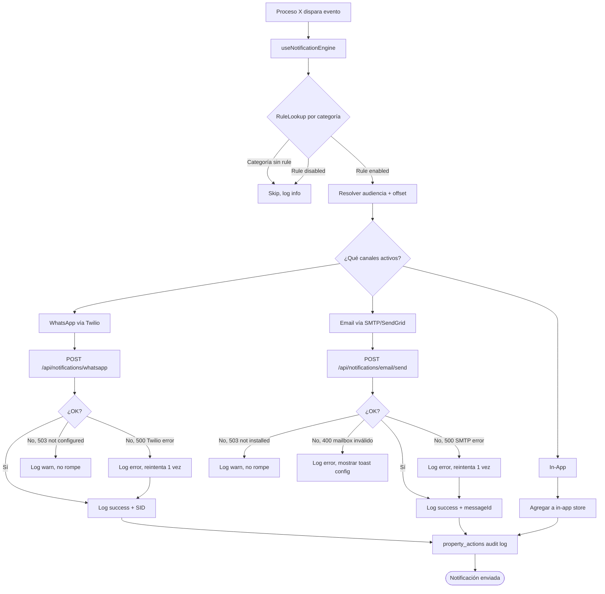
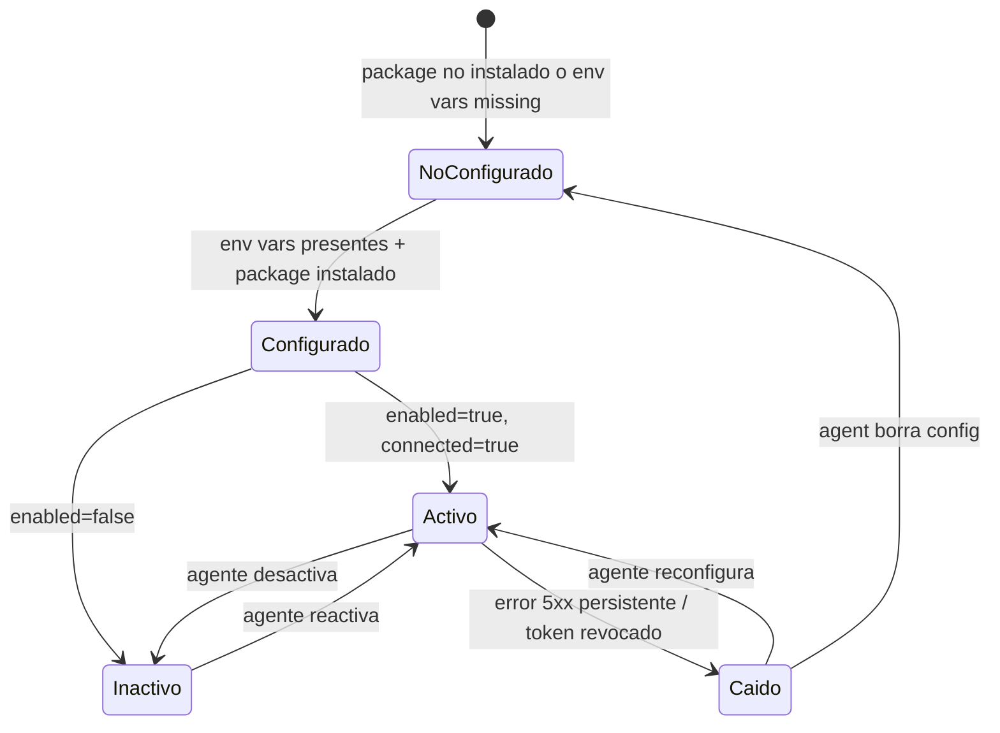
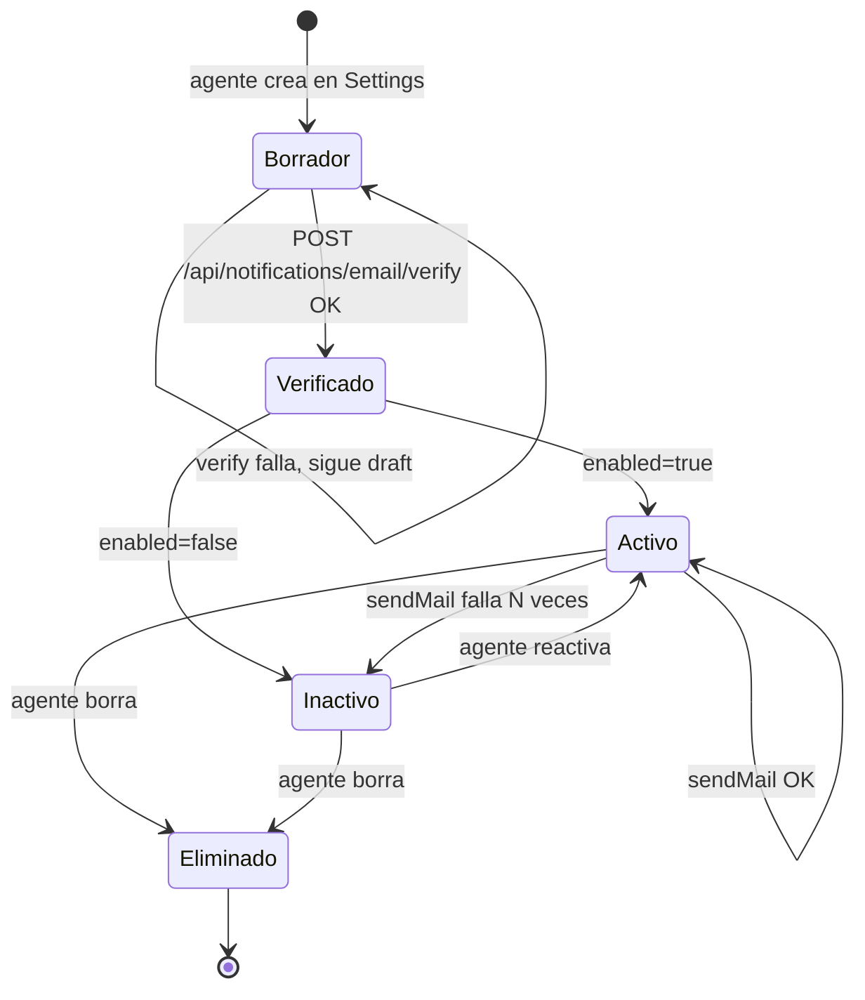
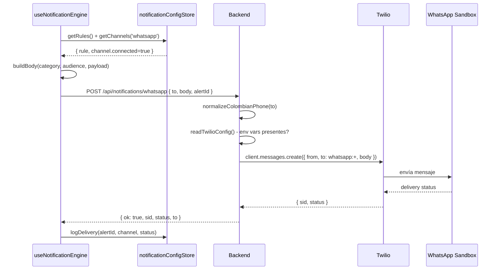
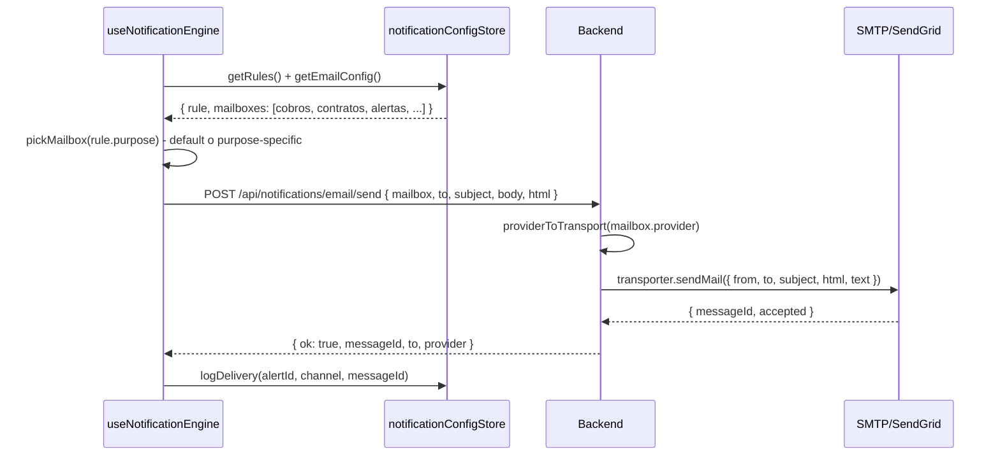

# PROCESO: NOTIFY — Notificaciones Multicanal

> Workflow agentico narrativo del proceso de notificaciones de InmoControl.
> Cubre los 3 canales (WhatsApp vía Twilio, Email vía SMTP/SendGrid, In-App),
> el adapter pattern del engine, las reglas por categoría de alerta (mora,
> vencimiento, preaviso, documento), el fallback cuando un canal no está
> configurado, y los audit logs.
>
> Es foundational: lo disparan otros procesos (`BILL-INVOICE`, `BILL-OWNER`,
> `ALERTS`) cuando ocurren eventos que el agente/propietario/inquilino deben
> saber. La config vive en Zustand persist (`notificationConfigStore`).

## 0. Metadata

| Campo | Valor |
|---|---|
| **Código** | `NOTIFY` |
| **Nombre legible** | Notificaciones Multicanal |
| **Dominio** | `notify` |
| **Owners** | Backend: `server/routes/notifications.ts` · Frontend: `src/features/alerts/notificationConfigStore.ts` + `src/features/alerts/useNotificationEngine.ts` + `src/features/alerts/ruleTypes.ts` · Config UI: `src/features/settings/SettingsView.tsx` (EmailConfigManager) + `src/features/alerts/AlertsView.tsx` |
| **Status** | ⏳ draft (workflow) / ✅ shipped (implementación, en prod desde jul-2026) |
| **Última revisión** | 2026-08-03 |
| **Procesos upstream** | — (foundational, no depende de otros) |
| **Procesos downstream** | `BILL-INVOICE` (notifica "Enviaste CC"), `BILL-OWNER` (envía estado de cuenta), `ALERTS` (alertas por categoría: mora, vencimiento, preaviso, documento), `TENANT-ONB` (notifica nuevo inquilino), futuros procesos que disparen eventos |

## 0.5. Diagramas

### Flujo principal (engine dispara evento)



### Estados de un canal



### Estados de un mailbox de email



### Secuencia de un envío (WhatsApp)



### Secuencia de un envío (Email multi-buzón)



## 1. Actores

- **Engine de notificaciones** (`useNotificationEngine.ts`) — Disparado por procesos que emiten eventos (mora, vencimiento, preaviso, documento).
- **Agente inmobiliario** — Configura canales desde `SettingsView` (mailboxes, enable/disable). Configura reglas desde `AlertsView` (qué canales por categoría, qué audiencias, offset).
- **Propietario** — Receptor de emails de vencimiento + preaviso + estado de cuenta. WhatsApp solo si configurado.
- **Inquilino** — Receptor de WhatsApp de mora (sandbox Twilio requiere "join <palabra>" previo).
- **Sistema (InmoControl backend)** — `server/routes/notifications.ts` (4 endpoints WhatsApp + 4 endpoints email). Lee credenciales de env (Twilio) o del body (mailboxes SMTP/SendGrid).
- **Twilio** — Sandbox WhatsApp (`whatsapp:+14155238886`). Producción: número dedicado.
- **SMTP / SendGrid** — Proveedor de email del mailbox configurado por la agencia.
- **Zustand persist** — `notificationConfigStore` guarda config en localStorage (canales + reglas + mailboxes).

## 2. Contexto inicial

- **Cuándo se dispara**:
  - **Config**: agente entra a `Settings → Integraciones` o `Alerts` y configura canales/reglas/mailboxes.
  - **Envío**: cualquier proceso downstream llama `useNotificationEngine.dispatch(event)` cuando ocurre un evento relevante.
- **UI entry points**:
  - Settings: `src/features/settings/SettingsView.tsx` → `EmailConfigManager` (CRUD de mailboxes + verify + test).
  - Alerts: `src/features/alerts/AlertsView.tsx` → reglas por categoría (canales + audiencias + offset).
  - Status: cualquier vista puede leer `selectChannelStatus('whatsapp' | 'email')`.
- **Precondiciones**:
  - **Config**: ninguna (puede configurar sin auth previa).
  - **Envío**: el canal debe estar configurado (Twilio env vars O mailbox SMTP/SendGrid). Si no, fallback silencioso.

## 3. Flujo principal (happy path)

### Paso 1 — Configurar canales (Settings → Integraciones)

El agente entra a Settings. Ve el panel de "Integraciones":

1. **WhatsApp**: muestra el status actual (`GET /api/notifications/whatsapp/status`).
   - Si Twilio está configurado (env vars presentes + package instalado):
     `configured=true, mode=live, from='whatsapp:+14155238886'`.
   - Si no: `configured=false, mode='mock'` + mensaje de qué falta.
   - Botón "Enviar mensaje de prueba" → `POST /api/notifications/whatsapp/test`.

2. **Email**: lista de mailboxes (CRUD).
   - Crear mailbox: nombre + from + provider (SMTP/SendGrid) + credenciales.
   - Verificar: `POST /api/notifications/email/verify` (sin enviar, solo verifica conexión).
   - Test: `POST /api/notifications/email/test` (envía un email de prueba).
   - Toggle enabled/disabled. Set default.

3. **Fallback env**: si la agencia no configura mailbox propio, el server
   usa `EMAIL_FALLBACK_ENABLED=true` + `SMTP_*` o `SENDGRID_API_KEY` de
   `.env.local`. Status: `GET /api/notifications/email/status`.

### Paso 2 — Configurar reglas (Alerts)

El agente entra a `AlertsView`. Para cada categoría (`mora`, `vencimiento`,
`preaviso`, `documento`):

- Toggle enabled.
- Elegir canales: whatsapp / email / in_app.
- Elegir audiencias: tenant / owner / agent.
- Offset en días (ej: mora → recordatorio 1 día después del vencimiento).

Defaults pensados para Colombia (ver `notificationConfigStore.ts:39-72`):
- **Mora**: WhatsApp al inquilino + email al propietario + in-app al agente, offset 1d.
- **Vencimiento**: email al propietario + in-app al agente, offset 60d.
- **Preaviso**: email al propietario + in-app al agente, offset 0d.
- **Documento (mandato)**: in-app al agente, offset 0d.

### Paso 3 — Engine dispara evento

Un proceso downstream (ej: `BILL-INVOICE` al marcar pagado, `ALERTS` al
detectar mora) llama `useNotificationEngine.dispatch(event)`:

```typescript
interface NotificationEvent {
  category: 'mora' | 'vencimiento' | 'preaviso' | 'documento' | 'payment_received' | 'invoice_sent';
  audiences: Array<{ type: 'tenant' | 'owner' | 'agent'; contact: string | null }>;
  payload: Record<string, any>;  // datos para el template (monto, fecha, etc.)
  alertId?: string;               // para tracking
}
```

El engine:

1. Lookup de la rule por categoría en `notificationConfigStore`.
2. Si la rule está disabled → skip + log info.
3. Resolver audiencia + offset (calcula fecha objetivo).
4. Para cada canal activo en la rule:
   - Si WhatsApp: `POST /api/notifications/whatsapp` con el body template.
   - Si Email: pick mailbox (default o purpose-specific) + `POST /api/notifications/email/send`.
   - Si In-App: agrega a `useInAppNotificationsStore`.
5. Log en audit (`property_actions` o tabla dedicada).

### Paso 4 — Templates de mensaje

Templates hardcoded en `useNotificationEngine.ts` por categoría. Ejemplos:

- **Mora**: "Hola {tenant_name}, te recordamos que el pago del canon de
  arrendamiento de {property_address} venció el {due_date}. Por favor
  realizá el pago a la brevedad. — InmoControl"
- **Vencimiento**: "El contrato de {property_address} vence el {end_date}.
  Recordá iniciar el proceso de renovación con 60 días de anticipación."
- **Estado de cuenta**: "Hola {owner_name}, adjuntamos el estado de cuenta
  del mes {period}. Por favor revisalo y reportá cualquier inconsistencia
  en 5 días hábiles."

Los templates NO son configurables hoy (TODO: hacerlos editables desde UI,
ver §12 Out of scope).

## 4. Edge cases

### EC-1 — Twilio no configurado

- **Trigger**: alguna de `TWILIO_ACCOUNT_SID`, `TWILIO_AUTH_TOKEN`,
  `TWILIO_WHATSAPP_FROM` falta en `.env.local`.
- **Comportamiento**: `GET /api/notifications/whatsapp/status` devuelve
  `{ configured: false, mode: 'mock' }`. `POST /api/notifications/whatsapp`
  devuelve `503 { error: 'TWILIO_NOT_CONFIGURED' }`. El frontend hace
  fallback a log local (NO rompe la app).
- **Mitigación**: el canal sigue apareciendo en la UI con badge 🟠
  "Twilio no configurado — Agrega TWILIO_* a .env.local".

### EC-2 — Twilio package no instalado

- **Trigger**: `twilio` no está en `node_modules` (ej: build de CI sin dev deps).
- **Comportamiento**: import dinámico falla (`getClient()` devuelve `null`).
  Mismo fallback que EC-1.

### EC-3 — Número de teléfono colombiano mal formateado

- **Trigger**: `normalizeColombianPhone(to)` no puede parsearlo.
- **Comportamiento**: server devuelve `400 { error: 'Número inválido: ...' }`.
  El engine loggea el error y NO reintenta (el dato está mal).
- **Normalización**: acepta `+57 300 123 4567`, `573001234567`, `3001234567`,
  `300 123 4567`. Rechaza cualquier otro formato.

### EC-4 — Sandbox Twilio — destinatario no hizo "join"

- **Trigger**: el inquilino nunca mandó "join <palabra>" al sandbox desde
  su WhatsApp. Twilio rechaza el envío con error `63016` (sandbox
  restriction).
- **Comportamiento**: server devuelve `500 { error: '...', code: '63016' }`.
  El engine loggea error. NO se reintenta.
- **Mitigación**: en producción con número dedicado, este edge case no
  aplica.

### EC-5 — nodemailer no instalado

- **Trigger**: `nodemailer` no está en `node_modules`.
- **Comportamiento**: `GET /api/notifications/email/status` devuelve
  `{ packageInstalled: false, ... }`. `POST /api/notifications/email/send`
  devuelve `503 { error: 'NODEMAILER_NOT_INSTALLED' }`.

### EC-6 — SMTP/SendGrid credenciales inválidas

- **Trigger**: `POST /api/notifications/email/send` con mailbox cuyas
  credenciales son incorrectas.
- **Comportamiento**: nodemailer tira error de auth. Server devuelve
  `500 { error: 'Invalid login: 535...' }`. El engine loggea error.
- **Mitigación**: el agente debe verificar la config con
  `POST /api/notifications/email/verify` antes de activar el mailbox.

### EC-7 — Sin mailbox configurado y sin fallback env

- **Trigger**: la agencia no configuró ningún mailbox Y
  `EMAIL_FALLBACK_ENABLED` no está en `true`.
- **Comportamiento**: `POST /api/notifications/email/send` devuelve
  `400 { error: 'Falta mailbox y no hay fallback configurado' }`. El
  engine loggea warn. El canal email se desactiva silenciosamente.

### EC-8 — Rate limit de Twilio o SMTP

- **Trigger**: muchas notificaciones en poco tiempo. Twilio devuelve 429.
  SMTP rechaza con "Too many connections".
- **Comportamiento**: server devuelve `429/500`. El engine reintenta 1 vez
  con backoff de 2s. Si falla, log error y NO reintenta más.
- **Mitigación**: throttle en el engine (max 1 notificación por
  destinatario cada 5 min, por categoría).

### EC-9 — Inyección HTML en subject/body del email

- **Trigger**: un payload malicioso incluye `<script>` en el subject.
- **Comportamiento actual**: el server `escapeHtml()` antes de meter en
  HTML. Server devuelve `nodemailer.sendMail({ html: htmlBody })` con el
  HTML escapado.
- **Mitigación adicional**: NO confiar en `html=true` del cliente para
  emails críticos (cuentas de cobro, estados de cuenta) — esos van como
  attachment PDF, no como HTML inline.

### EC-10 — Email fallback centralizado vs mailbox per-agency

- **Trigger**: en piloto single-tenant, el frontend pasa la config del
  mailbox en cada request. En SaaS multi-tenant, el backend debería
  resolver desde DB cifrada.
- **Estado**: el shape de `emailConfig` ya es per-agency (en el store),
  pero el server hoy lee credenciales del body. Migración pendiente
  cuando se implemente `AUTH` per-agency.

### EC-11 — Notificación enviada a audiencia sin contacto

- **Trigger**: el inquilino no tiene `phone` cargado, pero la rule
  "mora" incluye WhatsApp al inquilino.
- **Comportamiento**: el engine skip-a esa audiencia + log warn
  ("audiencia sin contacto: tenant"). NO falla la notificación para
  otras audiencias.
- **Mitigación**: validación al asignar inquilino (`TENANT-ONB` AC-X
  requiere phone).

### EC-12 — Audit trail perdido (engine crashea mid-envío)

- **Trigger**: el server crashea entre `sendMail` y el log.
- **Comportamiento**: la notificación se envió pero no se loggeó.
- **Mitigación**: el log está en el mismo try/catch. Si el server crashea,
  el log también se pierde. Trade-off aceptado (Twilio/SMTP no garantizan
  delivery report en HTTP response).

## 5. Estado que muta

### Tablas MySQL afectadas

| Tabla | Operación | Columnas tocadas |
|---|---|---|
| `notification_log` | INSERT | `alert_id`, `channel`, `recipient`, `status`, `provider_message_id`, `sent_at` |
| `property_actions` | INSERT (si aplica) | `property_id`, `action_type='notification_sent'`, `details` |

### Stores Zustand actualizados

| Store | Acción | Selectores afectados |
|---|---|---|
| `notificationConfigStore` | `addMailbox`, `updateMailbox`, `removeMailbox`, `toggleMailbox`, `setDefaultMailbox`, `setChannelEnabled`, `updateRule`, `toggleRule`, `toggleRuleChannel`, `toggleRuleAudience` | `selectChannels`, `selectRules`, `selectEmailConfig`, `selectMailboxes`, `selectDefaultMailbox` |
| `useInAppNotificationsStore` | `add(notification)` | `selectInAppNotifications`, `selectUnreadCount` |

### Archivos externos creados

| Destino | Trigger | Convención |
|---|---|---|
| Twilio | `client.messages.create` | API call (no archivo) |
| SMTP server | `transporter.sendMail` | API call (no archivo) |
| SendGrid API | `transporter.sendMail` (vía nodemailer) | API call (no archivo) |

## 6. Contratos cross-cutting

- **Tostadas**: ver `TOAST-001` + tabla §7 abajo. Las tostadas de este
  proceso son principalmente del agente configurando (no del receptor).
- **JSON errors**: ver `JSON-001`. Especialmente el server devuelve
  `503 { error: 'TWILIO_NOT_CONFIGURED' }` o
  `503 { error: 'NODEMAILER_NOT_INSTALLED' }` — el frontend hace fallback
  silencioso.
- **Timeouts**: ver `TIMEOUT-001`. Aplican: server sin timeout explícito
  hoy (Twilio: default 30s, nodemailer: default 0 = sin timeout). TODO:
  agregar `withTimeout` a `messages.create` y `transporter.sendMail`.
- **Idempotencia**: ver `IDEMPOTENT-001`. `alertId` permite deduplicar
  envíos en retry.
- **Auth**: ver `SECURITY-001`. `requireAuth` en todos los endpoints de
  notifications (`router.use(requireAuth)` al top del router).

## 7. Tostadas exactas (copy approved)

| Trigger | Tipo | Copy exacto |
|---|---|---|
| Test WhatsApp OK | success | "✓ Mensaje de WhatsApp enviado a {phone}" |
| Test WhatsApp fail (no config) | warning | "Twilio no está configurado. Agrega TWILIO_* a .env.local" |
| Test WhatsApp fail (Twilio error) | error | "Error enviando WhatsApp: {error}" |
| Verify email OK | success | "✓ Conexión SMTP/SendGrid verificada" |
| Verify email fail | error | "No se pudo verificar: {error}" |
| Test email OK | success | "✓ Email de prueba enviado a {to}" |
| Test email fail | error | "Error enviando email: {error}" |
| Mailbox creado | success | "✓ Buzón '{name}' creado" |
| Mailbox activado/desactivado | success | "Buzón '{name}' {enabled ? 'activado' : 'desactivado'}" |
| Mailbox eliminado | success | "Buzón '{name}' eliminado" |
| Notificación enviada OK | (log only, no toast) | "Notificación enviada: {category} via {channel} to {recipient}" |
| Notificación falló (5xx persistente) | error | "Falló el envío de {category} a {recipient}. Revisá la config." |
| Audiencia sin contacto | warning | "No se envió {channel} a {audience_type} — sin contacto cargado" |

## 8. Anti-patrones explícitos

- ❌ **Romper el flujo si un canal no está configurado** → el agente
  configura después. El fallback silencioso (log warn, no toast) es
  el comportamiento correcto.
- ❌ **Hardcodear credenciales en el cliente** → en piloto single-tenant
  se pasan en el body, pero la migración a SaaS debe resolver desde
  DB cifrada (ver EC-10).
- ❌ **Reintentar infinitamente un envío que falla por datos malos**
  → EC-3 (teléfono mal formateado) NO se reintenta. Es data error, no
  transient error.
- ❌ **Confiar en `html=true` del cliente para emails críticos** → usar
  attachments PDF para cuentas de cobro, estados de cuenta.
- ❌ **Asumir que el destinatario tiene `phone` cargado** → EC-11. Validar
  al asignar inquilino + skip silencioso si falta.
- ❌ **Cerrar el modal de test antes del response** → mismo patrón que
  Karpathy. El modal debe quedar abierto con spinner hasta que Twilio/SMTP
  responda.

## 9. Especificaciones técnicas relacionadas

- `docs/env/ARCHITECTURE.md` §1 — Stack incluye `twilio` + `nodemailer`.
- `docs/env/CONSTRAINTS.md` §5 — Timeouts explícitos.
- `docs/specs/fix-bug-029-central-error-wrapper.md` — `asyncHandler` en
  todas las rutas de notifications.
- `AGENTS.md` §"Reglas del proyecto" — Twilio y nodemailer son las únicas
  deps de notificación aprobadas (no agregar otras sin discusión).
- ⏳ TBD — Spec de "templates editables desde UI" (Out of scope hoy).

## 10. Endpoints backend utilizados

| Método | Path | Archivo | Notas |
|---|---|---|---|
| `GET` | `/api/notifications/whatsapp/status` | `server/routes/notifications.ts` | Health check del canal. |
| `POST` | `/api/notifications/whatsapp` | idem | Envía WhatsApp (uso del engine). |
| `POST` | `/api/notifications/whatsapp/test` | idem | Test desde UI Settings. |
| `GET` | `/api/notifications/email/status` | idem | Status global (package + fallback). |
| `POST` | `/api/notifications/email/verify` | idem | Verifica SMTP/SendGrid sin enviar. |
| `POST` | `/api/notifications/email/test` | idem | Test desde UI Settings. |
| `POST` | `/api/notifications/email/send` | idem | Envía email (uso del engine). |
| `GET` | `/api/notifications/in-app` | idem (planeado) | Lista notificaciones in-app. |
| `PATCH` | `/api/notifications/in-app/:id/read` | idem (planeado) | Marca como leída. |

## 11. Riesgos identificados

| Riesgo | Probabilidad | Impacto | Mitigación |
|---|---|---|---|
| Twilio account suspendida | Baja | Alta | Alertar al agente + log + fallback email |
| SMTP password leak en logs | Media | Alta | NO loggear credenciales. Sanitizar mensajes de error. |
| Rate limit de Twilio en pico | Media | Media | Throttle en el engine (1 notif/5min/destinatario) |
| SendGrid API key rotada | Baja | Media | UI permite actualizar sin redeploy |
| Sandbox Twilio restriction (63016) | Alta (piloto) | Baja | Doc en TESTERS.md — destinatario debe hacer "join" |
| Email cae en spam | Media | Media | Configurar SPF/DKIM en dominio del from. Documentación al usuario. |
| Migración SaaS sin cifrado de creds | Alta (cuando se haga) | Alta | Mover mailbox config a DB cifrada antes de multi-tenant |

## 12. Out of scope explícito

- ❌ **Templates editables desde UI** — los mensajes están hardcoded
  en `useNotificationEngine.ts`. El agente no puede editar copy.
- ❌ **Migración de credenciales a DB cifrada** — hoy pasan en el body
  del request. Pendiente para SaaS multi-tenant.
- ❌ **Retry persistente** — solo 1 retry con backoff de 2s. No hay
  cola de mensajes para re-envío diferido.
- ❌ **Delivery reports (webhooks)** — Twilio/SendGrid pueden reportar
  delivery status via webhook. No implementado.
- ❌ **Multi-idioma** — los mensajes están en español. No hay i18n.
- ❌ **Notificaciones push (browser)** — solo in-app, no push real.
- ❌ **Refactor del engine** — `useNotificationEngine.ts` puede crecer;
  refactor pendiente.

## 13. Approval

**Status:** ⏳ Pending Review
**Aprobado por:** —
**Fecha de aprobación:** —

> **Recordatorio Karpathy**: una vez aprobado, las features nuevas dentro
> de este proceso (ej: "templates editables", "retry persistente") siguen
> el flujo spec → verifier → implementación. Este workflow NO se modifica
> para hacer pasar checks.