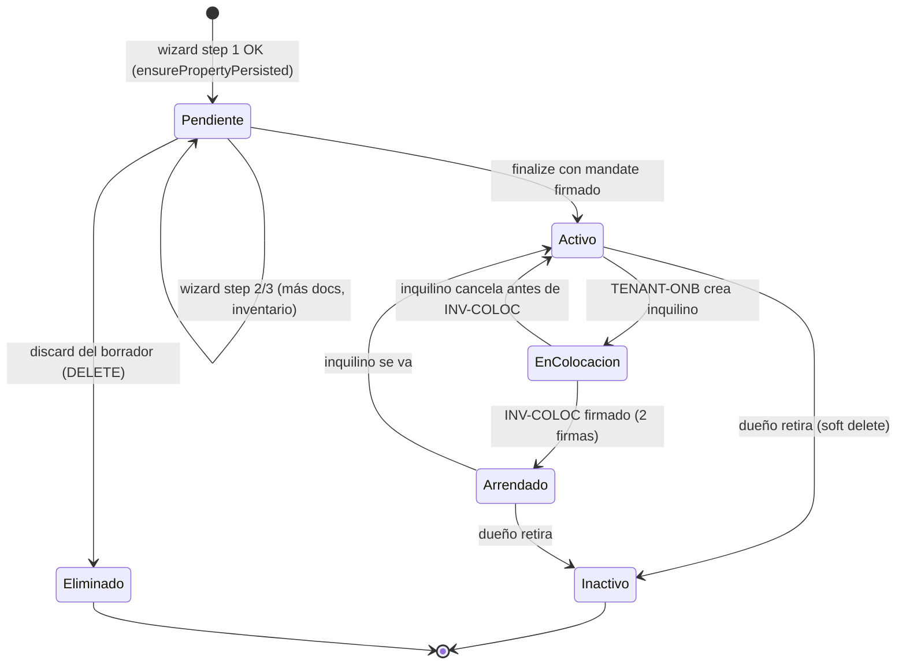
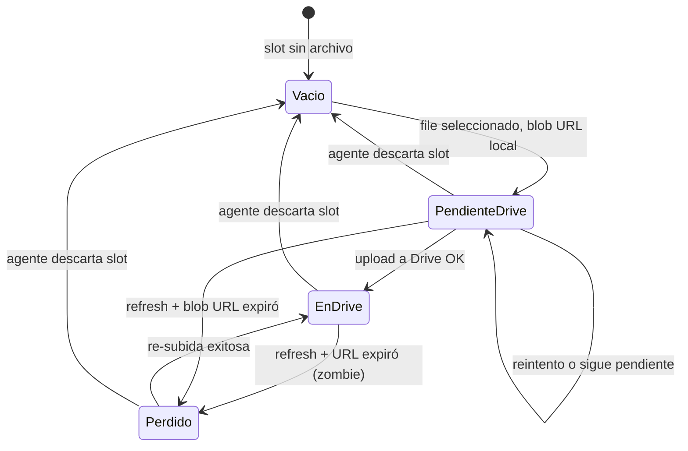
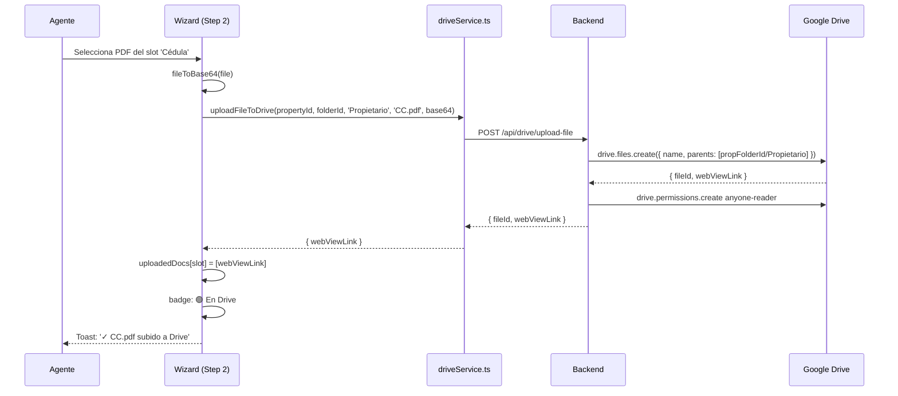
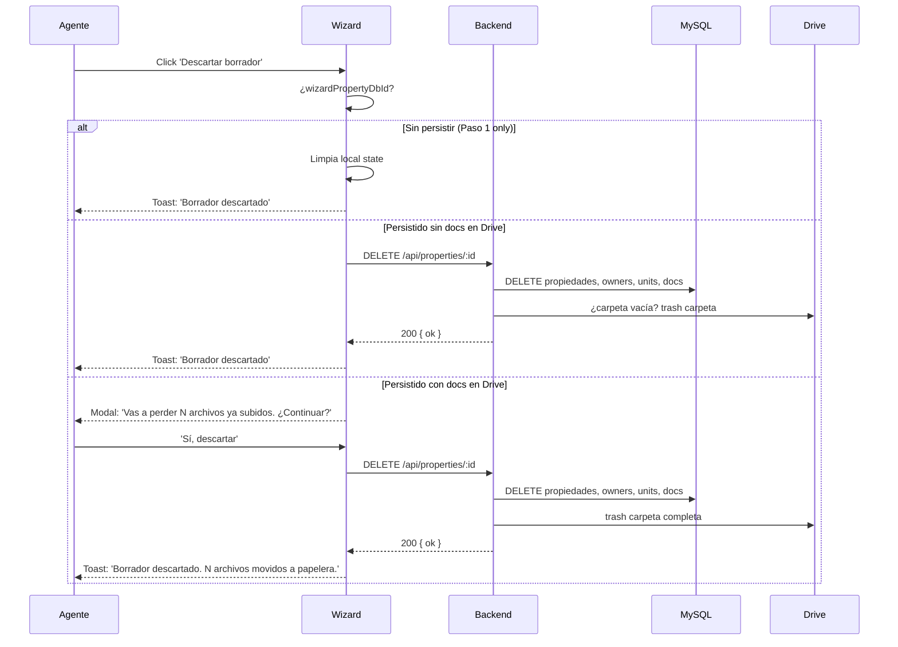

# PROCESO: PROP-CAPT — Captación de Propiedad

> Workflow agentico narrativo del proceso de captación de una propiedad
> en InmoControl. Cubre el wizard de 3 pasos (Datos → Documentos → Inventario),
> la finalización con UPSERT a MySQL, el discard del borrador con limpieza
> de huérfanos en Drive, y todos los edge cases documentados (Drive caído,
> timeout, doble POST, blob URL zombie, etc.).
>
> Es el proceso foundational de gestión inmobiliaria. Lo desbloquea todo:
> `PROP-DOCS`, `INV-CAPT`, `TENANT-ONB`, etc.

## 0. Metadata

| Campo | Valor |
|---|---|
| **Código** | `PROP-CAPT` |
| **Nombre legible** | Captación de Propiedad (wizard 3 pasos) |
| **Dominio** | `properties` |
| **Owners** | Frontend: `src/features/properties/PropertiesView.tsx` (monolito) + `StepBasic.tsx` + `StepDocs.tsx` + `StepInventory.tsx` · Backend: `server/routes/properties.ts` |
| **Status** | ⏳ draft (workflow) / ✅ shipped (implementación, en prod desde jul-2026) |
| **Última revisión** | 2026-08-03 |
| **Procesos upstream** | `DRIVE-OPS` (uploads + carpetas), `NOTIFY` (notificaciones opcionales) |
| **Procesos downstream** | `PROP-DOCS` (5 docs legales son sub-proceso), `INV-CAPT` (inventario es step 3), `TENANT-ONB` (asignar inquilino requiere propiedad), `CONTRACT-GEN`, `INV-COLOC`, `BILL-INVOICE` |

## 0.5. Diagramas

### Flujo principal del wizard (3 pasos + finalize + discard)

```mermaid
flowchart TD
    Start([Agente: 'Nueva propiedad']) --> Step1[Step 1: Datos básicos<br/>address, chip, folio, owners, units]
    Step1 --> Validate1{¿Datos válidos?}
    Validate1 -- No --> Err1[Toast: 'Agregá al menos un propietario']
    Validate1 -- Sí --> Persist1[ensurePropertyPersisted<br/>POST /api/properties status=Pendiente]
    Persist1 --> Step2[Step 2: 5 docs legales<br/>CC, Certificado, Predial, RUT, Mandato]
    Step2 --> Upload2{¿Sube PDF?}
    Upload2 -- Sí, Drive OK --> Real2[Upload inmediato a Drive<br/>badge 🟢]
    Upload2 -- Sí, Drive caído --> Local2[blob: URL local<br/>badge 🟠]
    Upload2 -- No --> Step3[Step 3: Inventario captación<br/>sin firmas arrendatario]
    Step2 --> Confirm2{¿Click 'Continuar a Inventario'?}
    Confirm2 -- Faltan docs --> Modal2[Modal: 'Subir los pendientes'<br/>o 'Continuar con N pendiente(s)']
    Modal2 --> Step3
    Step3 --> Finalize[handleFinalize<br/>UPSERT con mandate + docs + status]
    Finalize --> MandateCheck{¿Mandato firmado?}
    MandateCheck -- Sí --> Active[status = 'Activo']
    MandateCheck -- No --> Pendiente[status = 'Pendiente']
    Active --> Summary[Modal resumen post-finalize<br/>4 secciones: 🟢/🟠/❌/🔴]
    Pendiente --> Summary
    Summary --> End([✓ Propiedad creada])

    Step1 -.Click 'Descartar borrador'.-> Discard{¿Hubo persistencia?}
    Step2 -.Click 'Descartar borrador'.-> Discard
    Discard -- Sí, sin docs Drive --> Clean1[DELETE /api/properties/:id<br/>limpia carpeta Drive vacía]
    Discard -- Sí, con docs Drive --> ConfirmD[Modal: 'Vas a perder N archivos ya subidos']
    ConfirmD -- Sí --> CleanD[DELETE propiedades + trash archivos Drive]
    ConfirmD -- No --> Resume[Vuelve al wizard]
    Clean1 --> End2([Borrador descartado])
    CleanD --> End2
```

### Estados de la propiedad (ciclo de vida completo)



> Nota: este workflow solo cubre `Pendiente` + transición a `Activo`.
> Los estados `EnColocacion`, `Arrendado`, `Inactivo` los manejan
> los procesos `TENANT-ONB`, `INV-COLOC`, etc.

### Estados del slot de documento (badge 🟢/🟠/⚪)



### Secuencia de upload en tiempo real (step 2 con Drive OK)



### Secuencia de discard (limpia huérfanos)



## 1. Actores

- **Agente inmobiliario** — Dispara el wizard desde `PropertiesView`. Llena los 3 pasos. Puede discard del borrador en cualquier paso.
- **Propietario** — Tercero. Sus datos (nombre, cédula, teléfono, email) los carga el agente en step 1. Firma el Mandato.
- **Sistema (InmoControl backend)** — `POST /api/properties` (idempotente), `GET /api/drive/create-property-folders`, `DELETE /api/properties/:id`.
- **Sistema (InmoControl frontend)** — Maneja el wizard state (3 steps), drag&drop de PDFs, validación inline, badge storage, modal de resumen.
- **Google Drive** — Recibe uploads en tiempo real en step 2 + inventario PDF en step 3.
- **MySQL** — Persiste en `properties`, `property_owners`, `property_units`, `property_documents`, `inventories`.

## 2. Contexto inicial

- **Cuándo se dispara**: agente hace click en el botón "+" / "Nueva propiedad" desde `PropertiesView`.
- **UI entry point**: `src/features/properties/PropertiesView.tsx` → botón flotante / toolbar.
- **Precondiciones**:
  - Agente autenticado (sesión httpOnly, ver `SECURITY-001`).
  - **Drive NO requerido** — el wizard funciona con o sin Drive (fallback a blob local, ver `DRIVE-FALLBACK-001` + `DRIVE-OPS`).
  - Si la propiedad ya está persistida (cierre de browser + reopen), el state se restaura desde localStorage (ver `PERSIST-001`).

## 3. Flujo principal (happy path)

### Paso 1 — Datos básicos

El agente llena: dirección, CHIP (formato AAA + 7-8 chars), folio, tipo de
propiedad, y al menos 1 propietario con nombre. Opcional: múltiples
propietarios (con `ownershipPct`), unidades adicionales (parqueaderos,
depositos), tipo de propiedad.

Click en "Continuar a Documentación" (o "💾 Guardar avance (este equipo)"):

1. Validación inline (campos requeridos, formato CHIP).
2. **Idempotencia check**: si `wizardPropertyDbId` ya está set, no se hace
   otro POST (ver `IDEMPOTENT-001`).
3. `ensurePropertyPersisted()` → `POST /api/properties` con
   `localId='wizard-${Date.now()}'`, `status='Pendiente'`. El server hace
   INSERT (porque localId empieza con `wizard-*`).
4. Si OK: setea `wizardPropertyDbId` (UUID real), `wizardDriveFolderId`,
   `wizardDriveFolderPath`. Avanza a step 2.
5. Toast: "✓ Avance guardado en el servidor (MySQL). Estado: Pendiente hasta
   subir el Mandato."

### Paso 2 — 5 documentos legales

El agente sube N PDFs en cada slot. Cada slot tiene un `DocCard` con:

- Drag&drop o file picker.
- Conversión a base64 (`fileToBase64`).
- Upload inmediato a Drive si está conectado (`uploadFileToDrive` o
  `uploadPdfToDrive`). Ver `DRIVE-OPS §3 paso 4`.
- Badge explícito:
  - 🟢 **En Drive** si URL es `https://drive.google.com/...`
  - 🟠 **Pendiente → Drive** si URL es `blob:...` (local)
  - ⚪ Vacío si no hay archivo

5 slots:
1. **Cédula de Ciudadanía** (CC del propietario) → `Propietario/CC_<nombre>.pdf`
2. **Certificado de Tradición y Libertad** → `Propietario/Certificado_<chip>.pdf`
3. **Impuesto Predial** → `Propietario/Predial_<periodo>.pdf`
4. **RUT Actualizado** → `Propietario/RUT_<nombre>.pdf`
5. **Contrato de Mandato** (el único que lleva la firma del propietario)
   → `Propietario/Mandato_<nombre>.pdf`. Este es el que mueve el status
   a `Activo` cuando está firmado.

Click en "Continuar a Inventario":

- Modal de confirmación si faltan obligatorios (excepto Mandato, que es
  opcional pero requerido para `Activo`).
- 2 botones: "Subir los pendientes" (vuelve a step 2) y
  "Sí, continuar con N pendiente(s)" (avanza a step 3).

### Paso 3 — Inventario de captación

El agente llena el inventario del inmueble (muebles, enseres, estado de
habitaciones). El inventario **NO lleva firmas del arrendatario** en esta
fase (es el inventario de captación, ver `INV-CAPT`). Solo se usa para
tener un baseline del estado del inmueble al momento de captar.

Click en "Finalizar" → `handleFinalize(inventory)`:

1. `ensurePropertyPersisted()` (idempotente).
2. UPSERT en `POST /api/properties` con `localId=<UUID real>` + mandate +
   docs + status:
   - Si hay `mandatePdfUrl` Y `mandateSignedAt` → `status='Activo'`.
   - Si no → `status='Pendiente'`.
3. `POST /api/inventories` con el inventario.
4. Upload del PDF del inventario a `Inventarios/{tipo}_{YYYY-MM-DD}.pdf`.
5. `property_actions` audit log con `details='finalize'`.
6. Modal de resumen `finalizeSummary` (4 secciones: 🟢/🟠/❌/🔴, NO
   auto-dismiss).

### Discard del borrador (en cualquier paso)

El agente clickea "Descartar borrador":

- Si nunca se persistió (solo local state) → limpia state local.
- Si se persistió sin docs en Drive → `DELETE /api/properties/:id` (200).
  Limpia carpeta Drive vacía si quedó.
- Si se persistió con docs en Drive → modal de confirmación
  ("Vas a perder N archivos ya subidos. ¿Continuar?"). Si confirma,
  DELETE propiedades + trash carpeta completa.

## 4. Edge cases

### EC-1 — Drive caído al subir en step 2

- **Trigger**: `DRIVE-FALLBACK-001` activo (timeout 8s server, 30s cliente).
- **Comportamiento**: el PDF queda como `blob:` URL local, badge 🟠
  "Pendiente → Drive". El wizard sigue funcionando — el archivo se sube
  al finalizar (si Drive vuelve) o queda pendiente para re-subida manual
  desde el Detalle del Inmueble.
- **Toast**: "Drive no disponible — el archivo se guardó localmente. Se
  subirá cuando Drive responda." (warning, NO error).

### EC-2 — Doble click en "Continuar a Documentación"

- **Trigger**: el agente clickea 2 veces antes que se deshabilite el botón.
- **Comportamiento**: el segundo click NO dispara otro POST. El botón
  está `disabled` durante el POST. Después del response (éxito o error),
  se rehabilita en el `finally`.
- **Idempotencia adicional**: si por algún motivo se disparan 2 POSTs,
  `appStore.addProperty` chequea `if (p.id)` antes de postear
  (ver `IDEMPOTENT-001`).

### EC-3 — Server timeout (15s cliente)

- **Trigger**: `TIMEOUT-001` cliente. El fetch a `/api/properties` tarda >15s.
- **Comportamiento**: `AbortController` aborta el fetch. Toast:
  "El servidor tardó demasiado. Reintentá en unos segundos." El botón
  se rehabilita para reintento.
- **No se pierde data**: el state del step 1 sigue en memoria + localStorage.

### EC-4 — MySQL schema drift (columna `inventario_*` español)

- **Trigger**: bug histórico — el código usa `inventario_captacion_pdf_url`
  (español) en vez de `inventory_captacion_pdf_url` (inglés, el real en DB).
- **Comportamiento**: server devuelve `500 { error: 'Unknown column
  inventario_captacion_pdf_url' }` (JSON, ver `JSON-001`).
- **Mitigación**: nombres validados por la migración 009 + replicados en
  schema-hostinger.sql. Ver `fix-bug-009` y "Nombres de columnas" en
  AGENTS.md.

### EC-5 — Blob URL zombie persistida a MySQL

- **Trigger**: bug del 23-jul-2026. Se persistía `blob:` URL en
  `property_documents.file_url`. Al refrescar el browser, la URL expira
  → "el archivo se perdió".
- **Comportamiento actual**: 3 capas de defensa (ver `wizard_property`
  AC-15):
  1. Cliente (`PropertiesView.tsx:640`): valida que `docUrl` NO empiece
     con `blob:` antes del POST. Si empieza, log warning + NO persiste.
  2. Cliente (`handleFinalize:1071`): usa `uploadedDocs` (localStorage)
     como fuente de verdad, no `wizardFiles` (en memoria).
  3. Server (`properties.ts:478`): rechaza `url.startsWith('blob:')` con
     log warning. Red de seguridad.
- **UI honesta**: si una fila zombie existe, el Detalle muestra botón
  ámbar "Re-subir" + tooltip. El Contrato de Mandato muestra badge rojo
  "⚠ Archivo perdido" porque su pérdida afecta el status `Activo`.

### EC-6 — Drive URL persistida pero archivo no accesible

- **Trigger**: bug del 23-jul-2026. La URL en DB no correspondía a un
  archivo accesible en Drive (fileId muerto, link regenerado, etc.).
- **Comportamiento actual**: al renderizar, verificar el `fileId` con
  `drive.files.get({fileId, fields: 'webViewLink'})`. Si falla, mostrar
  badge 🔴 "Archivo no disponible en Drive" en vez de pretender que está
  todo bien.
- **Acción inmediata**: al subir, guardar también `drive_file_id` (no solo
  `webViewLink`) para poder regenerar el link.

### EC-7 — Discard deja archivos huérfanos en Drive

- **Trigger**: bug del 23-jul-2026. Discard borraba propiedad + carpeta
  Drive, pero los archivos que ya se habían subido también se borraban
  sin aviso. El agente no los tenía respaldados.
- **Comportamiento actual**: si hay docs en Drive, modal de confirmación
  previo ("Vas a perder N archivos ya subidos. ¿Continuar?"). Si confirma,
  se mueven a papelera (no se borran definitivamente).

### EC-8 — Propiedades Pendiente huérfanas (wizard abandonado)

- **Trigger**: el agente cierra el browser en medio del wizard sin hacer
  discard. Queda una fila `status='Pendiente'` sin finalizar.
- **Comportamiento**: la propiedad aparece en el listado como Pendiente.
  Si el agente la abre, el modal de detalle muestra los datos guardados.
- **Mitigación parcial**: endpoint futuro `GET /api/properties?status=Pendiente&olderThan=7d`
  para listar huérfanos. Auto-cleanup con cron después de 30 días: TODO.
- **Estado actual**: manual. El agente debe finalizar o discard manualmente.

### EC-9 — Network offline del cliente

- **Trigger**: el dispositivo pierde conexión durante el wizard.
- **Comportamiento**: el fetch se aborta por timeout. El state local
  sigue intacto (Zustand persist + localStorage). Cuando vuelve la
  conexión, el agente clickea "Continuar" de nuevo y se completa el
  flujo.

### EC-10 — Inventario sin completar (step 3)

- **Trigger**: el agente quiere finalizar pero hay items del inventario
  sin llenar.
- **Comportamiento**: el inventario es opcional para `Pendiente`, pero
  requerido para pasar a `Activo`. Si el agente finaliza sin inventario,
  la propiedad queda como `Pendiente` y el Detalle muestra warning
  "Sin inventario de captación".

### EC-11 — Mandato firmado después del wizard

- **Trigger**: el agente finaliza el wizard sin Mandato (queda Pendiente).
  Después, desde el Detalle del Inmueble, sube el Mandato firmado.
- **Comportamiento**: nuevo `PATCH /api/properties/:id` con
  `mandatePdfUrl` + `mandateSignedAt`. Si OK, status pasa a `Activo`.
- **Tostada**: "✓ Mandato subido. Propiedad marcada como Activo."

### EC-12 — Múltiples propietarios con ownershipPct inválido

- **Trigger**: la suma de `ownershipPct` no es 100.
- **Comportamiento**: validación inline en step 1. El agente puede
  finalizar igual (la validación es warning, no bloqueante).

## 5. Estado que muta

### Tablas MySQL afectadas

| Tabla | Operación | Columnas tocadas |
|---|---|---|
| `properties` | INSERT (step 1) / UPSERT (finalize) | `address`, `chip`, `folio`, `property_type`, `status`, `owner_name`, `owner_id_number`, `owner_phone`, `owner_email`, `mandate_pdf_url`, `mandate_signed_at`, `drive_folder_id`, `organization_id` |
| `property_owners` | INSERT / UPDATE / DELETE | `property_id`, `name`, `id_number`, `phone`, `email`, `ownership_pct`, `position` |
| `property_units` | INSERT / UPDATE / DELETE | `property_id`, `type`, `label`, `folio_matricula`, `area_m2`, `position` |
| `property_documents` | INSERT / UPDATE / DELETE | `property_id`, `doc_type`, `owner_id`?, `unit_id`?, `file_url`, `drive_file_id`, `web_view_link` |
| `inventories` | INSERT | `property_id`, `phase='inicial'`, `items_json`, `inventory_captacion_pdf_url`, `drive_file_id` |
| `property_actions` | INSERT | `property_id`, `action_type='drive_upload'\|'finalize'`, `details` |
| `rent_invoices` | — (no toca este proceso) | — |

### Archivos en Drive creados

| Carpeta destino | Trigger | Convención de nombre |
|---|---|---|
| `Mi unidad / InmoControl/` | OAuth callback | (1ra vez, ver `DRIVE-OPS`) |
| `Mi unidad / InmoControl/{dirección}/` | `createPropertyFolders` (auto en step 1 OK o finalize) | `{dirección}` |
| `Mi unidad / InmoControl/{dirección}/Propietario/` | idem | Fija |
| `Mi unidad / InmoControl/{dirección}/Propietario/{CC,Cedula,Certificado,Predial,RUT,Mandato}_*` | step 2 upload | `{tipo}_{nombre}_{YYYY-MM-DD}.pdf` |
| `Mi unidad / InmoControl/{dirección}/Inventarios/` | idem | Fija |
| `Mi unidad / InmoControl/{dirección}/Inventarios/Inventario_{tipo}_{YYYY-MM-DD}.pdf` | finalize upload | Fija |

### Stores Zustand actualizados

| Store | Acción | Selectores afectados |
|---|---|---|
| `appStore` | `addProperty(...)`, `updateProperty(...)` | `selectProperties`, `selectPropertyById` |
| `useGoogleDriveStore` | (lectura, no mutación en este proceso) | `selectIsConnected` |

## 6. Contratos cross-cutting

- **Tostadas**: ver `TOAST-001` + tabla §7 abajo.
- **JSON errors**: ver `JSON-001`. Especialmente el server `POST /api/properties`
  y `DELETE /api/properties/:id`.
- **Timeouts**: ver `TIMEOUT-001`. Aplican: server 8s por llamada a Drive;
  cliente 15s para queries (`POST /api/properties`), 30s para uploads
  (`uploadFileToDrive`).
- **Drive fallback**: ver `DRIVE-FALLBACK-001`. Badge 🟠 + persistencia
  local + retry al finalizar o cuando Drive vuelva.
- **Persistencia temprana**: ver `PERSIST-001`. **Opción B**: al pasar a
  step 2, la propiedad ya está en MySQL con `status='Pendiente'`.
- **Idempotencia**: ver `IDEMPOTENT-001`. `localId` distingue INSERT vs
  UPSERT. `createPropertyFolders` defensa. `appStore.addProperty` check.
- **Auth**: ver `SECURITY-001`. `requireAuth` en todos los endpoints.
- **Audit log**: ver `AUDIT-001`. Cada finalize + upload loggea en
  `property_actions`.

## 7. Tostadas exactas (copy approved)

| Trigger | Tipo | Copy exacto |
|---|---|---|
| AC-1 (continuar a step 2) éxito | success | "✓ Avance guardado en el servidor (MySQL). Estado: Pendiente hasta subir el Mandato." |
| AC-1 error | error | "Error guardando en servidor: {error del server}" |
| AC-1 timeout 15s | error | "El servidor tardó demasiado. Reintentá en unos segundos." |
| AC-9 upload Drive éxito | success | "✓ {filename} subido a Drive" |
| AC-9 upload Drive falla (sigue) | warning | "Drive no disponible — el archivo se guardó localmente. Se subirá cuando Drive responda." |
| AC-9 Drive no conectado | warning | "Documento guardado localmente (Drive no conectado). Se subirá cuando conectes tu Drive." |
| Step 2 → Step 3 sin pendientes | success | (silence, avanza al step) |
| Step 2 → Step 3 con pendientes | (modal, no toast) | Modal: "Subir los pendientes" / "Sí, continuar con N pendiente(s)" |
| AC-11 finalize éxito (sin pendientes) | success | "✓ ¡Propiedad creada! Resumen abajo." |
| AC-11 finalize con pendientes | warning | "⚠ Propiedad creada con N pendiente(s). Resumen abajo." |
| AC-11 finalize error | error | "Error guardando propiedad: {error}" |
| EC-5 blob URL rechazada | warning | (console, no toast: "[ensurePropertyPersisted] Rechazado blob URL: {slotKey}") |
| AC-13 discard éxito sin docs | success | "Borrador descartado. Empezás de cero." |
| AC-13 discard éxito con docs | warning | "Borrador descartado. N archivos movidos a papelera." |
| EC-11 Mandato post-wizard OK | success | "✓ Mandato subido. Propiedad marcada como Activo." |
| EC-11 Mandato post-wizard error | error | "Error subiendo Mandato: {error}" |

## 8. Anti-patrones explícitos

- ❌ **Cerrar el modal antes del POST** → el agente piensa que falló.
  Visto en `BUG-003` (PaymentModal). Mismo patrón: el modal de upload
  debe quedar abierto con spinner hasta que el server responda.
- ❌ **Persistir `blob:` URLs a MySQL** → bug del 23-jul-2026. 3 docs
  perdidos. Defensa en 3 capas (cliente A, cliente B, server).
- ❌ **Asumir que Drive siempre responde** → Visto en BUG-014/015/016/022/024
  (timeouts faltantes). Cada endpoint Drive tiene timeout + el cliente también.
- ❌ **Asumir que `connected=true` significa "operable AHORA"** → bug del
  jul-2026. El endpoint `/status/google-drive` debe chequear expiry real.
- ❌ **Crear carpeta de propiedad sin chequear si ya existe** → duplicación
  de carpetas. El server chequea por nombre + parent. Ver `DRIVE-OPS EC-5`.
- ❌ **Auto-cerrar el modal de resumen post-finalize** → el agente no ve
  qué quedó pendiente. El modal debe persistir hasta que el agente lo cierre.
- ❌ **Decir "guardado en este navegador" en el toast** → fue la causa de
  los bugs de wizard en jul-2026. La copia "guardado en el servidor (MySQL)"
  es la ÚNICA aceptable.

## 9. Especificaciones técnicas relacionadas

- `docs/specs/wizard_property.md` — Spec detallado con 17 ACs del wizard.
  **Es el spec base de este proceso** (aprobado 2026-07-23).
- `docs/specs/fix-bug-009-tenant-folder-dedupe.md` — Defensa contra
  duplicación de carpetas (también aplica a propiedad).
- `docs/specs/fix-bug-019-hydrate-timeouts.md` — Timeouts en hidratación.
- `docs/specs/fix-bug-024-drive-service-timeouts.md` — Timeouts
  diferenciados query vs upload.
- `docs/specs/fix-bug-029-central-error-wrapper.md` — `asyncHandler`.
- `docs/specs/fix_wizard_docs_persistence.md` — Persistencia temprana
  (Opción B del wizard).
- `docs/specs/fix-issue-24-skip-ensure-if-persisted.md` — Idempotencia
  en `ensurePropertyPersisted`.
- `tests/verifiers/wizard_property.md` — Verifier E2E del wizard.

## 10. Endpoints backend utilizados

| Método | Path | Archivo | Notas |
|---|---|---|---|
| `POST` | `/api/properties` | `server/routes/properties.ts` | INSERT (localId=`wizard-*`) o UPSERT (localId=UUID). Idempotente. |
| `GET` | `/api/properties` | idem | Listado. Usado por el cliente para hidratar el store. |
| `GET` | `/api/properties/:id` | idem | Detalle de una propiedad (con `inventory_count` y `documents`). |
| `PATCH` | `/api/properties/:id` | idem | Update parcial (ej: subir Mandato post-wizard). |
| `DELETE` | `/api/properties/:id` | idem | Discard. 409 si tiene inventarios. Limpia carpeta Drive vacía. |
| `GET` | `/api/drive/create-property-folders` | `server/routes/googleAuth.ts` | Crea carpetas de propiedad (defensa contra duplicación). |
| `POST` | `/api/drive/upload-file` | idem | Upload a `Propietario/` o `Inventarios/`. |
| `POST` | `/api/drive/upload-pdf` | idem | Upload genérico (no usado en este flujo, pero disponible). |
| `POST` | `/api/inventories` | `server/routes/inventories.ts` | Crea inventario de captación. |
| `POST` | `/api/inventories/upload-pdf` | idem | Sube PDF del inventario a `Inventarios/`. |
| `GET` | `/api/status/google-drive` | `server/routes/googleAuth.ts` | Status operacional (4 checks). |

## 11. Riesgos identificados

| Riesgo | Probabilidad | Impacto | Mitigación |
|---|---|---|---|
| Orphan `Pendiente` properties | Alta | Media | Discard manual + futuro cron de auto-cleanup (30 días) |
| Drive rate limiting (429) | Baja | Media | Retry transparente (no implementado) |
| Blob URL zombie persistido | Baja (post-fix) | Alta (data loss) | 3 capas de defensa + UI honesta con badge 🔴 |
| Browser cache con bundle viejo | Media | Media | Ctrl+Shift+R después del deploy + commit messages claros |
| Schema drift en nombres español vs inglés | Baja (post-009) | Alta | Convención de nombres en AGENTS.md + replicado en schema |
| Cierre de browser sin discard | Alta | Baja | State en Zustand persist + recovery al reabrir |

## 12. Out of scope explícito

- ❌ Refactor del monolito `PropertiesView.tsx` (Fase 2 del proyecto).
- ❌ Auto-cleanup de huérfanos `Pendiente` con cron (TODO).
- ❌ Multi-tenant real (sigue single-tenant piloto).
- ❌ Auth + roles (Fase 3, diferido).
- ❌ Inventario con items dinámicos / fotos (el spec actual es JSON estático).
- ❌ Wizard recovery full (hoy: solo persiste localStorage del state; los
  blobs en memoria se pierden al refresh).
- ❌ Visibilidad privada de PDFs en Drive (siempre `anyone-reader`).

## 13. Approval

**Status:** ⏳ Pending Review
**Aprobado por:** —
**Fecha de aprobación:** —

> Spec base: `docs/specs/wizard_property.md` ✅ aprobado el 2026-07-23.
> Este workflow es la versión "proceso de negocio" del spec base, con
> diagramas, edge cases adicionales, y cross-cutting invariants. NO
> reemplaza el spec base — lo referencia y lo extiende.

---

> **Recordatorio Karpathy**: una vez aprobado, las features nuevas dentro
> de este proceso (ej: "auto-cleanup de huérfanos", "wizard recovery full")
> siguen el flujo spec → verifier → implementación. Este workflow NO se
> modifica para hacer pasar checks.