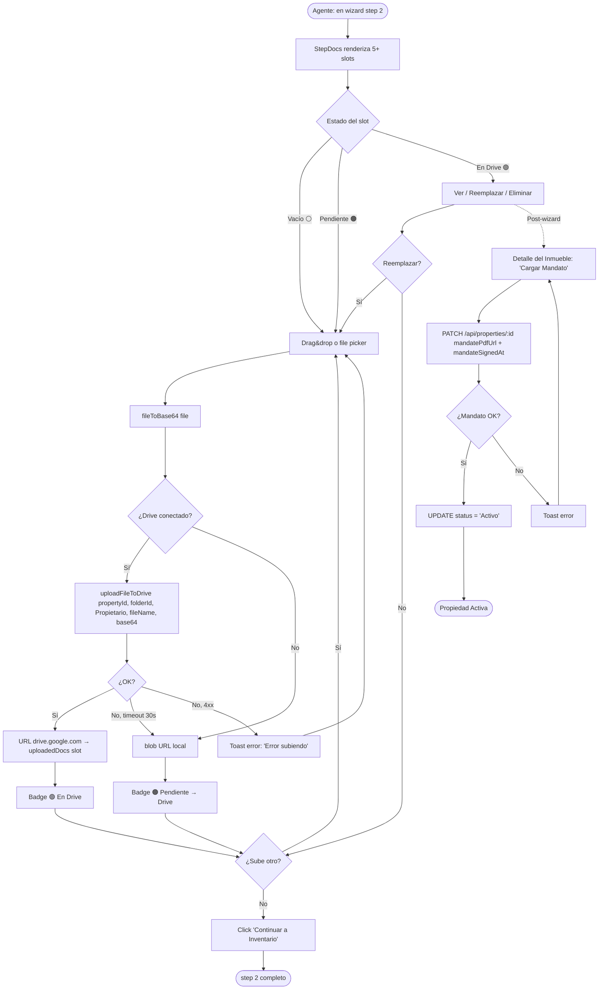
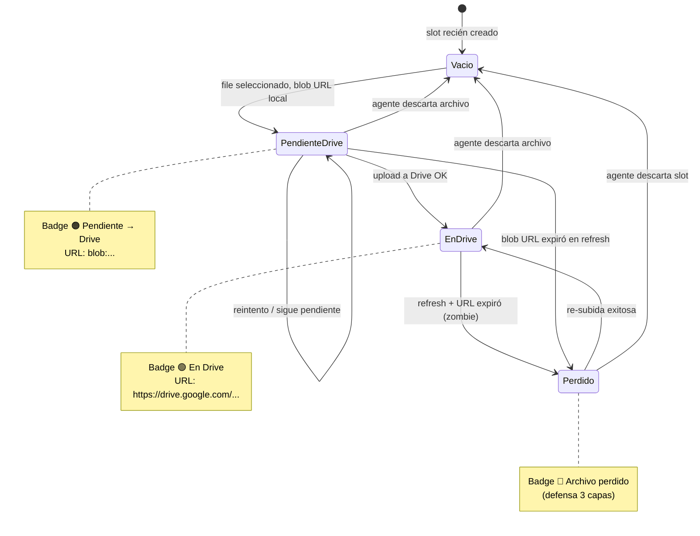
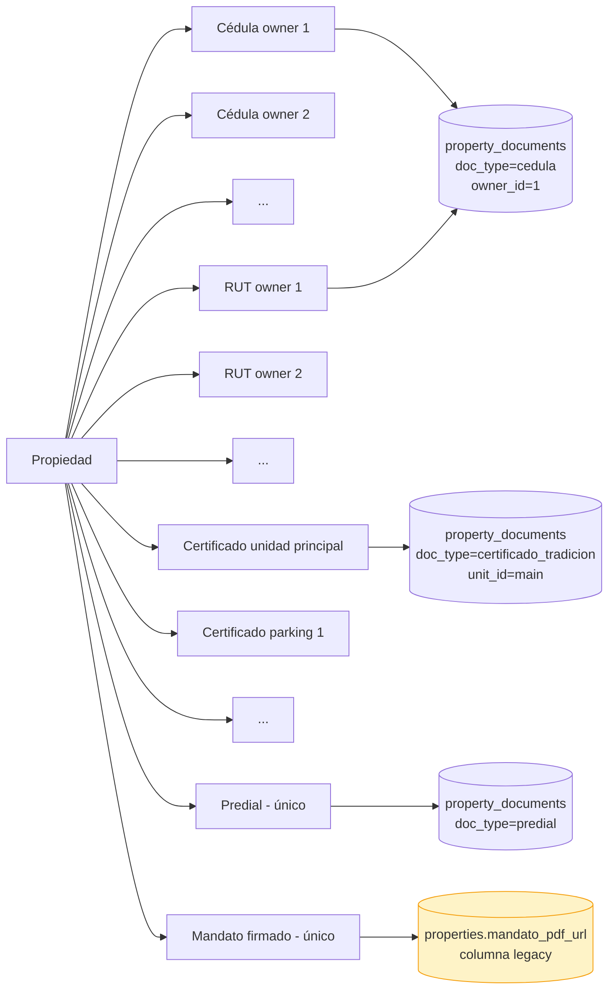
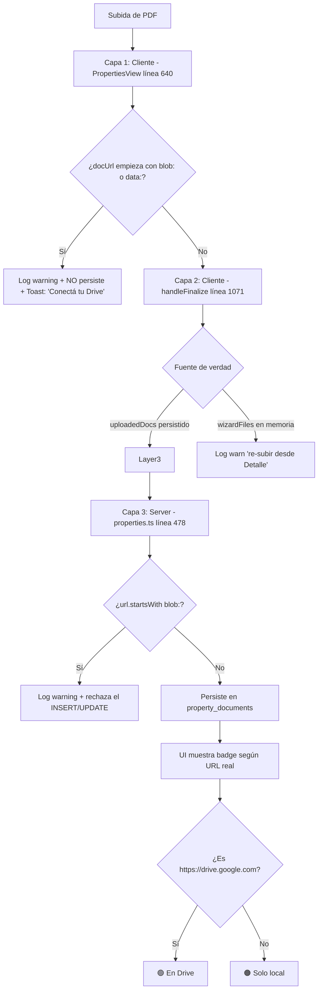

# PROCESO: PROP-DOCS — Documentos legales de la Propiedad

> Workflow agentico narrativo del sub-proceso de **gestión de los 5
> documentos legales** de una propiedad captada en InmoControl: Cédula
> de Ciudadanía del propietario, Certificado de Tradición y Libertad,
> Impuesto Predial, RUT Actualizado, y Contrato de Mandato (firmado).
>
> Es **sub-proceso de `PROP-CAPT`** — vive dentro del step 2 del wizard
> pero también opera **post-wizard** cuando el agente sube el Mandato
> firmado desde el Detalle del Inmueble. Cubre upload en tiempo real,
> multi-archivo por slot, validación contra blob URL zombie, y la
> política de storage honesto con badges 🟢/🟠/⚪.

## 0. Metadata

| Campo | Valor |
|---|---|
| **Código** | `PROP-DOCS` |
| **Nombre legible** | 5 Documentos Legales de la Propiedad |
| **Dominio** | `properties` |
| **Owners** | Frontend: `src/features/properties/components/StepDocs.tsx` + `src/features/properties/PropertiesView.tsx` (modal Detalle → "Cargar Mandato") · Backend: `server/routes/properties.ts` (`POST /api/properties`, `PATCH /api/properties/:id`, `DELETE /api/properties/:id`) |
| **Status** | ⏳ draft (workflow) / ✅ shipped (implementación, en prod desde jul-2026) |
| **Última revisión** | 2026-08-03 |
| **Procesos upstream** | `PROP-CAPT` (step 2 del wizard), `DRIVE-OPS` (uploads) |
| **Procesos downstream** | `PROP-CAPT` (finalize arma el summary + activa la propiedad si Mandato firmado), `INV-CAPT` (no depende — es independiente), `REPORTS` (consolidado anual) |

## 0.5. Diagramas

### Flujo principal (wizard step 2 + post-wizard Detalle)



### Estados de un slot de documento (storage + lifecycle)



### Tipos de slot y sus relaciones



### Defensa contra blob URL zombie (3 capas)



## 1. Actores

- **Agente inmobiliario** — Sube los 5 docs durante el wizard (step 2) y sube el Mandato post-wizard desde el Detalle.
- **Propietario** — Firma el Mandato (físicamente o vía DocuSign/firma digital, fuera del scope de InmoControl). Su CC y RUT son los que se suben.
- **Sistema (InmoControl backend)** — `POST /api/properties`, `PATCH /api/properties/:id`, `GET /api/properties/:id`. Schema `property_documents` + `properties.mandato_pdf_url`.
- **Sistema (InmoControl frontend)** — `StepDocs.tsx` (wizard), modal Detalle (post-wizard). `getDocStorageState()` para badge honesto.
- **Google Drive** — Almacena los PDFs en `Mi unidad / InmoControl/{dirección}/Propietario/`.
- **MySQL** — Tablas `properties` (columna `mandato_pdf_url`) + `property_documents` (5 tipos).

## 2. Contexto inicial

- **Cuándo se dispara**:
  - **En wizard**: el agente llega a step 2 después de completar step 1 (ver `PROP-CAPT §3 paso 2`).
  - **Post-wizard**: el agente quiere subir el Mandato firmado desde el Detalle del Inmueble (modal "Cargar Mandato").
- **UI entry points**:
  - Wizard: `src/features/properties/PropertiesView.tsx` → renderiza `StepDocs` cuando `step === 2`.
  - Detalle: `src/features/properties/PropertiesView.tsx` → modal de detalle → tab Documentos → botón "Cargar Mandato".
- **Precondiciones**:
  - La propiedad existe en MySQL (`wizardPropertyDbId` o `propertyId`).
  - Drive puede estar conectado o no (fallback a blob local, ver `DRIVE-FALLBACK-001`).

## 3. Flujo principal (happy path)

### Paso 1 — Render de slots

`StepDocs` recibe `owners`, `units`, `uploadedDocs` y renderiza 1 slot
por cada owner + unidad adicional + 2 slots globales (Predial + Mandato):

| Slot | Llave (`DocSlotKey`) | Constraint |
|---|---|---|
| Cédula por owner | `cedula:<ownerId>` | N archivos (varias hojas de vida) |
| RUT por owner | `rut:<ownerId>` | N archivos |
| Certificado unidad principal | `certificado_tradicion:main` | N archivos (varias actualizaciones) |
| Certificado por unidad adicional | `certificado_tradicion:<unitId>` | N archivos |
| Impuesto Predial | `predial` | N archivos |
| Contrato de Mandato | `mandato` | 1 archivo (multi-firmado) |

Cada card muestra:
- Etiqueta humana (`labelForKey(key, owners, units)`).
- Estado actual: badge 🟢/🟠/⚪ según `getDocStorageState(url)`.
- Botones: "Subir PDF" (drag&drop o picker), "Ver" (si hay archivo),
  "Reemplazar", "Eliminar".

### Paso 2 — Subir PDF (drag&drop o picker)

1. Usuario selecciona archivo (PDF).
2. `fileToBase64(file)` → base64 string.
3. Si Drive está conectado (`useGoogleDriveStore.connected`):
   - `uploadFileToDrive(propertyId, folderId, 'Propietario', fileName, base64)`.
   - Si OK: `uploadedDocs[slotKey].push(webViewLink)` → badge 🟢.
   - Si timeout 30s: queda como blob URL local + badge 🟠 (ver EC-1).
   - Si 4xx/5xx: toast error + no se persiste.
4. Si Drive NO conectado:
   - `URL.createObjectURL(file)` → blob URL local.
   - `uploadedDocs[slotKey].push(blobUrl)` → badge 🟠 "Pendiente → Drive".
   - Toast: "Documento guardado localmente (Drive no conectado). Se subirá cuando conectes tu Drive."

### Paso 3 — Validación en tiempo real (3 capas)

Cada upload pasa por 3 capas de defensa antes de persistirse (ver
`PROP-CAPT EC-5/EC-6/EC-7` para contexto de los bugs que las motivaron):

1. **Cliente — `PropertiesView.tsx:640`** (Caso B): antes del POST a
   `/api/properties`, validar que `docUrl` NO empiece con `blob:` o `data:`.
   Si empieza, log warning y NO persiste. Toast claro.
2. **Cliente — `handleFinalize:1071`**: la fuente de verdad es
   `uploadedDocs` (localStorage), NO `wizardFiles` (en memoria). Si un
   slot tiene URL de Drive, reusarla. Si tiene blob URL sin File en
   memoria (post-refresh), log warn + seguir.
3. **Server — `properties.ts:478`**: rechazo final de `url.startsWith('blob:')`
   o `url.startsWith('data:')` con log warning.

### Paso 5 — Subir Mandato post-wizard (Detalle del Inmueble)

Después del wizard, el agente abre el Detalle. Tab "Documentos" muestra
el Mandato como slot pendiente (⚪). Botón "Cargar Mandato firmado":

1. File picker.
2. Si Drive OK: `uploadFileToDrive(..., 'Propietario', 'Mandato_<nombre>.pdf', ...)`.
3. `PATCH /api/properties/:id` con `{ mandatePdfUrl, mandateSignedAt }`.
4. Server valida que `mandatePdfUrl` NO sea blob URL.
5. Si OK + `mandateSignedAt` válido → UPDATE `properties.status = 'Activo'`.
6. Toast: "✓ Mandato subido. Propiedad marcada como Activo."

### Paso 6 — Persistencia en MySQL

`POST /api/properties` (wizard) y `PATCH /api/properties/:id` (post-wizard)
procesan `documents` field:

```typescript
interface DocumentsField {
  [slotKey: string]: string | string[] | { primary: string; extras: string[] };
}
```

Server hace:

1. `parseDocumentKey(key, firstOwnerId)` → `{ docType, ownerId, unitId }`.
2. Si el slot NO matchea ningún `DOC_TYPES` → skip silencioso (NO error).
3. `INSERT INTO property_documents (property_id, doc_type, owner_id?, unit_id?, file_url, drive_file_id?, web_view_link?)`.
4. El Mandato NO va en `property_documents` — va en
   `properties.mandato_pdf_url` (columna legacy paralela).

## 4. Edge cases

### EC-1 — Drive timeout al subir

- **Trigger**: `DRIVE-FALLBACK-001` activo. Timeout 30s en
  `uploadFileToDrive`.
- **Comportamiento**: el PDF queda como `blob:` URL local + badge 🟠.
  El archivo se sube al finalizar el wizard (si Drive vuelve) o queda
  pendiente para re-subida desde el Detalle.
- **Toast**: "Drive no disponible — el archivo se guardó localmente. Se
  subirá cuando Drive responda." (warning, NO error).

### EC-2 — Blob URL zombie persistida a MySQL

- **Trigger**: bug del 23-jul-2026. Se persistía `blob:` URL en
  `property_documents.file_url`. Al refrescar el browser, la URL expira
  → "el archivo se perdió".
- **Comportamiento actual**: 3 capas de defensa (Paso 3 §3).
- **UI honesta**: si una fila zombie existe, el Detalle muestra botón
  ámbar "Re-subir" + tooltip "Archivo previo perdido (URL local expirada) —
  re-subí para acceder". El Contrato de Mandato muestra badge rojo
  "⚠ Archivo perdido" porque su pérdida es más grave (afecta status
  `Activo` de la propiedad).
- **Script de limpieza**: `scripts/clean-blob-property-documents.sql`
  lista filas zombie + DELETE comentado para ejecutar cuando el user
  esté listo.

### EC-3 — Drive URL persistida pero archivo no accesible

- **Trigger**: bug del 23-jul-2026. La URL en DB no correspondía a un
  archivo accesible en Drive (fileId muerto, link regenerado, etc.).
- **Comportamiento actual**: al renderizar, verificar el `fileId` con
  `drive.files.get({fileId, fields: 'webViewLink'})`. Si falla, mostrar
  badge 🔴 "Archivo no disponible en Drive" en vez de pretender que está
  todo bien.
- **Acción inmediata**: al subir, guardar también `drive_file_id` (no solo
  `webViewLink`).

### EC-4 — Slot con N archivos (varias hojas de vida)

- **Trigger**: el propietario tiene varias CCs actualizadas. El agente
  sube 2 PDFs para el mismo slot.
- **Comportamiento**: `uploadedDocs[slotKey]` es `string[]`, acepta N. La
  card muestra "N archivos" + lista de links. El primero es el "primary"
  (visible por default).
- **Storage**: cada PDF se sube por separado a `Propietario/{tipo}_{nombre}_{idx}.pdf`.
- **DB**: una fila por archivo en `property_documents` con el mismo
  `(property_id, doc_type, owner_id)`.

### EC-5 — Eliminar un archivo del slot

- **Trigger**: el agente clickea "Eliminar" en uno de los N archivos del slot.
- **Comportamiento**:
  1. `DELETE /api/property-documents/:id` (soft delete, marca `deleted_at`).
  2. `uploadedDocs[slotKey]` se filtra para excluir esa URL.
  3. Si la URL es de Drive, opcionalmente trash el archivo en Drive
     (decisión pendiente, ver §12).
  4. UI actualiza el badge.

### EC-6 — Reemplazar un archivo (mismo slot)

- **Trigger**: el agente quiere reemplazar el CC del propietario por uno
  más reciente.
- **Comportamiento**:
  1. Sube el nuevo PDF (mismo flujo que Paso 2).
  2. UI pregunta: "¿Reemplazar el anterior?" → si sí, trash el anterior
     en Drive + DELETE la fila anterior en DB.
  3. Si no, el nuevo se agrega al array (queda N+1 archivos).

### EC-7 — Mandato sin firma

- **Trigger**: el agente sube el PDF del Mandato pero NO marca la fecha
  de firma (`mandateSignedAt` vacío).
- **Comportamiento**: el server rechaza o acepta sin mover a `Activo`:
  - Si rechaza: toast "El Mandato debe estar firmado para activar la propiedad".
  - Si acepta: la propiedad queda como `Pendiente` aunque el doc esté subido.
- **Decisión**: hoy se ACEPTA sin mover a Activo. La UI muestra warning
  "Mandato pendiente de firma".

### EC-8 — Mandato firmado pero subido como blob URL

- **Trigger**: el agente sube el Mandato firmado con Drive desconectado.
  Queda blob URL local.
- **Comportamiento**: el server rechaza el blob URL (capa 3 de defensa).
  Toast: "El Mandato debe subirse a Drive antes de activar la propiedad.
  Conectá tu Drive y reintentá."
- **Mitigación**: si Drive está caído, la activación de la propiedad se
  difiere hasta que Drive vuelva y el agente re-suba.

### EC-9 — Multi-arquitectura del slot (CC de 2 propietarios)

- **Trigger**: la propiedad tiene 2 propietarios. Cada uno tiene su CC.
- **Comportamiento**: 2 slots separados (`cedula:<ownerId1>` y
  `cedula:<ownerId2>`). Cada uno con su propio array de archivos.
- **Validación servidor**: `parseDocumentKey` resuelve cada slot al owner
  correcto.

### EC-10 — Certificado de Tradición por unidad adicional

- **Trigger**: la propiedad tiene 1 unidad principal + 1 parqueadero + 1
  depósito. Cada uno con su folio de matrícula.
- **Comportamiento**: 3 slots separados (`certificado_tradicion:main`,
  `certificado_tradicion:<unitId_parking>`, `certificado_tradicion:<unitId_deposito>`).
- **Schema**: cada slot tiene `unit_id` distinto en `property_documents`.

### EC-11 — Drag&drop de archivo no-PDF

- **Trigger**: el agente arrastra un JPG o un DOCX al slot de Mandato.
- **Comportamiento**: validación cliente (`accept="application/pdf"`).
  Si pasa, el server valida MIME type del base64 → rechaza con
  `400 { error: 'Solo se aceptan PDFs' }`.

### EC-12 — Disco lleno / MySQL fuera de servicio

- **Trigger**: MySQL rechaza el INSERT por espacio o por timeout.
- **Comportamiento**: server devuelve `500 { error: '...' }` (JSON, ver
  `JSON-001`). El cliente mantiene el archivo en memoria + localStorage.
  Toast: "Error guardando en servidor. Reintentá en unos segundos."

### EC-13 — Discardo del wizard con docs en Drive

- **Trigger**: el agente descarta el borrador después de subir CC + RUT
  a Drive.
- **Comportamiento**: modal de confirmación ("Vas a perder 2 archivos ya
  subidos. ¿Continuar?"). Si confirma, DELETE propiedad + trash carpeta
  Drive completa. Toast: "Borrador descartado. 2 archivos movidos a papelera."
- **Ver**: `PROP-CAPT §3 Discard` + `PROP-CAPT §4 EC-7`.

### EC-14 — Property_documents UNIQUE constraint

- **Trigger**: el server intenta INSERT duplicado
  `(property_id, doc_type, owner_id, unit_id, file_url)`.
- **Comportamiento**: server devuelve `409 { error: 'Document already exists' }`.
  El cliente muestra toast "Este documento ya está cargado".

### EC-15 — Subir Mandato cuando ya hay uno

- **Trigger**: el agente sube el Mandato desde el Detalle, pero ya había
  subido uno (no firmado) antes.
- **Comportamiento**: el server hace UPSERT de `properties.mandato_pdf_url`
  (no INSERT en `property_documents` — el Mandato es columna legacy).
  El PDF anterior se mueve a papelera en Drive.

## 5. Estado que muta

### Tablas MySQL afectadas

| Tabla | Operación | Columnas tocadas |
|---|---|---|
| `property_documents` | INSERT / UPDATE / DELETE (soft) | `property_id`, `doc_type`, `owner_id`?, `unit_id`?, `file_url`, `drive_file_id`?, `web_view_link`?, `deleted_at`? |
| `properties` | UPDATE (cuando se sube Mandato) | `mandate_pdf_url`, `mandate_signed_at`, `status` (Pendiente → Activo si Mandato OK) |

### Archivos en Drive creados

| Carpeta destino | Trigger | Convención de nombre |
|---|---|---|
| `Mi unidad / InmoControl/{dirección}/Propietario/Cedula_<nombre>_{YYYY-MM-DD}.pdf` | wizard step 2 / Detalle | Fija |
| `Mi unidad / InmoControl/{dirección}/Propietario/Certificado_<chip>_{YYYY-MM-DD}.pdf` | idem | Fija |
| `Mi unidad / InmoControl/{dirección}/Propietario/Predial_<periodo>.pdf` | idem | Fija |
| `Mi unidad / InmoControl/{dirección}/Propietario/RUT_<nombre>_{YYYY-MM-DD}.pdf` | idem | Fija |
| `Mi unidad / InmoControl/{dirección}/Propietario/Mandato_<nombre>_{YYYY-MM-DD}.pdf` | idem | Fija (post-wizard, firmado) |

### Stores Zustand actualizados

| Store | Acción | Selectores afectados |
|---|---|---|
| `appStore` | `updateProperty(...)` (post-Mandato) | `selectPropertyById` |
| `useGoogleDriveStore` | (lectura) | `selectIsConnected` |

## 6. Contratos cross-cutting

- **Tostadas**: ver `TOAST-001` + tabla §7 abajo. Reutiliza las de `PROP-CAPT` + agrega las de Mandato post-wizard.
- **JSON errors**: ver `JSON-001`. Especialmente el rechazo de blob URL en server (capa 3).
- **Timeouts**: ver `TIMEOUT-001`. Aplican: server 8s por llamada a Drive; cliente 30s para uploads.
- **Drive fallback**: ver `DRIVE-FALLBACK-001`. Badge 🟠 + persistencia local.
- **Persistencia temprana**: ver `PERSIST-001`. La propiedad YA existe en MySQL cuando step 2 arranca.
- **Idempotencia**: ver `IDEMPOTENT-001`. UNIQUE constraint en `(property_id, doc_type, owner_id, unit_id, file_url)`.

## 7. Tostadas exactas (copy approved)

| Trigger | Tipo | Copy exacto |
|---|---|---|
| Upload PDF Drive OK | success | "✓ {filename} subido a Drive" |
| Upload PDF Drive fail (sigue) | warning | "Drive no disponible — el archivo se guardó localmente. Se subirá cuando Drive responda." |
| Upload PDF Drive fail (data error) | error | "Error al subir a Drive: {error}" |
| Upload PDF Drive no conectado | warning | "Documento guardado localmente (Drive no conectado). Se subirá cuando conectes tu Drive." |
| Blob URL rechazada (cliente) | warning | (console: "[ensurePropertyPersisted] Rechazado blob URL: {slotKey}") |
| Blob URL rechazada (server) | warning | (console: "[properties.ts] Rechazado blob URL: {fileUrl}") |
| Mandato post-wizard OK | success | "✓ Mandato subido. Propiedad marcada como Activo." |
| Mandato post-wizard error (Drive) | error | "Error subiendo Mandato: {error}" |
| Mandato post-wizard sin firma | warning | "Mandato pendiente de firma. La propiedad sigue como Pendiente." |
| Eliminar archivo OK | success | "Archivo eliminado" |
| Reemplazar archivo OK | success | "Archivo reemplazado" |
| Subir archivo no-PDF | error | "Solo se aceptan archivos PDF" |

## 8. Anti-patrones explícitos

- ❌ **Persistir `blob:` URLs a MySQL** → bug del 23-jul-2026. 3 docs
  perdidos. Defensa en 3 capas (cliente A, cliente B, server).
- ❌ **Mostrar "Ver" en card con URL inválida** → bug del 23-jul-2026.
  Verificar al renderizar (HEAD request o `drive.files.get`).
- ❌ **Confiar en `html=true` para emails de Mandato** → usar attachment
  PDF si el Mandato se envía por email.
- ❌ **Borrar el PDF anterior en Drive al reemplazar** → mover a papelera
  primero, nunca delete físico.
- ❌ **Cerrar el modal de upload antes del response** → mismo patrón
  Karpathy. Modal abierto con spinner hasta response.
- ❌ **Asumir que el Mandato es opcional** → si no está firmado, la
  propiedad NO puede pasar a `Activo`. Validar siempre.

## 9. Especificaciones técnicas relacionadas

- `docs/specs/wizard_property.md` AC-7 a AC-17 — Spec detallado del
  step 2 + Detalle.
- `docs/specs/fix_wizard_docs_persistence.md` — Persistencia temprana
  del step 2.
- `docs/specs/fix-bug-019-hydrate-timeouts.md` — Timeouts en hidratación.
- `docs/specs/fix-bug-024-drive-service-timeouts.md` — Timeouts
  diferenciados.
- `docs/specs/fix-issue-25-local-file-url-helper.md` — Helper para
  detectar URLs locales vs Drive.
- `tests/verifiers/wizard_property.md` — Verifier E2E del wizard (cubre
  step 2 parcialmente).
- ⏳ TBD — Spec de "soft delete en property_documents" (Out of scope hoy).

## 10. Endpoints backend utilizados

| Método | Path | Archivo | Notas |
|---|---|---|---|
| `POST` | `/api/properties` | `server/routes/properties.ts` | Wizard step 2 + finalize. UPSERT. Procesa `documents` field. |
| `GET` | `/api/properties/:id` | idem | Detalle de la propiedad con `documents` join. |
| `PATCH` | `/api/properties/:id` | idem | Update parcial (subir Mandato post-wizard). |
| `DELETE` | `/api/properties/:id` | idem | Discard. Limpia property_documents en CASCADE. |
| `POST` | `/api/drive/upload-file` | `server/routes/googleAuth.ts` | Upload a `Propietario/`. |
| `POST` | `/api/drive/upload-pdf` | idem | Upload genérico (alternativa). |
| `GET` | `/api/status/google-drive` | idem | Status operacional (4 checks). |
| ⏳ TBD | `POST` `/api/property-documents` | (futuro) | CRUD dedicado de un solo documento. Hoy va dentro de `/api/properties`. |
| ⏳ TBD | `DELETE` `/api/property-documents/:id` | (futuro) | Soft delete individual. |

## 11. Riesgos identificados

| Riesgo | Probabilidad | Impacto | Mitigación |
|---|---|---|---|
| Blob URL zombie persistido | Baja (post-fix) | Alta (data loss) | 3 capas de defensa + UI honesta + script de limpieza |
| Drive URL inválida | Baja (post-fix) | Alta (PDF no accesible) | Verificar `drive_file_id` al renderizar |
| Mandato sin firma aceptado | Media | Media | Validación de `mandateSignedAt` + UI warning |
| Multi-archivo por slot crece sin bound | Baja | Baja | Límite de 10 archivos por slot (TODO) |
| Trash vs delete en Drive | Baja | Media | Mover a papelera, no delete físico |
| Schema drift `inventario_*` vs `inventory_*` | Baja (post-009) | Alta | Convención en AGENTS.md + replicado en schema |

## 12. Out of scope explícito

- ❌ **OCR / extracción automática de datos del PDF** — el agente llena
  los datos manualmente en step 1.
- ❌ **Validación de autenticidad del PDF** (firma digital, cadena de
  certificación). El agente verifica visualmente.
- ❌ **Refactor del monolito `PropertiesView.tsx`** (Fase 2 del proyecto).
- ❌ **CRUD dedicado `/api/property-documents/:id`** — hoy todo va en
  `/api/properties` (POST/PATCH/DELETE).
- ❌ **Soft delete con `deleted_at`** — hoy DELETE físico en CASCADE.
- ❌ **Límite de N archivos por slot** — hoy sin límite.
- ❌ **Reemplazo automático del PDF anterior en Drive** — hoy queda como
  N+1 archivos, el agente debe eliminar manualmente.
- ❌ **Visibilidad privada de PDFs** (siempre `anyone-reader`).

## 13. Approval

**Status:** ⏳ Pending Review
**Aprobado por:** —
**Fecha de aprobación:** —

> Spec base: `docs/specs/wizard_property.md` AC-7/8/9/10/15/16/17.
> Este workflow es la versión "proceso dedicado" del sub-proceso de
> documentos legales, con énfasis en: multi-archivo por slot, las 3
> capas de defensa contra blob URL zombie, el flujo post-wizard del
> Mandato, y el detalle de cada `DocSlotKey`.

---

> **Recordatorio Karpathy**: una vez aprobado, las features nuevas dentro
> de este proceso (ej: "OCR automático", "soft delete") siguen el flujo
> spec → verifier → implementación. Este workflow NO se modifica para
> hacer pasar checks.