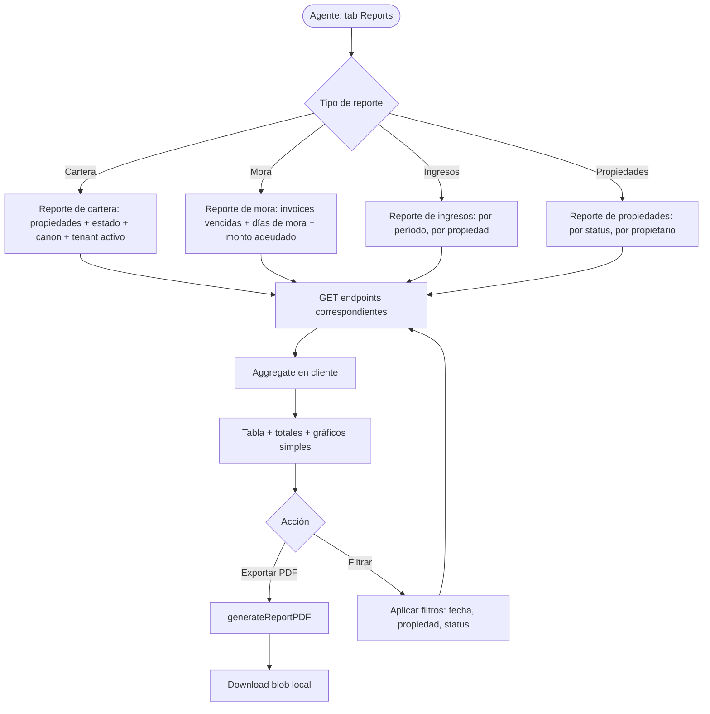
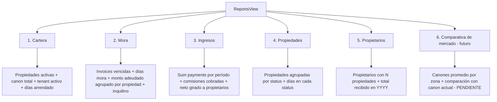
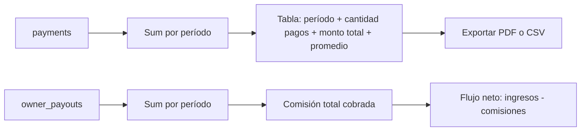

# PROCESO: REPORTS — Reportes Consolidados

> Workflow agentico narrativo del proceso de **reportes consolidados**
> de InmoControl. Cubre los reportes operativos que el agente usa para
> tomar decisiones: cartera, mora, ingresos por período, propiedades
> por status, comparativa de mercado (futuro). Cada reporte es
> read-only sobre MySQL + Zustand, y se puede exportar a PDF.
>
> Es el proceso de **inteligencia de negocio** del producto. Sin
> reportes, el agente no sabe qué propiedad está en mora, qué
> propietario no se le giró, o cuánto se facturó este mes.

## 0. Metadata

| Campo | Valor |
|---|---|
| **Código** | `REPORTS` |
| **Nombre legible** | Reportes Consolidados |
| **Dominio** | `reports` |
| **Owners** | Frontend: `src/features/reports/ReportsView.tsx` · Backend: usa endpoints existentes (`/api/properties`, `/api/tenants`, `/api/billing/*`) — no tiene routes dedicados |
| **Status** | ⏳ draft (workflow) / 🚧 in-progress (cartera + mora + ingresos básicos; comparativa pendiente) |
| **Última revisión** | 2026-08-03 |
| **Procesos upstream** | Todos los demás (lee datos de `properties`, `tenants`, `contracts`, `rent_invoices`, `payments`, `owner_payouts`) |
| **Procesos downstream** | — (terminal, decisiones de negocio) |

## 0.5. Diagramas

### Flujo principal (generar reporte)



### Tipos de reportes



### Reporte de Mora (drill-down)

```mermaid
flowchart TD
    Root[Reporte de Mora] --> Month[Mes: YYYY-MM]
    Month --> Prop[Por propiedad]
    Prop --> Detail[Detalle]
    Detail --> Tenant[Inquilino]
    Detail --> Invoice[Invoice: #CC-YYYYMM-NNN]
    Detail --> Days[Días de mora: hoy - period.end]
    Detail --> Amount[Monto adeudado: invoice.amount - sum(payments)]
    Detail --> Actions[Acciones: enviar recordatorio, marcar pago, ver contrato]
```

### Reporte de Ingresos (agregación)



## 1. Actores

- **Agente inmobiliario** — Genera reportes para tomar decisiones. Exporta PDFs.
- **Gerencia** — Ve reportes consolidados a nivel agencia (futuro, multi-agencia).
- **Sistema (InmoControl backend)** — Endpoints existentes (`/api/properties`, `/api/tenants`, `/api/billing/*`). NO tiene routes dedicados de reporting.
- **Sistema (InmoControl frontend)** — `ReportsView.tsx`. Agregación client-side desde Zustand + fetch.
- **Zustand persist** — `appStore` con `properties`, `tenants`, `contracts`, `invoices`, `payments`, `payouts`.

## 2. Contexto inicial

- **Cuándo se dispara**: el agente abre el tab "Reportes" desde la navegación principal.
- **UI entry point**: `src/App.tsx` → `activeTab === 'reports'` → `ReportsView`.
- **Precondiciones**:
  - El agente tiene `can(role, 'canViewReports')` (auth pendiente Fase 3).
  - Hay datos en MySQL/Zustand (al menos 1 propiedad captada).

## 3. Flujo principal (happy path)

### Paso 1 — Elegir tipo de reporte

El agente ve un menú de tipos de reporte (6 opciones, una por cada dominio).

### Paso 2 — Configurar filtros

- Período (mes actual, mes anterior, YTD, custom).
- Propiedad (todas, una específica, por status).
- Propietario (todos, uno específico).
- Tenant (todos, uno específico).

### Paso 3 — Generar reporte

`ReportsView` agrega datos desde el `appStore` + fetch complementario.
Renderiza tabla + totales + gráficos simples (barras, tortas).

### Paso 4 — Exportar PDF (opcional)

`generateReportPDF(reportData, filters)` produce un PDF con:

- Encabezado: logo + título del reporte + período + filtros aplicados.
- Tabla con los datos.
- Totales al pie.
- Footer: fecha de generación + usuario.

### Paso 5 — Drill-down (opcional)

Click en una fila → detalle del item (ej: click en invoice vencida → detalle del contrato + inquilino + días de mora).

## 4. Edge cases

### EC-1 — Sin datos en el período

- **Trigger**: el reporte de mora del mes actual no tiene invoices vencidas.
- **Comportamiento**: muestra "✓ Sin mora en este período" con mensaje positivo.

### EC-2 — Multi-propiedad del mismo propietario

- **Trigger**: reporte de propietarios muestra N propiedades per owner.
- **Comportamiento**: agrupa por `owner_id`, muestra total consolidado.

### EC-3 — Datos inconsistentes (ej: pago sin invoice)

- **Trigger**: caso edge — `payment.invoice_id` no apunta a ningún invoice.
- **Comportamiento**: el reporte excluye esos pagos (data integrity warning).

### EC-4 — Mora > 90 días

- **Trigger**: el inquilino no paga hace 3 meses.
- **Comportamiento**: badge rojo "Crítica" + acción sugerida "Considerar terminación anticipada".

### EC-5 — Comparativa de mercado sin datos de referencia

- **Trigger**: el reporte de comparativa necesita data externa (precios promedio por zona).
- **Comportamiento actual**: feature pendiente (ver §12). NO implementado.

### EC-6 — Performance con muchos datos

- **Trigger**: la agencia tiene 500+ propiedades. El reporte tarda 10s en cargar.
- **Comportamiento actual**: agregado client-side puede ser lento. Mejora:
  paginación server-side (TODO).

### EC-7 — Reporte de periodo futuro

- **Trigger**: el agente pide reporte de octubre en septiembre.
- **Comportamiento**: muestra $0 o vacío con mensaje "El período aún no llega".

### EC-8 — Timeouts en fetch

- **Trigger**: el server tarda 15s+.
- **Comportamiento**: `AbortController` aborta. Toast de error.

### EC-9 — Multi-moneda

- **Trigger**: error.
- **Comportamiento**: solo COP. Sin decimales.

### EC-10 — Reporte sin auth

- **Trigger**: el usuario no tiene permiso `canViewReports`.
- **Comportamiento**: la vista no se muestra (auth pendiente Fase 3).

### EC-11 — Datos stale (Zustand vs MySQL)

- **Trigger**: el agente modificó algo pero el store no se refrescó.
- **Comportamiento**: el reporte muestra datos viejos. Refresh manual.

### EC-12 — Exportar PDF con datos sensibles

- **Trigger**: el PDF incluye cédulas, emails, teléfonos.
- **Comportamiento**: NO se ofuscan (el agente los ve en pantalla igual).
  Mejora futura: opción "modo anonimizado".

### EC-13 — Reporte multi-agencia (SaaS)

- **Trigger**: cuando se implemente `AUTH` per-agency.
- **Comportamiento actual**: TODO. Hoy single-tenant piloto.

### EC-14 — Mora en moneda extranjera

- **Trigger**: error.
- **Comportamiento**: solo COP.

### EC-15 — Drill-down con FK rota

- **Trigger**: el invoice referencia un contrato que fue eliminado.
- **Comportamiento**: muestra "Contrato no disponible" + opción de ver la factura original.

## 5. Estado que muta

### Tablas MySQL afectadas

| Tabla | Operación | | |
|---|---|---|---|
| — | — | **Solo lectura**. No muta estado. |

### Archivos en Drive creados

| Carpeta destino | Trigger | Convención |
|---|---|---|
| (ninguno) | (los PDFs se descargan localmente) | — |

### Stores Zustand actualizados

| Store | Acción | Selectores afectados |
|---|---|---|
| `appStore` | (solo lectura) | múltiples selectores |

## 6. Contratos cross-cutting

- **Tostadas**: ver `TOAST-001` + tabla §7 abajo.
- **JSON errors**: ver `JSON-001`.
- **Timeouts**: ver `TIMEOUT-001`. Cliente 15s para queries.
- **Auth**: ver `SECURITY-001`. Permiso `canViewReports` (pendiente Fase 3).

## 7. Tostadas exactas (copy approved)

| Trigger | Tipo | Copy exacto |
|---|---|---|
| Generar reporte OK | success | (visual, no toast) |
| Exportar PDF OK | success | "✓ Reporte exportado a PDF" |
| Sin datos en el período | (visual, mensaje positivo) | "✓ Sin mora en este período" |
| Performance lenta | warning | "El reporte está tardando. Reintentá con menos filtros." |
| Error de fetch | error | "Error cargando reporte: {error}" |

## 8. Anti-patrones explícitos

- ❌ **Mutación de estado desde un reporte** — read-only.
- ❌ **Asumir que el reporte tiene datos frescos** — Zustand puede estar stale.
- ❌ **Cargar 500+ propiedades sin paginación** — performance.
- ❌ **Mostrar datos sensibles sin confirmar** — la UI ya los muestra, pero
  el PDF no debería filtrarse fuera de la agencia.

## 9. Especificaciones técnicas relacionadas

- ⏳ TBD — Spec de "Reportes server-side con paginación".
- ⏳ TBD — Spec de "Comparativa de mercado" (Fase X).
- `docs/specs/fix-issue-12-fine-selectors.md` — Selectores finos para no
  cargar todo el state.

## 10. Endpoints backend utilizados

| Método | Path | Archivo | Notas |
|---|---|---|---|
| `GET` | `/api/properties` | `server/routes/properties.ts` | Lista propiedades con `inventory_count`. |
| `GET` | `/api/tenants` | `server/routes/tenants.ts` | Lista tenants. |
| `GET` | `/api/entities/contracts` | `server/routes/entities.ts` | Lista contratos. |
| `GET` | `/api/billing/invoices` | `server/routes/billing.ts` | Lista invoices (para mora). |
| `GET` | `/api/billing/payments` | idem | Lista pagos (para ingresos). |
| `GET` | `/api/billing/owner-payouts` | idem | Lista transferencias (para flujo neto). |
| ⏳ TBD | `/api/reports/*` | (futuro) | Endpoints dedicados con agregación server-side. |

## 11. Riesgos identificados

| Riesgo | Probabilidad | Impacto | Mitigación |
|---|---|---|---|
| Performance con muchos datos | Alta | Media | Paginación server-side (TODO) |
| Datos stale de Zustand | Alta | Media | Refresh button + auto-refresh cada N min (TODO) |
| Multi-agencia sin aislamiento | Alta (cuando se haga) | Alta | Auth per-agency (Fase 3) |
| Comparativa sin data externa | Alta | Baja | Feature no priorizada todavía |

## 12. Out of scope explícito

- ❌ **Comparativa de mercado** (canones promedio por zona) — feature no priorizada.
- ❌ **Reportes server-side con agregación** — hoy client-side.
- ❌ **Reportes multi-agencia** — single-tenant piloto.
- ❌ **Drill-down avanzado** (ej: gráfico de evolución de mora).
- ❌ **Exportación a CSV** — solo PDF.
- ❌ **Reportes programados** (envío automático por email) — manual.
- ❌ **Modo anonimizado** del PDF.

## 13. Approval

**Status:** ⏳ Pending Review
**Aprobado por:** —
**Fecha de aprobación:** —

> Este workflow es la versión "proceso dedicado" del módulo de reportes.
> Cubre los 6 tipos básicos (cartera, mora, ingresos, propiedades,
> propietarios, comparativa) con énfasis en: read-only, agregación
> client-side desde Zustand, drill-down opcional, y exportación a PDF.
> No incluye specs detallados por reporte (cada reporte puede tener su
> propio spec puntual cuando se implemente).

---

> **Recordatorio Karpathy**: una vez aprobado, las features nuevas dentro
> de este proceso (ej: "comparativa de mercado", "reportes programados")
> siguen el flujo spec → verifier → implementación. Este workflow NO se
> modifica para hacer pasar checks.