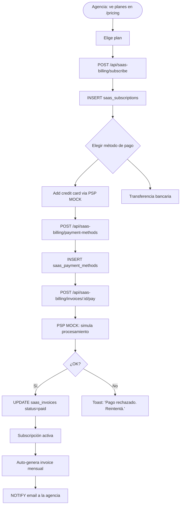
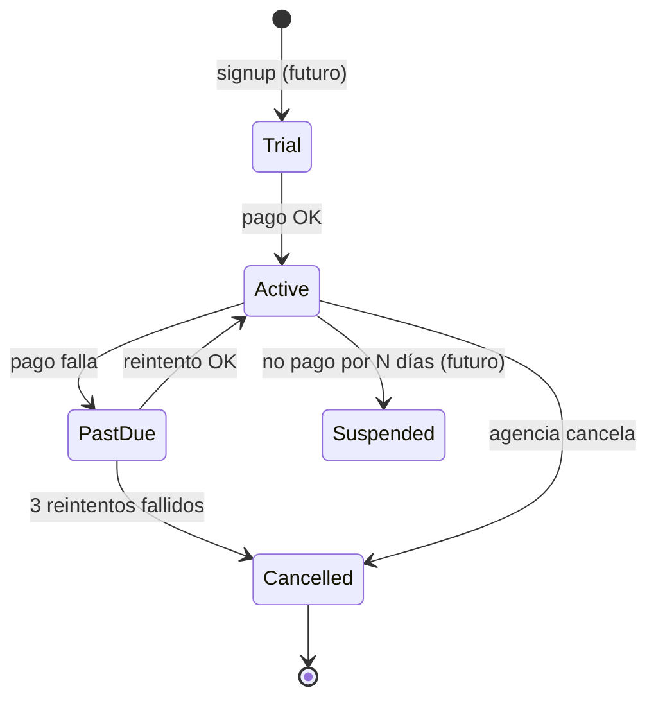
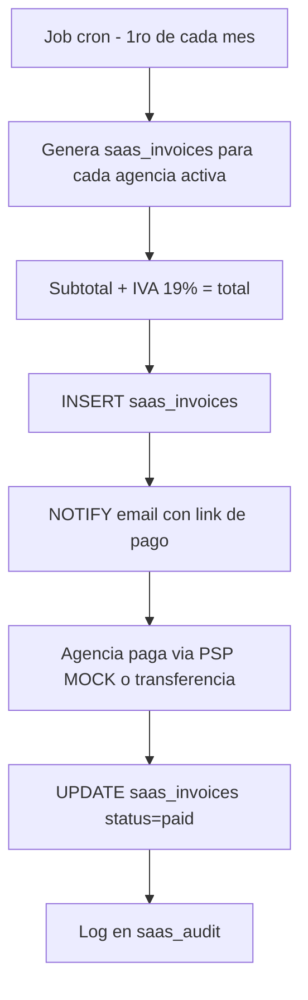
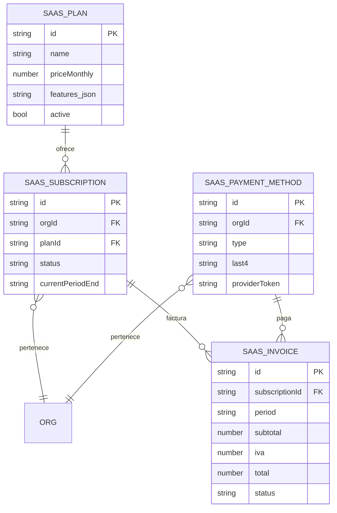

# PROCESO: SAAS-BILL — SaaS Billing (planes + subscripciones + PSP)

> Workflow agentico narrativo del proceso de **SaaS Billing** de
> InmoControl — la capa de monetización que cobra a las agencias
> inmobiliarias por usar el producto. Cubre el catálogo de planes
> (global), la subscripción per-agency, los métodos de pago (PSP), y
> la facturación con IVA colombiano 19%.
>
> **Es independiente del flujo inmobiliario**. Mientras `BILL-INVOICE`
> cobra al inquilino el canon de arrendamiento, `SAAS-BILL` cobra a la
> AGENCIA (dueña del SaaS) la subscripción mensual. Ambos viven en
> MySQL pero con namespaces distintos (`/api/billing/*` vs
> `/api/saas-billing/*`).
>
> Estado: Fase 8 ✅ shipped con PSP MOCK. Cuando se enchufe Wompi o
> MercadoPago real, los endpoints cambian, el frontend NO.

## 0. Metadata

| Campo | Valor |
|---|---|
| **Código** | `SAAS-BILL` |
| **Nombre legible** | SaaS Billing (planes + subscripciones + PSP) |
| **Dominio** | `saas` |
| **Owners** | Frontend: `src/features/saasBilling/SaasBillingView.tsx` (customer-facing) + `PlanAdminView.tsx` (admin) · Backend: `server/routes/saasBilling.ts` |
| **Status** | ⏳ draft (workflow) / ✅ shipped (Fase 8 ✅) con PSP MOCK |
| **Última revisión** | 2026-08-03 |
| **Procesos upstream** | — (foundational, no depende del flujo inmobiliario) |
| **Procesos downstream** | — (terminal; cuando una agencia no paga, eventualmente se suspende — futuro) |

## 0.5. Diagramas

### Flujo principal (subscribe + pay)



### Arquitectura namespace separado

```mermaid
flowchart LR
    subgraph Inmobiliaria[Billing inmobiliario]
        BI[/api/billing/invoices]
        BP[/api/billing/payments]
        BO[/api/billing/owner-payouts]
        BOS[/api/billing/owner-statement]
    end
    subgraph SaaS[SaaS Billing]
        SI[/api/saas-billing/plans]
        SS[/api/saas-billing/subscribe]
        SP[/api/saas-billing/payment-methods]
        SIN[/api/saas-billing/invoices/:id/pay]
    end
    Inmobiliaria -.tablas: rent_invoices, payments, owner_payouts.-> MySQL1[(MySQL)]
    SaaS -.tablas: saas_plans, saas_subscriptions, saas_payment_methods, saas_invoices.-> MySQL2[(MySQL)]

    classDef saas fill:#fef3c7,stroke:#f59e0b
    classDef inm fill:#dbeafe,stroke:#3b82f6
    class SI,SS,SP,SIN saas
    class BI,BP,BO,BOS inm
```

### Estados de la subscripción



### Flujo de facturación mensual



### Plan + subscripción + método de pago



## 1. Actores

- **Agencia (cliente del SaaS)** — Se subscribe, elige plan, agrega método de pago, paga mensualmente.
- **Admin de InmoControl** — Crea planes, ve métricas globales (MRR, churn), suspende agencias.
- **PSP (Wompi / MercadoPago — futuro)** — Procesa pagos con tarjeta. Hoy MOCK.
- **Sistema (InmoControl backend)** — `server/routes/saasBilling.ts`. Schema `saas_*` (separado del inmobiliario).
- **Sistema (InmoControl frontend)** — `SaasBillingView.tsx` (customer), `PlanAdminView.tsx` (admin).
- **MySQL** — Tablas `saas_plans`, `saas_subscriptions`, `saas_payment_methods`, `saas_invoices`.

## 2. Contexto inicial

- **Cuándo se dispara**:
  - **Customer**: agencia visita `/pricing`, elige plan, subscribe.
  - **Admin**: panel de admin crea/edita planes.
  - **Auto**: cron job mensual genera invoices.
- **UI entry points**:
  - `src/features/saasBilling/SaasBillingView.tsx` → tab Billing de la agencia.
  - `src/features/admin/PlanAdminView.tsx` → panel admin.
- **Precondiciones**:
  - **Customer**: agencia autenticada.
  - **Admin**: rol `admin` (Fase 3, pendiente).

## 3. Flujo principal (happy path)

### Paso 1 — Catálogo de planes

`GET /api/saas-billing/plans`. Catálogo global, compartido entre todas
las orgs. 3 planes base:

- **Starter**: $X/mes, hasta 5 propiedades.
- **Pro**: $Y/mes, hasta 50 propiedades.
- **Enterprise**: $Z/mes, propiedades ilimitadas.

(precios reales definidos al deploy).

### Paso 2 — Subscribe

`POST /api/saas-billing/subscribe { planId, orgId }`:

1. Server valida plan activo.
2. INSERT en `saas_subscriptions` con `status='active'`, `currentPeriodEnd=NOW+30d`.
3. Devuelve `{ subscriptionId }`.

### Paso 3 — Agregar método de pago

`POST /api/saas-billing/payment-methods { type, ...details }`:

- **Credit card** (via PSP MOCK): `{ number, expMonth, expYear, cvv }`. MOCK devuelve `last4`.
- **Transferencia bancaria**: `{ bank, accountType, accountNumber }` (para pagos manuales).
- Server guarda (tokenizado en producción, plain en MOCK).

### Paso 4 — Pago de invoice

Auto-generado el 1ro de cada mes o manual:

- `POST /api/saas-billing/invoices/:id/pay { paymentMethodId }`.
- MOCK: simula procesamiento con 80% OK / 20% fail.
- Real (futuro): Wompi/MercadoPago API.

### Paso 5 — Subscripción activa

`status='active'`, `currentPeriodEnd` se renueva 30 días.

## 4. Edge cases

### EC-1 — Pago rechazado (MOCK 20% fail)

- **Trigger**: PSP simula rechazo.
- **Comportamiento**: `status='past_due'`. Toast: "Pago rechazado. Reintentá con otro método."
- **Mitigación**: reintento con otra tarjeta o transferencia.

### EC-2 — Subscripción cancelada

- **Trigger**: agencia clickea "Cancelar subscripción".
- **Comportamiento**: `status='cancelled'`. Acceso se mantiene hasta fin del período.
- **Período de gracia**: 7 días (futuro, ver §12).

### EC-3 — Plan descontinuado

- **Trigger**: admin marca un plan como `active=false`.
- **Comportamiento**: agencias con ese plan deben migrar a otro.
- **UI**: banner "Tu plan ya no está disponible. Migra a Pro."

### EC-4 — Multi-org (mismo usuario en N agencias)

- **Trigger**: SaaS multi-tenant.
- **Comportamiento actual**: NO soportado (Fase 3).
- **Pendiente**: selector de org en el login.

### EC-5 — Cambio de plan mid-period

- **Trigger**: agencia upgrade de Starter a Pro.
- **Comportamiento**: prorrateo del cargo (futuro, ver §12).
- **Actual**: el cargo del próximo mes usa el nuevo plan.

### EC-6 — Pago en USD

- **Trigger**: agencia de fuera de Colombia.
- **Comportamiento actual**: solo COP. TODO multi-moneda.

### EC-7 — Invoice generada pero agencia no la ve

- **Trigger**: la agencia no abre el tab Billing.
- **Comportamiento**: el invoice se acumula. Después de 7 días, recordatorio
  por email (NOTIFY regla vencimiento SaaS).

### EC-8 — Cancelación inmediata vs fin de período

- **Trigger**: agencia quiere cancelar YA.
- **Comportamiento**: la cancelación es **inmediata por simplicidad** (sin
  período de gracia). TODO: agregar período de gracia.

### EC-9 — PSP down (Wompi fuera de servicio)

- **Trigger**: el PSP real (futuro) está caído.
- **Comportamiento**: el pago queda en `pending`. La subscripción pasa
  a `past_due` después de N reintentos.

### EC-10 — Fraude (chargeback)

- **Trigger**: el banco hace chargeback.
- **Comportamiento**: `status='cancelled'` automáticamente. La agencia
  debe contactar soporte.

### EC-11 — Subscripción heredada (legacy)

- **Trigger**: la agencia se creó antes de implementar SAAS-BILL.
- **Comportamiento**: se le asigna el plan Starter por default.

### EC-12 — Empresa sin NIT

- **Trigger**: la agencia quiere factura electrónica sin NIT.
- **Comportamiento**: NO se puede emitir factura electrónica válida.
  Pendiente integración con DIAN.

### EC-13 — Admin ve métricas globales

- **Trigger**: admin abre `PlanAdminView`.
- **Comportamiento**: muestra MRR, ARR, churn, agencies activas, etc.
- **Auth**: requiere rol admin (Fase 3).

### EC-14 — Plan con precio 0 (free tier)

- **Trigger**: el admin crea un plan con `priceMonthly=0`.
- **Comportamiento**: la subscripción es gratuita. NO se genera invoice.

### EC-15 — Subscripción duplicada (mismo org, mismo plan)

- **Trigger**: error o doble click.
- **Comportamiento**: UNIQUE constraint en `(orgId, planId, status='active')`.
  409 si intenta duplicar.

## 6. Contratos cross-cutting

- **Tostadas**: ver `TOAST-001` + tabla §7 abajo.
- **JSON errors**: ver `JSON-001`.
- **Timeouts**: ver `TIMEOUT-001`. Cliente 15s para queries, 30s para PSP.
- **Idempotencia**: ver `IDEMPOTENT-001`. Subscripción UNIQUE.
- **Auth**: ver `SECURITY-001`. Endpoints privados con `requireAuth`. Admin requiere rol.

## 7. Tostadas exactas (copy approved)

| Trigger | Tipo | Copy exacto |
|---|---|---|
| Subscribe OK | success | "✓ Subscripción activa al plan {planName}." |
| Pago OK | success | "✓ Pago procesado. Subscripción renovada." |
| Pago rechazado | error | "Pago rechazado. Probá con otro método." |
| Cancelar OK | success | "Subscripción cancelada. Acceso hasta {currentPeriodEnd}." |
| Migrar de plan | success | "✓ Plan migrado a {newPlan}." |
| Pago pendiente (transferencia) | warning | "Pago por transferencia pendiente de confirmación." |

## 8. Anti-patrones explícitos

- ❌ **Mezclar namespace** `/api/billing/*` con SaaS billing → separar en `/api/saas-billing/*`.
- ❌ **Asumir que el PSP real está conectado** → hoy es MOCK. Cuando se enchufe Wompi, los endpoints internos cambian, el frontend NO.
- ❌ **Cancelación sin período de gracia** → hoy inmediata. Pendiente.
- ❌ **Tablas `saas_*` mezcladas con tablas inmobiliarias** → son 2 dominios.
- ❌ **Cobrar sin factura** → Colombia requiere factura electrónica para IVA.

## 9. Especificaciones técnicas relacionadas

- `db/mysql/migrations/003_saas_billing.sql` — Schema inicial SaaS.
- `db/mysql/migrations/012_unique_invoice_number.sql` — UNIQUE en invoice_number.
- `AGENTS.md` §"SaaS Billing (Fase 8) — namespace separado".

## 10. Endpoints backend utilizados

| Método | Path | Archivo | Notas |
|---|---|---|---|
| `GET` | `/api/saas-billing/plans` | `server/routes/saasBilling.ts` | Catálogo de planes. |
| `POST` | `/api/saas-billing/plans` | idem | (admin) Crear plan. |
| `PATCH` | `/api/saas-billing/plans/:id` | idem | (admin) Editar plan. |
| `POST` | `/api/saas-billing/subscribe` | idem | Subscribe a un plan. |
| `DELETE` | `/api/saas-billing/subscribe/:id` | idem | Cancelar. |
| `GET` | `/api/saas-billing/subscriptions` | idem | Lista subscripciones. |
| `POST` | `/api/saas-billing/payment-methods` | idem | Agregar método. |
| `GET` | `/api/saas-billing/payment-methods` | idem | Lista métodos. |
| `DELETE` | `/api/saas-billing/payment-methods/:id` | idem | Eliminar método. |
| `POST` | `/api/saas-billing/invoices/:id/pay` | idem | Pagar invoice. |
| `GET` | `/api/saas-billing/invoices` | idem | Lista invoices. |

## 11. Riesgos identificados

| Riesgo | Probabilidad | Impacto | Mitigación |
|---|---|---|---|
| PSP real no conectado | Alta (en MOCK) | Baja | MOCK funcional; integración Wompi planificada |
| Fraude / chargeback | Media | Alta | Notificación al admin + cancelación automática |
| Multi-moneda | Baja | Baja | Solo COP por ahora |
| Período de gracia faltante | Alta | Media | TODO |
| Multi-org sin selector | Alta (SaaS) | Alta | Fase 3 (AUTH) |

## 12. Out of scope explícito

- ❌ **PSP real (Wompi/MercadoPago)** — hoy MOCK. Cuando se enchufe,
  endpoints internos cambian.
- ❌ **Período de gracia** — cancelación inmediata.
- ❌ **Prorrateo en cambios de plan** — próximo mes con nuevo plan.
- ❌ **Multi-moneda** — solo COP.
- ❌ **Factura electrónica DIAN** — pendiente.
- ❌ **Multi-org por usuario** — Fase 3.
- ❌ **Suspensión automática por mora** — manual por ahora.

## 13. Approval

**Status:** ⏳ Pending Review
**Aprobado por:** —
**Fecha de aprobación:** —

> Spec base: AGENTS.md §"SaaS Billing (Fase 8) — namespace separado" +
> migración 003_saas_billing.sql.
> Este workflow es la versión "proceso dedicado" del SaaS billing, con
> énfasis en: **namespace separado** del billing inmobiliario, **PSP
> MOCK** listo para reemplazar por Wompi/MercadoPago, **IVA colombiano
> 19%** calculado en cada invoice, y **planes globales + subscripción
> per-agency**.

---

> **Recordatorio Karpathy**: una vez aprobado, las features nuevas dentro
> de este proceso (ej: "PSP real Wompi", "factura electrónica") siguen el
> flujo spec → verifier → implementación. Este workflow NO se modifica
> para hacer pasar checks.