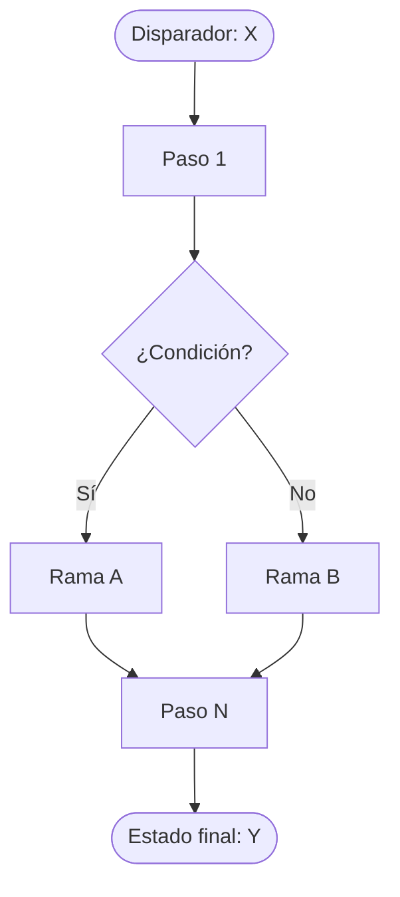
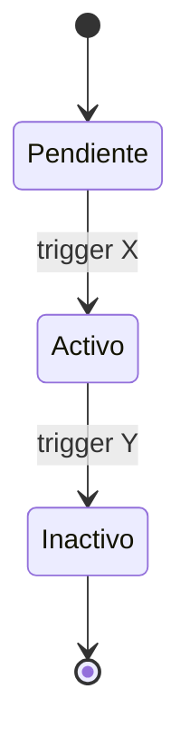
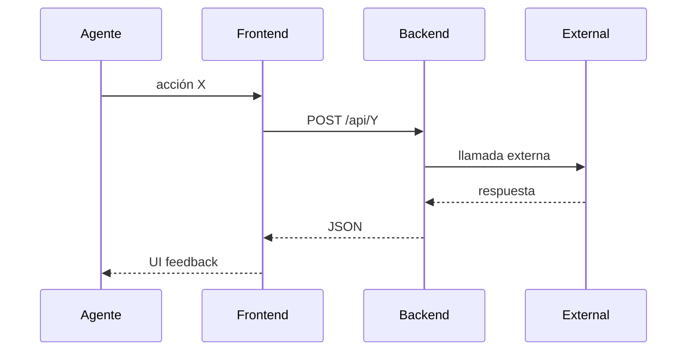

# PROCESO: [CODIGO] — [Nombre legible]

> Workflow agentico narrativo de un proceso de negocio de InmoControl.
> Define QUÉ debe poder hacer el sistema, QUIÉNES interactúan, en qué
> ORDEN, y qué pasa cuando algo falla. NO incluye código de implementación.
>
> Adaptado del template Karpathy al nivel "proceso de negocio" (un nivel
> arriba del spec puntual por feature). Las features individuales viven en
> `docs/specs/{nombre}.md` y referencian este workflow.

## 0. Metadata

| Campo | Valor |
|---|---|
| **Código** | `MAYUSCULAS-GUION` (ej: `BILL-INVOICE`) |
| **Nombre legible** | (ej: "Cuenta de cobro mensual") |
| **Dominio** | `properties` \| `tenants` \| `billing` \| `saas` \| `drive` \| `notify` |
| **Owners** | Agente(s) responsable(s) del proceso |
| **Status** | `⏳ draft` \| `✅ approved` \| `🚧 in-progress` \| `📦 shipped` |
| **Última revisión** | `YYYY-MM-DD` |
| **Procesos upstream** (este proceso depende de) | (ej: `DRIVE-OPS`, `TENANT-ONB`) |
| **Procesos downstream** (procesos que dependen de este) | (ej: `BILL-PAY`, `REPORTS`) |

## 0.5. Diagramas (Mermaid)

Diagramas antes del detalle narrativo. Sirven para entender el flujo
en 30 segundos. El detalle va en §3 (Flujo principal) y §4 (Edge cases).

### Diagrama de flujo principal

### Diagrama de estados (si aplica)

### Diagrama de secuencia (si hay integración externa)

## 1. Actores

Quiénes participan en este proceso y qué pueden hacer.

- **Agente inmobiliario** — Usuario primario. Dispara y opera el flujo desde la UI.
- **Propietario** — Tercero. Interactúa de forma asincrónica (firma PDFs, recibe estado de cuenta).
- **Inquilino** — Tercero. Interactúa vía WhatsApp/email o firmando PDFs.
- **Sistema (InmoControl)** — Backend + frontend. Persiste, calcula, sube a Drive, dispara notificaciones.
- **Google Drive** — Almacenamiento externo. Recibe uploads, devuelve web links.
- **MySQL** — Almacenamiento canónico. Tablas afectadas listadas en §5.
- **Twilio (WhatsApp) / SMTP (Email)** — Canales de notificación (ver `NOTIFY`).

## 2. Contexto inicial

- **Cuándo se dispara**: (ej: "agente hace click en 'Nueva propiedad' desde `PropertiesView`")
- **UI entry point**: ruta y componente exacto (ej: `src/features/properties/PropertiesView.tsx` → botón flotante)
- **Precondiciones**:
  - (ej: "agente autenticado")
  - (ej: "Drive conectado — ver `DRIVE-OPS §4 OAuth flow`")
  - (ej: "propiedad existe en MySQL con status='Activo'")

## 3. Flujo principal (happy path)

Narrativa paso a paso del flujo cuando todo va bien. Numerar los pasos
para referencia cruzada con los edge cases.

### Paso 1 — [Título]

El agente [acción exacta desde la UI]. El sistema [lo que hace en respuesta].
La UI muestra [qué ve el usuario].

- **Inputs**: [datos que recibe el sistema]
- **Outputs**: [estado persistido + UI feedback]
- **Decisión**: si [condición] → [branch], sino → [branch]
- **Tostada**: [copy exacta, ver cross-cutting `TOAST-001`]

### Paso 2 — [Título]

...

### Paso N — Finalización

El proceso termina cuando [condición final]. El estado queda en [tabla/columna].

## 4. Edge cases

Cada caso edge tiene: trigger → comportamiento esperado → toast/mensaje exacto.

### EC-1 — [Drive caído]
- **Trigger**: `DRIVE-FALLBACK-001` activa (timeout 8s en cualquier llamada a `drive.files.*`).
- **Comportamiento**: el flujo principal continúa sin Drive. El archivo queda como `blob:` URL local con badge 🟠 "Pendiente → Drive".
- **Toast**: "⚠ Sin conexión con Drive. El archivo se guardó localmente y se subirá cuando Drive responda." (warning, NO error).

### EC-2 — [Doble click]
- **Trigger**: el usuario hace click 2 veces en "Guardar" antes de que el botón se deshabilite.
- **Comportamiento**: el segundo POST es idempotente (ver `IDEMPOTENT-001`). Solo se crea/actualiza una fila.
- **Prevención**: el botón se deshabilita al inicio del POST y se rehabilita solo en el `finally` del try/catch.

### EC-3 — [Timeout del server]
- **Trigger**: `TIMEOUT-001` cliente (15s sin respuesta).
- **Comportamiento**: el cliente aborta el fetch. Toast de error.
- **Toast**: "El servidor tardó demasiado. Reintentá en unos segundos." (error, ver `TIMEOUT-001`).

### EC-4 — [Validación falla]
- **Trigger**: el usuario envía un form con campos requeridos vacíos.
- **Comportamiento**: el form NO se envía. Errores inline debajo de cada campo.
- **Toast**: ninguno (el feedback es inline).

### EC-5 — [MySQL schema drift]
- **Trigger**: el server hace `SELECT` a una columna que no existe (ej: `inventario_*_pdf_url` en español en vez de `inventory_*_pdf_url` en inglés).
- **Comportamiento**: el server responde `500 { error: "Unknown column..." }` (JSON, ver `JSON-001`).
- **Mitigación**: nombres de columnas validados por el linter (cuando se instale) + spec del proceso los referencia explícitamente.

### EC-N — [Otro edge case específico del proceso]
- ...

## 5. Estado que muta

### Tablas MySQL afectadas

| Tabla | Operación | Columnas tocadas |
|---|---|---|
| `properties` | INSERT / UPDATE | `address`, `status`, `drive_folder_id`, ... |
| `rent_invoices` | INSERT | `property_id`, `period`, `invoice_number`, ... |
| ... | ... | ... |

### Archivos en Drive creados

| Carpeta destino | Trigger | Convención de nombre |
|---|---|---|
| `Mi unidad / InmoControl/{dirección}/Propietario/` | wizard step 2 → upload CC | `{tipo}_{YYYY-MM-DD}.pdf` |
| ... | ... | ... |

### Stores Zustand actualizados

| Store | Acción | Selectores afectados |
|---|---|---|
| `appStore` | `addProperty(...)` | `selectProperties` |
| `notificationConfigStore` | `setEmailConfig(...)` | `selectEmailConfig` |
| ... | ... | ... |

## 6. Contratos cross-cutting

Referenciar los cross-cutting invariants del README por código (no duplicar acá).

- **Tostadas**: ver `TOAST-001` en `docs/processes/README.md` + tabla §7 abajo.
- **JSON errors**: ver `JSON-001`.
- **Timeouts**: ver `TIMEOUT-001`.
- **Drive fallback**: ver `DRIVE-FALLBACK-001`.
- **Persistencia temprana**: ver `PERSIST-001` (si aplica).
- **Idempotencia**: ver `IDEMPOTENT-001`.
- **Auth**: ver `SECURITY-001`.
- **Audit log**: ver `AUDIT-001`.

## 7. Tostadas exactas (copy approved)

Catálogo completo de toasts que dispara este proceso. **NO improvisar
copy** — si un caso nuevo necesita un toast, agregarlo acá y pedir
aprobación.

| Trigger | Tipo | Copy exacto |
|---|---|---|
| [Acción X] éxito | success | "[emoji] [mensaje]" |
| [Acción X] error | error | "[mensaje con {placeholder para error del server}]" |
| [Acción X] warning (drive caído) | warning | "[emoji] [mensaje]" |
| [Acción X] timeout | error | "[mensaje fijo]" |

## 8. Anti-patrones explícitos

Lo que NO se debe hacer en este proceso (consecuencias vistas en prod o
que se quieren prevenir). Ser específico.

- ❌ **Cerrar el modal antes del POST** → el user piensa que falló. Visto en `BUG-003` (PaymentModal).
- ❌ **Mostrar "guardado" sin verificar la respuesta del server** → Visto en la cadena de bugs de wizard (jul-2026).
- ❌ **Asumir que Drive siempre responde** → Visto en BUG-014/015/016/022/024 (timeouts faltantes).
- ❌ **[Otro específico del proceso]** → [consecuencia + link al bug].

## 9. Especificaciones técnicas relacionadas

Links a `docs/specs/{feature}.md` que detallan features dentro de este
proceso. Si una feature no tiene spec todavía, listarla como `⏳ TBD`.

- `docs/specs/wizard_property.md` — Spec del wizard de captación (sub-proceso de `PROP-CAPT`).
- `docs/specs/fix-bug-019-hydrate-timeouts.md` — Fix de timeouts.
- ⏳ TBD — Spec de [feature X].

## 10. Endpoints backend utilizados

| Método | Path | Archivo | Notas |
|---|---|---|---|
| `POST` | `/api/properties` | `server/routes/properties.ts` | UPSERT (INSERT si `localId='wizard-*'`) |
| `POST` | `/api/drive/upload-pdf` | `server/routes/googleAuth.ts` | Helper genérico |
| ... | ... | ... | ... |

## 11. Riesgos identificados

| Riesgo | Probabilidad | Impacto | Mitigación |
|---|---|---|---|
| Drive OAuth expira mid-flow | Media | Alta | `isTokenExpiringSoon()` + refresh transparente |
| MySQL connection pool agotado | Baja | Media | `connectionLimit=10` + monitoring |
| Concurrencia en `invoice_number` | Media | Alta | UNIQUE constraint + retry transparente (ver `RACE-001`) |
| ... | ... | ... | ... |

## 12. Out of scope explícito

Lo que este proceso NO hace (para evitar scope creep).

- ❌ No hace [X] — eso es parte de [proceso Y].
- ❌ No toca [Z] — refactor pendiente en Fase [N] del proyecto.

## 13. Approval

**Status:** ⏳ Pending Review
**Aprobado por:** [nombre del user]
**Fecha de aprobación:** [YYYY-MM-DD]

---

> **Recordatorio Karpathy**: una vez este workflow esté aprobado, cada
> feature nuevo del proceso se hace con el flujo normal (spec → verifier →
> implementación → verify). Este documento NO se modifica para hacer
> pasar checks — si un check falla, el código está mal.