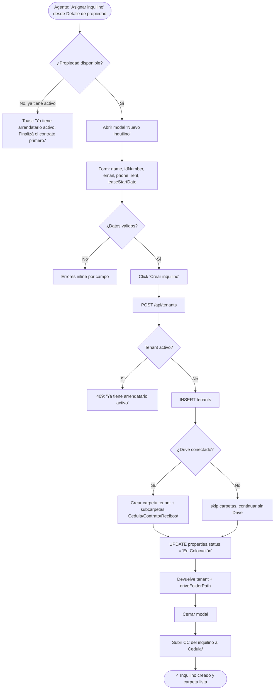
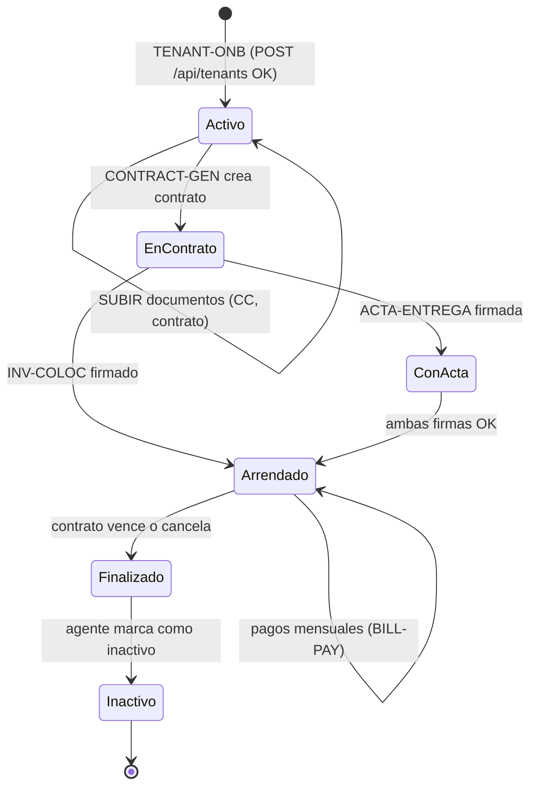
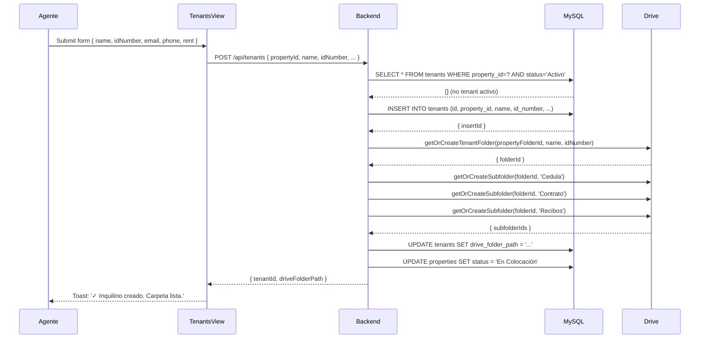

# PROCESO: TENANT-ONB — Onboarding de Inquilino

> Workflow agentico narrativo del proceso de **asignar un inquilino a
> una propiedad** captada en InmoControl. Crea la fila del inquilino en
> MySQL (con constraint único de cédula por property), crea su carpeta
> en Google Drive con subcarpetas `Cedula/`, `Contrato/`, `Recibos/`,
> sube documentos (CC, contrato firmado), y deja la propiedad en estado
> `En Colocación` (listo para Inventario de Colocación).
>
> Es el proceso que **desbloquea el ciclo de vida comercial** de una
> propiedad captada: sin inquilino asignado, no hay contrato, no hay
> cuenta de cobro, no hay acta de entrega.

## 0. Metadata

| Campo | Valor |
|---|---|
| **Código** | `TENANT-ONB` |
| **Nombre legible** | Onboarding de Inquilino |
| **Dominio** | `tenants` |
| **Owners** | Frontend: `src/features/tenants/TenantsView.tsx` + `ActaEntregaModal.tsx` · Backend: `server/routes/tenants.ts` |
| **Status** | ⏳ draft (workflow) / ✅ shipped (implementación, en prod desde jul-2026) |
| **Última revisión** | 2026-08-03 |
| **Procesos upstream** | `PROP-CAPT` (propiedad existe, status='Activo'), `DRIVE-OPS` (carpetas), `PROP-DOCS` (no requerido directamente) |
| **Procesos downstream** | `CONTRACT-GEN` (genera contrato PDF), `INV-COLOC` (firma inventario de colocación + marca `Arrendado`), `BILL-INVOICE` (primera cuenta de cobro), `ACTA-ENTREGA` (al iniciar contrato) |

## 0.5. Diagramas

### Flujo principal (crear inquilino + carpetas + documentos)



### Estados del inquilino (ciclo de vida)



### Estructura de carpetas del inquilino en Drive

```mermaid
flowchart LR
    Property[Mi unidad / InmoControl / {dirección}] --> Tenant[{nombre} ({cédula})]
    Tenant --> Cedula[Cedula/]
    Tenant --> Contrato[Contrato/]
    Tenant --> Recibos[Recibos/]

    Cedula --> CC1[CC_{nombre}_{YYYY-MM-DD}.pdf]
    Cedula --> CC2[CC Reverso_{YYYY-MM-DD}.pdf]
    Contrato --> C1[Contrato_{firmado}_{YYYY-MM-DD}.pdf]
    Recibos --> R1[CuentaCobro_CC-YYYYMM-NNN_{period}.pdf]
    Recibos --> R2[CuentaCobro_CC-YYYYMM-NNN+1_{period}.pdf]
    Recibos --> R3[...]
    Recibos --> Acta[Acta/ - creada on-demand]

    classDef legacy fill:#fef3c7,stroke:#f59e0b
    class Cedula legacy
    class Contrato legacy
    class Recibos legacy
```

### Secuencia de creación (idempotencia)



### Validación de duplicados

```mermaid
flowchart TD
    Submit[POST /api/tenants] --> V1{name?}
    V1 -- No --> E400[400: 'Falta name']
    V1 -- Sí --> V2{idNumber?}
    V2 -- No --> E400B[400: 'Falta idNumber']
    V2 -- Sí --> V3{propertyId?}
    V3 -- No --> E400C[400: 'Falta propertyId']
    V3 -- Sí --> V4{Tenant activo en property?}
    V4 -- Sí --> E409[409: 'Ya tiene arrendatario activo']
    V4 -- No --> V5{Cédula ya registrada en otra property?}
    V5 -- Sí --> W409[409 con pregunta: 'Esta cédula ya tiene un contrato en {propertyAddress}. ¿Crear nuevo?' UI confirma]
    V5 -- No --> OK[Crear tenant]
    W409 -- UI confirma --> OK
    W409 -- UI cancela --> Cancel[Skip]
    OK --> Drive
```

## 1. Actores

- **Agente inmobiliario** — Crea el inquilino desde el Detalle del Inmueble. Sube la CC del inquilino. Crea el contrato (`CONTRACT-GEN`).
- **Inquilino** — Tercero. Sus datos (nombre, cédula, contacto) los carga el agente. Firma contrato, inventario de colocación, acta de entrega.
- **Sistema (InmoControl backend)** — `POST /api/tenants`, `POST /api/tenants/upload-document`. Schema `tenants`, transiciones `properties.status`.
- **Sistema (InmoControl frontend)** — `TenantsView.tsx` (listado de inquilinos), modal "Nuevo inquilino", `ActaEntregaModal.tsx` (acta de entrega — vive acá por legacy).
- **Google Drive** — Recibe uploads en `{nombre} ({cédula})/{Cedula,Contrato,Recibos}/`.
- **MySQL** — Tablas `tenants` (con UNIQUE constraint en `id_number`), `properties` (status), `tenant_documents`.

## 2. Contexto inicial

- **Cuándo se dispara**: el agente abre el Detalle de una propiedad `Activo` (sin inquilino) y hace click en "Asignar inquilino".
- **UI entry point**: `src/features/properties/PropertiesView.tsx` → tab Inquilinos → botón "+ Asignar inquilino" → modal `NuevoInquilinoModal` en `TenantsView.tsx`.
- **Precondiciones**:
  - La propiedad existe en MySQL con `status='Activo'`.
  - NO tiene un inquilino activo (constraint 1-propiedad → 1-tenant activo).
  - Drive puede estar conectado o no (fallback silencioso).

## 3. Flujo principal (happy path)

### Paso 1 — Abrir modal "Nuevo inquilino"

El agente abre el modal. Ve el form con campos:

- **Nombre** (requerido)
- **Cédula** (requerido, formato colombiano 6-10 dígitos)
- **Email** (opcional pero recomendado)
- **Teléfono** (requerido para WhatsApp de mora, ver `NOTIFY EC-11`)
- **Renta mensual acordada** (opcional, se puede definir en contrato)
- **Fecha de inicio del contrato** (opcional, default = hoy)

### Paso 2 — Validar disponibilidad

Click "Crear inquilino":

1. `POST /api/tenants` con el body.
2. Server valida:
   - `propertyId`, `name`, `idNumber` no vacíos → 400 si falta.
   - NO hay otro tenant activo en esta propiedad → 409 si hay.
   - Cédula no duplicada en otra propiedad (warning, NO bloqueante —
     permite multi-propiedad per-inquilino).

### Paso 3 — Crear fila del inquilino

```sql
INSERT INTO tenants (id, property_id, name, id_number, email, phone, rent, lease_start_date, status, created_at)
VALUES (UUID(), :propertyId, :name, :idNumber, :email, :phone, :rent, :leaseStartDate, 'Activo', NOW())
```

Si la cédula ya existe (otra property), el server responde con
`409 { error: 'Cédula ya registrada', existingPropertyId, existingPropertyAddress }`.
La UI pregunta: "¿Esta cédula ya tiene contrato en {address}. ¿Crear
nuevo de todos modos?" → si confirma, INSERT.

### Paso 4 — Crear carpetas en Drive (si está conectado)

Si `useGoogleDriveStore.connected`:

1. `getOrCreateTenantFolder(propertyFolderId, name, idNumber)` →
   `{nombre} ({cédula})/`.
2. `getOrCreateSubfolder(tenantFolderId, 'Cedula')` → `Cedula/`.
3. `getOrCreateSubfolder(tenantFolderId, 'Contrato')` → `Contrato/`.
4. `getOrCreateSubfolder(tenantFolderId, 'Recibos')` → `Recibos/`.
5. `UPDATE tenants SET drive_folder_path = '...'`.

Si Drive NO conectado, skip silencioso (NO rompe).

### Paso 5 — Transición de status de la propiedad

`UPDATE properties SET status = 'En Colocación' WHERE id = :propertyId`.

`En Colocación` significa: tiene inquilino asignado, falta firmar el
Inventario de Colocación. NO se puede asignar otro inquilino hasta que
se finalice este contrato.

### Paso 6 — Subir documentos del inquilino (opcional, post-creación)

El agente puede subir inmediatamente:

- CC del inquilino (PDF, opcional pero recomendado) → `Cedula/CC_<nombre>_<YYYY-MM-DD>.pdf`.

El contrato (`CONTRACT-GEN`) y las cuentas de cobro (`BILL-INVOICE`)
se suben automáticamente por sus respectivos procesos.

### Paso 7 — Cerrar modal + Toast

Modal se cierra. Toast: "✓ Inquilino creado. Carpeta en Drive lista.".

El Detalle de la propiedad ahora muestra el inquilino + botón "Generar contrato" (`CONTRACT-GEN`) + botón "Subir CC".

## 4. Edge cases

### EC-1 — Propiedad ya tiene inquilino activo

- **Trigger**: el agente intenta asignar otro inquilino a una propiedad
  con status `En Colocación` o `Arrendado`.
- **Comportamiento**: server devuelve `409 { error: 'Este inmueble ya
  tiene un arrendatario activo (X). Finaliza o cancela ese contrato
  antes de asignar uno nuevo.' }`. El modal muestra el error.
- **UI**: el botón "Asignar inquilino" está deshabilitado en el Detalle
  si ya hay un tenant activo.

### EC-2 — Cédula duplicada en otra propiedad

- **Trigger**: el mismo inquilino tuvo un contrato anterior en otra
  propiedad.
- **Comportamiento**: server devuelve `409 { error: 'Cédula ya
  registrada', existingPropertyId, existingPropertyAddress }`. La UI
  pregunta explícitamente si quiere crear de todos modos (caso válido:
  el inquilino se muda de una propiedad a otra).
- **Schema**: NO hay UNIQUE constraint en `(id_number)` global — solo
  `(property_id, status='Activo')`. Multi-propiedad per-inquilino es
  permitido.

### EC-3 — Drive caído al crear carpetas

- **Trigger**: `DRIVE-FALLBACK-001`. Timeout 8s server.
- **Comportamiento**: el tenant se crea igual en MySQL (sin
  `drive_folder_path`). Las subcarpetas NO se crean. El flujo continúa.
- **Toast**: "Inquilino creado. Las carpetas en Drive no se pudieron
  crear (Drive no disponible). Se crearán cuando Drive responda."
- **Mitigación**: el siguiente upload a Drive (CC, contrato) intenta
  crear la carpeta on-demand (helper de DRIVE-OPS).

### EC-4 — Phone faltante

- **Trigger**: el agente no carga el teléfono del inquilino.
- **Comportamiento**: el tenant se crea sin phone. **PERO** las
  notificaciones de mora (regla WhatsApp al inquilino, ver `NOTIFY
  default rules`) van a fallar silenciosamente (audiencia sin contacto,
  ver `NOTIFY EC-11`).
- **Validación recomendada**: marcar phone como requerido para
  inquilinos con `rent > 0` (los que pagan). Ver §12 Out of scope.

### EC-5 — Email inválido

- **Trigger**: el agente escribe "juan@" sin dominio.
- **Comportamiento**: validación cliente (regex). Server también valida.
  Toast: "Email inválido".

### EC-6 — Cédula con formato incorrecto

- **Trigger**: el agente escribe "123" o "abcdef".
- **Comportamiento**: validación cliente (6-10 dígitos). Server también
  valida. Toast: "Cédula debe tener entre 6 y 10 dígitos".

### EC-7 — Rent = 0 o negativo

- **Trigger**: el agente no llena el campo `rent` o pone 0.
- **Comportamiento**: `rent` es opcional en la creación del tenant
  (puede definirse en el contrato después). Si es 0 o negativo, server
  acepta igual (validación pendiente, ver §12).

### EC-8 — Lease start date en el pasado

- **Trigger**: el agente pone una fecha anterior a hoy.
- **Comportamiento**: server acepta. La fecha es informativa, no
  genera contrato automático.

### EC-9 — Creación de tenant sin propiedad asociada

- **Trigger**: error — `propertyId` está vacío o no existe en MySQL.
- **Comportamiento**: server devuelve `400 { error: 'Falta propertyId' }`
  o `500 { error: 'Property not found' }`.

### EC-10 — Nombre con caracteres especiales

- **Trigger**: el agente pone "José Ñandú's" (con tildes, eñe, apóstrofe).
- **Comportamiento**: la validación acepta Unicode. El nombre se guarda
  tal cual en MySQL (utf8mb4). El nombre en Drive se sanitiza
  (`escapeDriveQueryValue` para queries Drive) pero la carpeta se crea
  con el nombre original.

### EC-11 — Eliminar un tenant (no debería pasar)

- **Trigger**: el agente clickea "Eliminar" en el listado de tenants.
- **Comportamiento actual**: NO hay UI de eliminación. Los tenants se
  marcan como `Finalizado` cuando termina el contrato (ver EC-12).
- **Endpoint**: `DELETE /api/tenants/:id` existe pero con `409` si hay
  contratos activos. Ver `fix-bug-023-tenant-rollback-409.md`.

### EC-12 — Tenant finaliza contrato (transición a Inactivo)

- **Trigger**: el contrato vence o se cancela.
- **Comportamiento**: `UPDATE tenants SET status='Finalizado'` +
  `UPDATE properties SET status='Inactivo'` (o `Activo` si el dueño
  quiere volver a colocar). Ver proceso `BILL-PAY` para el flujo de
  finalización.

### EC-13 — Race condition en creación concurrente

- **Trigger**: 2 agentes crean el mismo tenant simultáneamente (raro en
  piloto, posible en SaaS multi-user).
- **Comportamiento**: UNIQUE constraint en `(property_id, status='Activo')`
  previene el duplicado. El segundo INSERT falla con `ER_DUP_ENTRY`. Server
  devuelve `409`.

### EC-14 — Multi-tenant por propiedad (1 propiedad → N tenants)

- **Trigger**: decisión de negocio — ¿se permite que una casa tenga 2
  inquilinos (ej: 2 amigos)?
- **Decisión**: NO permitido. Constraint duro: 1 propiedad → 1 tenant
  activo. Si se quiere multi-tenant, hay que cambiar el schema y la UI.

### EC-15 — Tenant creado con éxito pero el modal sigue abierto

- **Trigger**: bug histórico — el modal se cierra antes del POST (mismo
  patrón que Karpathy anti-patterns).
- **Comportamiento actual**: el modal tiene `setSubmitting(true)` durante
  el POST. Se deshabilita el botón "Crear". Se cierra solo después del
  200 del server.

## 5. Estado que muta

### Tablas MySQL afectadas

| Tabla | Operación | Columnas tocadas |
|---|---|---|
| `tenants` | INSERT | `id`, `property_id`, `name`, `id_number`, `email`, `phone`, `rent`, `lease_start_date`, `status='Activo'`, `drive_folder_path`, `created_at` |
| `properties` | UPDATE | `status='En Colocación'`, `updated_at` |
| `tenant_documents` | INSERT (cuando se sube CC) | `tenant_id`, `doc_type`, `file_url`, `drive_file_id`, `web_view_link` |
| `property_actions` | INSERT | `property_id`, `action_type='tenant_assigned'`, `details='tenant:{id}:{name}'` |

### Archivos en Drive creados

| Carpeta destino | Trigger | Convención de nombre |
|---|---|---|
| `Mi unidad / InmoControl/{dirección}/{nombre} ({cédula})/` | TENANT-ONB | Fija |
| `Mi unidad / InmoControl/{dirección}/{nombre} ({cédula})/Cedula/` | idem | Fija |
| `Mi unidad / InmoControl/{dirección}/{nombre} ({cédula})/Contrato/` | idem | Fija |
| `Mi unidad / InmoControl/{dirección}/{nombre} ({cédula})/Recibos/` | idem | Fija |
| `Mi unidad / InmoControl/{dirección}/{nombre} ({cédula})/Cedula/CC_{nombre}_{YYYY-MM-DD}.pdf` | post-creación upload | Fija |

### Stores Zustand actualizados

| Store | Acción | Selectores afectados |
|---|---|---|
| `appStore` | `addTenant(...)`, `updateProperty(propertyId, {status: 'En Colocación'})` | `selectTenants`, `selectPropertyById` |

## 6. Contratos cross-cutting

- **Tostadas**: ver `TOAST-001` + tabla §7 abajo.
- **JSON errors**: ver `JSON-001`. Especialmente los `409` de constraint
  duplicado.
- **Timeouts**: ver `TIMEOUT-001`. Aplican: server 8s por llamada a Drive;
  cliente 15s para queries.
- **Drive fallback**: ver `DRIVE-FALLBACK-001`. Tenant se crea igual sin
  carpetas Drive.
- **Idempotencia**: ver `IDEMPOTENT-001`. UNIQUE constraint previene
  duplicados.
- **Auth**: ver `SECURITY-001`. `requireAuth` en todos los endpoints de tenants.

## 7. Tostadas exactas (copy approved)

| Trigger | Tipo | Copy exacto |
|---|---|---|
| Crear tenant OK (Drive OK) | success | "✓ Inquilino creado. Carpeta en Drive lista." |
| Crear tenant OK (Drive fail) | warning | "Inquilino creado. Las carpetas en Drive no se pudieron crear (Drive no disponible). Se crearán cuando Drive responda." |
| Cédula duplicada (otra property) | warning | "Esta cédula ya tiene contrato en {address}. ¿Crear de todos modos?" |
| Property ya tiene tenant activo | error | "Este inmueble ya tiene un arrendatario activo ({name}). Finalizá o cancelá ese contrato antes de asignar uno nuevo." |
| Subir CC OK | success | "✓ {filename} subido a Drive" |
| Subir CC fail | error | "Error subiendo CC: {error}" |
| Phone faltante (warning, no bloqueante) | warning | "Sin teléfono cargado. Las notificaciones por WhatsApp no llegarán al inquilino." |
| Email inválido | error | "Email inválido" |
| Cédula formato inválido | error | "Cédula debe tener entre 6 y 10 dígitos" |
| Finalizar contrato OK | success | "Contrato finalizado. Tenant marcado como Finalizado, propiedad en Inactivo." |

## 8. Anti-patrones explícitos

- ❌ **Cerrar el modal antes del POST** → bug Karpathy. Modal abierto
  con spinner hasta response.
- ❌ **Permitir 2 tenants activos en la misma propiedad** → constraint
  duro en schema. Ver EC-1.
- ❌ **Asumir que las carpetas de Drive se crean antes que el tenant en DB**
  → el orden es: tenant en DB → Drive (best-effort). Si Drive falla, el
  tenant existe igual.
- ❌ **Borrar físicamente un tenant** → soft delete (`status='Inactivo'`).
  Trazabilidad legal.
- ❌ **Mostrar "guardado" si solo se creó en localStorage** → Karpathy.
  El server debe responder 200 antes del toast.
- ❌ **Hardcodear el nombre del tenant en queries Drive sin escape** →
  bug del jul-2026 (`fix-bug-010-property-address-escape.md` aplica
  misma lógica a tenants).

## 9. Especificaciones técnicas relacionadas

- `docs/specs/wizard_tenant.md` — Spec del flujo de tenant (aprobado).
- `docs/specs/fix-bug-010-property-address-escape.md` — Escape de
  caracteres en queries Drive.
- `docs/specs/fix-bug-022-tenant-doc-upload-timeout.md` — Timeout en
  upload de documentos del tenant.
- `docs/specs/fix-bug-023-tenant-rollback-409.md` — 409 al eliminar
  tenant con contratos activos.
- `docs/specs/fix-bug-033-unique-tenant-document.md` — UNIQUE en
  `tenant_documents`.
- `tests/verifiers/wizard_tenant.md` — Verifier E2E del tenant.

## 10. Endpoints backend utilizados

| Método | Path | Archivo | Notas |
|---|---|---|---|
| `POST` | `/api/tenants` | `server/routes/tenants.ts` | Crea tenant + carpetas + transiciona propiedad. |
| `GET` | `/api/tenants` | idem | Lista tenants. |
| `GET` | `/api/tenants/:id` | idem | Detalle del tenant. |
| `PATCH` | `/api/tenants/:id` | idem | Update (rent, lease dates, phone, etc.). |
| `DELETE` | `/api/tenants/:id` | idem | Soft delete (409 si contratos activos). |
| `POST` | `/api/tenants/upload-document` | idem | Sube PDF del tenant a `Cedula/` o `Contrato/`. |
| `GET` | `/api/properties/:id` | `server/routes/properties.ts` | Refresh post-tenant-assignment. |
| `PATCH` | `/api/properties/:id` | idem | (server-side, dentro de POST /api/tenants) Actualiza status. |

## 11. Riesgos identificados

| Riesgo | Probabilidad | Impacto | Mitigación |
|---|---|---|---|
| Multi-tenant SaaS sin cifrado | Alta (cuando se haga) | Alta | Mover `tenants` a per-org + cifrado de PII |
| Cédula duplicada por error humano | Media | Media | Validación + warning explícito |
| Phone faltante → mora silenciosa | Media | Media | Marcar phone como requerido en `rent > 0` |
| Drive quota excedido | Baja | Media | Throttle en uploads + retry |
| Status `En Colocación` olvidado | Media | Baja | Alerta mensual: "propiedades en En Colocación >30 días" |
| Constraint 1:1 muy rígido | Baja | Baja | Permitir multi-tenant futuro con cambio de schema |

## 12. Out of scope explícito

- ❌ **Multi-tenant por propiedad** (1 propiedad → N tenants activos). Hard
  constraint hoy. Migración requiere schema + UI.
- ❌ **Phone obligatorio** — hoy opcional. Marcar como requerido cuando
  se discuta (ver EC-4).
- ❌ **Validación de rent > 0** — hoy acepta 0 o negativo.
- ❌ **Refactor del monolito `TenantsView.tsx`** — Fase 2 del proyecto.
- ❌ **Cifrado de PII** (cédula, email, phone) — pendiente para SaaS
  multi-tenant.
- ❌ **Auto-creación del contrato** después del tenant — el contrato es
  un proceso separado (`CONTRACT-GEN`).
- ❌ **Notificación al inquilino** de bienvenida — el engine de
  notificaciones puede dispararse, pero no hay template todavía.

## 13. Approval

**Status:** ⏳ Pending Review
**Aprobado por:** —
**Fecha de aprobación:** —

> Spec base: `docs/specs/wizard_tenant.md` (aprobado).
> Este workflow es la versión "proceso dedicado" del onboarding del
> inquilino, con énfasis en: la transición de status de la propiedad,
> la estructura de carpetas en Drive, las validaciones (1:1 constraint,
> cédula duplicada), y la preparación para los procesos downstream.

---

> **Recordatorio Karpathy**: una vez aprobado, las features nuevas dentro
> de este proceso (ej: "phone obligatorio", "notificación de bienvenida")
> siguen el flujo spec → verifier → implementación. Este workflow NO se
> modifica para hacer pasar checks.